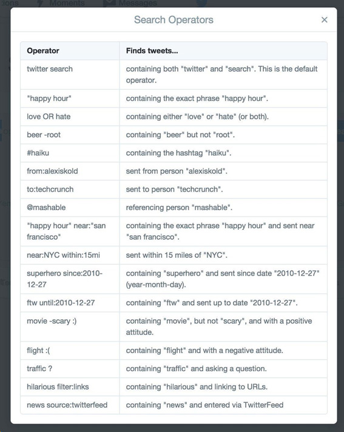

# 📡 Difusión en redes sociales de cartografía

## 📋 Listas de tweets preparados

### 🗄 Tweets de Archivo Topográfico

|                |            |             |             |
|:---------:|:------------------------:|:------------------------:|:------------------------:|
| Enero     | [Abril](tweetat04.md)    | Julio       | Octubre
| Febrero   | [Mayo](tweetat05.md)     | Agosto      | Noviembre
| Marzo     | Junio                    | Septiembre  | Diciembre


### 🧭️ Tweets de Cartoteca

|                |            |             |             |
|:---------:|:---------------------------:|:------------------------------:|:------------------------:|
| Enero     | [Abril](tweetcarto04.md)    | [Julio](tweetcarto07.md)       | Octubre
| Febrero   | [Mayo](tweetcarto05.md)     | Agosto      | Noviembre
| Marzo     | Junio                    | Septiembre  | Diciembre


### 🧶 Hilos para difusión 

* [Hilos genéricos del 🗄Archivo Topográfico](tweetat00hilos.md)
* [Hilos genéricos del 🗄Cartoteca](tweetcarto00hilos.md)
* La carpeta *threads* contiene otros hilos para difusión 🧶

## 🚀 Instalar este repositorio

Es necesario tener instalada la herramienta de versionado **GIT** [👉aquí](https://git-scm.com/). Una vez instalada y configurada se puede clonar el repositorio en local

```bash
# Crear un directorio
mkdir repoTweets
# Navegar al directorio
cd repoTweets
# Ejecutar un clone
git clone https://github.com/e2molin/repotweets.git
```
También es posible bajar todo el contenido en ZIP, pero en ese caso no hay control de versiones. La documentación está escrita en *markdown* por si se quieren añadir nuevos *tweets*.

### 🛠 Herramientas recomendadas

* Editor Visual Studio Code 
* Para aprender **Markdown** usar **Dillinger**  👉[aquí](https://dillinger.io/)
* Obtención de códigos *emoji* para maquetar [👉aquí](https://emojipedia.org/)
* Caracteres especiales de letras en otros idiomas [👉aquí](https://copychar.cc/)
* Creación de GIF animados [👉aquí](https://ezgif.com/video-to-gif)
* Creación de textos resaltados en Unicode [👉aquí](https://qaz.wtf/u/convert.cgi?text=Instituto+Geogr%C3%A1fico+Nacional)


## 🍼 Empezando en RRSS

**Curación de contenidos**, *content curation*: selección de contenidos originales para difundirlos en RRSS de manera retocada y con un valor adicional. Muy importante 📣:
* El proceso de selección de fuentes de información: búsqueda, selección, filtrado.
* Uso de *hashtags* para el etiquetado de contenidos y conexión con *trending topics*. 
* Utilización de menciones de autores, entidades u otros organismos.

### ✍ Recomendaciones para textos

Uso de textos concisos. Máxima información en mínima extensión. Para expliaciones más extensas, artículos en blogs, Facebook. Instagram permiet textos mñas extensos pero según las estadísticas la gente que usa esta red social nuonca depliega los textos que tienen más de tres líneas (en estos casos hay que hacer clic en el texto *más...*). Si la información que hay que difundir necesita más espacio, encadenar tweets en los hilos 🧵. Todos los post del hilo, siempre con imágenes. utilizar el último para las bibliografías. Y si es posible, indicar tweet y número (1/6).

Muy importante buscar contacto con otros organismos y comunidades con temática común. Incluso escribiendo los post en otro idioma (inglés).

Inclusión de hashtags, a ser posible virales, lo ideal es introducir 3 a 5 *hashtags*, de los cuales al menos dos relacionados con la imagen y al menos uno que sea viral. Para ello buscar tendencias en **Instagram**. 
Instagram no aconseja incluir enlaces en las descripciones de las imágenes. De hecho, los embed link (enlaces sobre los que hacer clic) están desabilitados. A la publicación en Instagram podemos acompañarla de un tweet con los enlaces que nos ayudan a localizar la imagen. 

El post para Twitter no puede superar los 280 caracteres. Si incluye un enlace, el espacio para la descripción se reduce. Si se usa un shortener (acortador de URLs), la URL se puede reducor por debajo de los 15 caracteres. Por eso, útiles para el tweet nos quedan en 260-270 caracteres (la imagen que acompaña no cuenta).

Sería interesante que entre los hashtags se incluyera uno propio de Cartoteca, de manera que a la hora de hacer búsquedas por ese hashtag, salieran todas las publicaciones del Twitter del IGN relacionadas con cartoteca. Creo que tanto Cartoteca como Archivo técnico podrían usar el mismo, y podría ser #cartonautas. Además, también etiquetaría con #CartografíaAntigua.

Podemos intentar publicar todos los viernes algo relacionado con Cartoteca o Archivo Técnico, etiquetar como #MapaViernes. Si de AT publicamos imágenes de municipios o planos de ciudades sería interesante vincular con la cuenta del ayuntamiento de dicha ciudad, sobre todos en el caso de que sean ciudades pequeñas, no capitales de provincia, donde uno de nuestrios mensajes puede pasar más desapercibido. Mirad como ejemplo el post del 11 de noviembre.

###	📷 Imágenes

Imágenes con detalles. Evitar imágenes de mapas generales sin que se aprecien detalles. Se pueden combinar varias imágenes en un pequeño fotomontaje, pero es recomendable no más de cuatro. 
* Imagen Instagram cuadrada: 1080x1080 píxel ó 1024x1024 píxel. Las imágenes cuadradas
* Imagen rectangular horizontal: 1080x566 píxel
* Imagen rectangular vertical: 1080x1350 píxel
* Imagen en un Tweet: se recomienda que las imágenes en Twitter no superen los 3MB. Las proporciones ancho/alto deben ser 2/1 si queremos que la imagen se muestre en la preview del stream. Ajustarse a esta proporción siempre es recomendable. Cuando usamos imágenes de otras proporciones, hay que comprobar que se vean adecuadamente. Suelo subir imágenes como mucho de 1800x900 píxeles.

En este recurso [SocialSizes.io](https://socialsizes.io/) tenéis las dimensiones óptimas de una imagen para las diferentes redes sociales. Estas medidas cambian con frecuencia, y esta página se mantiene actualizada con los últimos datos. 

### 🧵 Hilos en Twitter
Es el mecanismo para contar historias de **Twitter** y poder desarrollar exposiciones largas que exceden el tamaño máximo del contenido de un tweet, 280 caracteres. No deben ser muy largos, creo que diez *tweets* encadenados son un tope al que no hay que llegar. Esto pone a prueba la capacidad de síntesis del que redacta, pero más *tweets* pueden provocar el abandono del lector. Todos deben llevar imágenes, que es el mecanismo que nos ayuda a *no perder el hilo*. En estos casos, sólo una imagen por tweet. Si hacen falta más mejor hacer un montaje.

Los hilos los hago con una presentación donde incluyo las *hashtags* principales para búsquedas. A continuación viene  el hilo propiamente dicho, enumerando con la forma *1 de tantos* el número de tweets de los que consta. Al final, uno o varios tweets con la bibliografía si es necesaria. La bibliografía es un buen mecanismo no sólo para agradecer referencias sino para generar vínculos con autores u otras instituciones.

Sí están indicados los hilos muy largos para narraciones de eventos, como conferencias o exposiciones.

* [Tab[ula] Mo[derna] Secundae partis Aphricae, con 6 tweets](https://twitter.com/e2molin/status/1247469420366176257?s=20)
* [Hilo especialmente largo pero por un motivo. Los 40 años de la Constitución y el PNOA](https://twitter.com/e2molin/status/1069967754294411264?s=20)
* [Narración del evento Ibercarto 2018 en Portugal](https://twitter.com/e2molin/status/1063043092226473984?s=20)


### Comentarios de acceso para los *permalinks*

Las imágenes de la **Cartoteca** son las más sencillas de compartir porque son ficheros estáticos, con un *permalink* conocido. La misma miniatura puede servir de imagen del *tweet* aunque no tenga las propociones ideales. El **Catálogo de Cartoteca** se desarrolló con la premisa de que fuera fácil de compartir en RRSS.

La documentación del **Archivo Topográfico** se encuentra en su mayoría en el **Centro de Descargas**, **CdD**. El **CdD** no permite para algunos documentos un enlace directo al documento. Sí se puede con las actas, planimetrías y altimetrías, pero no se puede con los planos de población por ahora, hasta que lo monten. La solución es hacer una búsqueda por producto y municipio y meter en la descripción el *tweet* el número de documento y que el usuario busque este último paso. Esto es importante porque el epígrafe de *documentación geográfica antigua* bajo el que se encuentra la información del Archivo Topográfico no es a mi ehtender muy intuitiva de que hay se encuentran sus documentos.

Para obtener los enlaces a tipo de producto por municipio, hay que usar la herramienta de intranet de Santi que está [👉aquí](http://sapignmad200/test-santi/ConsultasCdD/). En ella podemos seleccionar el tipo de producto y el municipio y nos devuelve la URL con la consulta que resuelve el CdD.

**ABSYS** permite en sus últimas versiones la generación de permalinks. El problema con el que nos encontramos es que tenemos un límite de conexiones simultáneas debido al tipo de licencia. Luego si se utiliza este permalink, al publicarse la noticia o el post pueden generarse a la vez muchas llamadas de consulta, y a partir más o menos de diez peticiones al servidor (tengo dudas del número, pero es bajo) el usuario recibe un mensaje de **conexión no permitida** y no se resuelve el permalink. Por eso no es adecuado para compartir en RRSS y debe evitarse siempre que se pueda, excepto en Biblioteca que es de obligado uso.

#### Accesos a la info del **CdD**

* Documentación de **GEODOCAT**.
  * Planos de Poblacion de Cuenca (34081616078) [👉aquí](https://centrodedescargas.cnig.es/CentroDescargas/buscar.do?filtro.codFamilia=PLPOB&filtro.codIne=34081616078)
  * Planimetrías y Altimetrías de Cuenca  (34081616078) [👉aquí](https://centrodedescargas.cnig.es/CentroDescargas/buscar.do?filtro.codFamilia=MIPAC&filtro.codIne=34081616078)
  * Planos de Edificación de Cuenca  (34081616078) [👉aquí](https://centrodedescargas.cnig.es/CentroDescargas/buscar.do?filtro.codFamilia=PLEDI&filtro.codIne=34081616078)
  * Búsqueda directa a una planimetría, altimetría. Planimetría 280109 [👉aquí](https://centrodedescargas.cnig.es/CentroDescargas/busquedaIdProductor.do?idProductor=280109&Serie=MIPAC)
* Documentación de **SIDDAE**
  * Actas y cuadernos de Cuenca  (34081616078) [👉aquí](https://centrodedescargas.cnig.es/CentroDescargas/buscar.do?filtro.codFamilia=ACLLI&filtro.codIne=34081616078)
  * Búsqueda directa a un acta, reseña o cuaderno. Acta nº56108 [👉aquí](https://centrodedescargas.cnig.es/CentroDescargas/busquedaIdProductor.do?idProductor=056108&Serie=ACLLI)


### 🔎 Herramientas de búsqueda en Twitter

A veces es necesario realizar búsquedas en Twitter. Algunos comandos necesarios son



