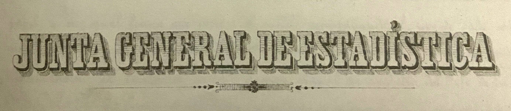
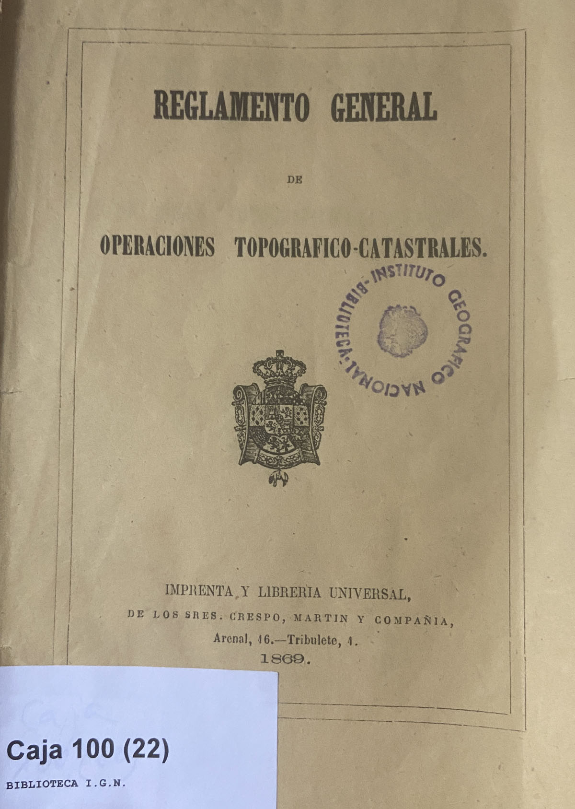
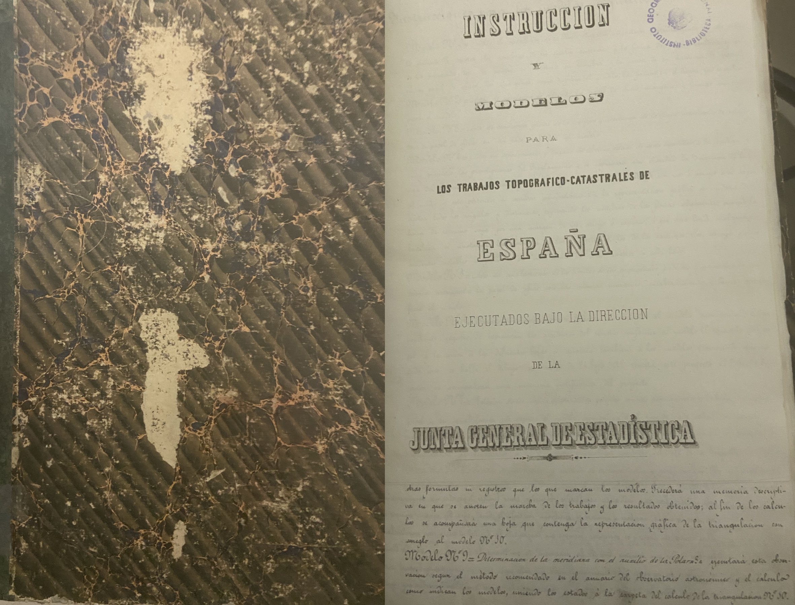

# Bitácora Mayo 2025

```
`⌛️ Fecha` `🗺️ Cartografía` `👀 Lecturas` `⛑️ Trabajo` `🧰 Recursos` `🎞️ Vídeos` `🍊 Genérico` `💿 Ruta Física` `🔗 Enlace Web` `🎤 Ponencia`

`📫 Mail` `⛲️ Fuentes` `💊 Tip` `💡 Destacado` 

`🍉 Encabezado 1`  `🥝 Encabezado 2` `🥕 Encabezado 3` `🍋 Encabezado 3`

« »
```
---

## ⌛️ 2025-05-13

```sql
-- Así convierto las superficies de character varying a numérico
with data as (
SELECT id,metros,metros::float
	,metros::float - ROUND(ABS(metros::float - TRUNC(metros::float))::numeric,2) as sup_m2
	,(MOD(ROUND(ABS(metros::float - TRUNC(metros::float))::numeric,2),1)*100)::integer as sup_dec
	FROM bdsidschema.parcelasmadriddata where metros<>'0'
)
select 'UPDATE bdsidschema.parcelasmadriddata SET sup_m=' || data.sup_m2 || ',sup_dec=' || data.sup_dec || ' Where id=' || data.id || ';'
FROM data
```


## ⌛️ 2025-05-11



Buscando información de las instrucciones de cómo se rrlziaron las planimetrías, encuentro esta entrada en la Biblioteca que creo que se corresponde con el documento `1878 - Instrucciones para los Trabajos Topograficos.pdf`. Comprobar y ver si es posible consuktarlo, porque la copia que tngo en mi repo es malísima.

También es muy interesante este documento `Trabajos topográficos-España-Normas` `Trabajos topográficos-España-Normas.(ZZ0016479.AUTZ.) `

* 📘 Instrucciones para los trabajos topográficos / Dirección General del Instituto Geográfico y Estadístico.
  * Autor: España. Dirección General del Instituto Geográfico y Estadístico .
  * Editorial: Madrid : [s.n.], 1878 (Establecimiento tipográfico de R. Labajos) - 320 p. : il., mapas ; 16 cm.
  * Signatura: 1008, S-1502, 988, 989 Hojas finales plegadas
  * http://www.ign.es/web/biblioteca_cartoteca/abnetcl.cgi?TITN=10774
  * **Tengo copia en repo de muy mala calidad `1878 - Instrucciones para los Trabajos Topograficos.pdf`**
* 📘 Instrucción para el levantamiento parcelario por administración acordado por la Sección 2ª de la Comisión de Estadística General del Reino
   * Autor:Junta de Estadística General del Reino (España)
   * Madrid 1860.Editorial:Madrid : la Comisión, 1860.Descripción física:100 p. manuscritas : il. ; 16 x 22 cm.
   * Signatura:
   * http://www.ign.es/web/biblioteca_cartoteca/abnetcl.cgi?TITN=14826
* 📘 Instrucciones y modelos para los trabajos topograficos-catastrales de España
   * Autor:Junta de Estadística General del Reino (España)
   * Madrid 1860.Editorial: Manuscrito. Madrid : la Comisión, 1860.Descripción física:100 p. manuscritas : il. ; 16 x 22 cm.
   * Signatura: 699
   * http://www.ign.es/web/biblioteca_cartoteca/abnetcl.cgi?TITN=13914
   * **Sólo hemos escaneado la hoja de los signos convencionales. Sería necesario escanear todo**
* 📘 Reglamento general de operaciones topográfico-catastrales.
  * Autor:España
  * Editorial: Madrid : Imprenta y Libreria Universal, 1869 - 55 p. ; 22 cm.
  * Es el reglamento para la aplicación de la Ley de 5 de junio de 1859, firmado por Leopoldo O'Donnell.
  * Signatura:
  * http://www.ign.es/web/biblioteca_cartoteca/abnetcl.cgi?TITN=14793
  * 👇



* 📘 Instrucciones para la ejecución de los trabajos topográficos y estadísticos : aprobadas por R. O. de 12 de diciembre de 1881, encomendados al Cuerpo de E. M. del Ejército.
  * Autor: España. Cuerpo de Estado Mayor del Ejército.
  * Editorial: Madrid : Depósito de la Guerra, 1883. - 87 p., : gráf. ; 16 cm.
  * Signatura:
  * http://www.ign.es/web/biblioteca_cartoteca/abnetcl.cgi?TITN=18695
* 📘 Instrucciones para la ejecucion de trabajos topograficos-catastrales.
  * Autor:Junta de Estadística General del Reino (España)
  * Editorial:[S. l. : s. n.], 1869 - 10 p. manuscritas ; 32 cm
  * Signatura:
  * http://www.ign.es/web/biblioteca_cartoteca/abnetcl.cgi?TITN=15953
* 📘 Instrucción y modelos para los trabajos topográfico-catastrales de España / ejecutados bajo la dirección de la Junta General de Estadística
  * Autor:Junta General de Estadística
  * Editorial:[Madrid : s.l., 18--] - 1 volumen (pág. var.) : formularios ; 34 cm.
  * Signatura: 5175
  * http://www.ign.es/web/biblioteca_cartoteca/abnetcl.cgi?TITN=26603
  * 👇



---

> **Tengo copia en repo de muy mala calidad `1865-08-05 - Reglamento General de Operaciones Topografico-Catastrales.pdf`**


### Cronografía de Gobiernos y el Catastro

* 18 07 1854 - 14 07 1856: Espartero
* 14 07 1856 - 12 10 1856: O`Donnell (Progresista)
* 12 10 1856 - 15 10 1857: Narváez (Moderado)
  * 03-nov-1856: se crea la Comisión Estadística General del Reino, CEGR
  * 05-feb-1857: se constituye la la Comisión de Topografía catastral
  * 21-feb-1857: Celestino del Piélago presenta su plan de operaciones
* 15 10 1857 - 14 01 1858: Francisco Armero y Fernández de Peñaranda (O’donnellista)
* 14 01 1858 - 30 06 1858: Francisco Javier Istúriz Montero (Moderado)
* 30 06 1858 - 07 11 1859: O`Donnell (Progresista)
  * 21-oct-1858: se encarga al CEGR que decida quien hace los trabajos, empresas contratadas o crear un cuerpocivil de topógrafos
  * 20-nov-1858: la CEGR vota volver al modelo parcelario
  * 05-jun-1859: LEY DE MEDICIÓN DEL TERRITORIO
* 07 11 1859 - 30 04 1860: Saturnino Calderón Collantes. (Progresista)
* 30 04 1860 - 02 03 1863: O`Donnell (Progresista)
  * 21-abr-1861: Desaparece CEGR. Se crea la **JUNTA GENERAL DE ESTADÍSTICA**
  * 06-mar-1862: Coello presenta su Reglamento para los trabajos Topográfico-Catastrales
* 02 03 1863 - 17 01 1864: Manuel Pando Fernández de Pinedo (Moderado)
* 17 01 1864 - 01 03 1864: Lorenzo Arrazola (Confianza de Narváez)
* 01 03 1864 - 16 09 1864: Alejandro Mon
* 16 09 1864 - 21 07 1865: Narváez  (Moderado)
* 21 07 1865 - 10 06 1866: O`Donnell (Progresista)
  * 05-ago-1865: se aprueba el Reglamento para los trabajos Topográfico-Catastrales
  * 12-may-1866: levantamiento de todos los perímetros municipales de España por parte de la Dirección General de Operaciones Geográficas
* 10 07 1866 - 23 04 1868: Narváez (Moderado)
  * 21-jul-1866: Suspensión de la Dirección General de Operaciones Geográficas
* 23 04 1868 - 19 09 1868: Luis González Bravo (Progresista)
  * Revolución La Gloriosa
* 19 09 1868 - 03 10 1868: José Gutiérrez de la Concha
* 03 10 1868 - 18 06 1869: Francisco Serrano Domínguez
* 18 06 1869: INICIO REGENCIA DEL GENERAL SERRANO
* 18 06 1869 - 25 08 1869: Juan Prim Prats
* 25 08 1869 - 21 09 1869: Juan Bautista Topete Carballo
  * 14-sep-1870: **INSTITUTO GEOGRÁFICO**
* 21 09 1869 - 27 12 1870: Juan Prim Prats (Asesinado)
* 27 12 1870 - 04 01 1871: Juan Bautista Topete Carballo
* 02 01 1871: FINAL REGENCIA DEL GENERAL SERRANO - Amadeo I de España
* 04 01 1871 - 24 07 1871: Francisco Serrano Domínguez

El Atlas Marítimo de España se podía comprar en Madrid con tres tipos de encuadernación, pero sus hojas también se vendían sueltas en **pliego de marca imperial** y en **papel de media marca**.
En pliegos de papel de Olanda de marca mayor

Marquilla: Fórmula que se repite en las descripciones clásicos del tamaño del libro y que marca, respecto al folio,

en folio marquilla
loc. adj. Dicho de un libro o de un folleto: Que mide de 34 a 45 cm.

---

## ⌛️ 2025-05-09

Pôsoble aprobavion del reglamento

https://repositorio.aemet.es/bitstream/20.500.11765/4045/1/RD_15071865_JuntaEstadist.pdf

Estudiar lo que hay en pizarra

---

## ⌛️ 2025-05-08

Trabajos de jmCarrascosa
\\sbdignmad651.ign.fomento.es\ZZ_HojaKilometrica\__TRABAJO\procesoObtencionMosaicos

* El mosaic de Casarrubiuelos tiene problemas: chequear
* 

**Voy por 2807911_Vallecas_final.ecw**

### Hojas KM

Proyecto de la Junta General de Estadística en 1860-70 que dirige los trabajos catastrales. Primera cartografía catastral de la historia de España. En una década sólo se terminaron 156 municipios de la provincia de Madrid. Estos planos son el inicio del mapa topográfico Nacional. El IGN cuenta en la actualidad con 6000 de ellos.

Existen las Cédulas Catastrales, información literal y gráfica individualizada de cada una de las parcelas representadas, de ellas se conservan 75.000 en el IGN. La unidad básica es la parcela que se representa gráficamente y se determina mediante numeración correlativa. La "Cédula de Propietario" es el documento literal y gráfico de cada parcela que define el poseedor de la tierra, sin carácter jurídico. En las Cédulas se especifica el nombre, número de parcela y número de hoja y término municipal en la que se encuentra.

Fueron realizados en la década de 1860, a partir del reglamento escrito por D. Francisco de Coello, para la Junta General de Estadística.Sólo se pudieron elaborar de municipios de Madrid, zonas rústicas y urbanas, y no de todos por problemas presupuestarios. Proyecto ingente, en exceso ambicioso.

Los medios técnicos empleados fueron los más avanzados de la e´poca, teodolitos para las triangulaciones, y brújala y plancheta para el levantamiento de los puntos importantes. A partir de éstos se utilizaba el sistema de abscisas y ordenadas con cinta. Los edificios se acotaban en todas las dimensiones posibles. Esas acotaciones se aprecian en el producto final.

Son coordenadas locales planas. Sin proyección y sin sistema referencia global. Se pueden unir de forma aproximada, hojas contiguas.

https://www.eis.unl.edu.ar/z/adjuntos/2761/Apuntes_topograf%C3%ADa_1_-_Unidad_3_-_Mediciones_con_cinta_-_EIS_2022.pdf


https://www.google.com/search?sca_esv=3f663a9f48f5c032&rlz=1C1CHBF_esES972ES972&sxsrf=AHTn8zqaF9kEncWD0rx8yrIIK7ziIl1arg:1746716910231&q=hojas+kilometricas+junta+general+estadistica+%22abscisas%22+y+ordenadas&sa=X&ved=2ahUKEwjGndTHk5SNAxWzfKQEHUcoLVYQ5t4CegQIKxAB&biw=3822&bih=1412&dpr=0.9

## ⌛️ 2025-05-07


### Estudio de las parcelas:

* Preparado el interfaz de consulta. 
* Hay parcelas pinchadas que no están relacionadas con las registradas. 
  * Pueden pasar dos cosas:
    * Parcelas mal pinchadas con los números de parcela erróneos
    * No existe la cédula digitalizada, por lo que no tenemos el atributo de la parcela.
  * Tenemos que ver qué hacemos con estas. O las damos de alta sin cédula (y por tanto sin propietario) O pasamos de ellas
* Hay parcelas cuya asociación hay que ve detenidamente, por la complejidad
  *  Polvoranca (2807401): no resuelvo ninguna de las cordenadas que han pinchado
  * Vicálvaro (2807912): hay que resuolverla manualmente
  * Sacedón de Canales (2818101): hay una mega parcela con el 34 que hay que resolver
  * Hortaleza(2807909): hay que ver la depacio
* Faltan parcelas sin coordendas. Hay que ver si se corresponde con las hojas de urbana (Partcelario urbano georref)

```sql
--- SQL para lstar parcelas por idterritorio o por código INE histo
--- Las parcelas no georreferenciadas salen con el campo nparcegeom null
select  
	                    parcelasdatos.idparceladato,
	                   	provincias.nombreprovincia as provincia,
                        territorios.nombre as municipio,
	                    listaprop.ayuntamiento AS ayuntamiento,
                        COALESCE(listaprop.coleccion,'Única') as coleccion,
	                    propietarios.nombre_completo AS propietario,
                        parcelasdatos.numparcela AS parcela,
                        parcelasdatos.sup_m2 AS superficie,
                        parcelasdatos.distribuidor as distribuidor,
                        (('https://www.ign.es/cartoteca/HK/'::text || 
			                    parcelasdatos.terminoid::text) || '/'::text) || 
			                    replace(parcelasdatos.nombre_archivo::text, 'A.JPG'::text, '.pdf'::text) AS urlcdd,
                        parcelasdatos.terminoid AS inemunihisto,
	                    parcelasdatos.sup_ha,parcelasdatos.sup_a,parcelasdatos.sup_m,parcelasdatos.sup_dec,
	                    parcelasdatos.ncc,parcelasdatos.calificador,parcelasdatos.incidencia,
	                    ST_AsText(ST_CENTROID(ST_UNION(parcelasgeotrans.the_geom))) as nparcegeom
                    from bdsidschema.parcelasdatos 
                        LEFT JOIN bdsidschema.listaprop ON parcelasdatos.listaprop_id = listaprop.idlistaprop
                        LEFT JOIN bdsidschema.propietarios ON parcelasdatos.propietario_id = propietarios.idpropietario
	                    LEFT JOIN bdsidschema.parcelasgeotrans ON parcelasdatos.idparceladato = parcelasgeotrans.parceladato_id
                        INNER JOIN bdsidschema.territorios ON listaprop.territorio_id=territorios.idterritorio
						INNER JOIN bdsidschema.provincias ON territorios.provincia=provincias.idprovincia
                    WHERE listaprop.territorio_id=(select idterritorio from bdsidschema.territorios where munihisto=2818100)                    
                    group by 
	                    idparceladato,provincias.nombreprovincia,territorios.nombre,listaprop.ayuntamiento,listaprop.coleccion,propietarios.nombre_completo,parcelasdatos.numparcela,parcelasdatos.sup_m2,
	                    parcelasdatos.distribuidor,urlcdd,parcelasdatos.sup_ha,parcelasdatos.sup_a,parcelasdatos.sup_m,parcelasdatos.sup_dec,parcelasdatos.ncc,parcelasdatos.calificador,parcelasdatos.incidencia
```

Si queremos obtener los dtos de una determinada parcela

```sql
SELECT  
	                                    parcelasdatos.idparceladato,parcelasdatos.numero_doc,parcelasdatos.fecha_insert,parcelasdatos.fechamodificacion,parcelasdatos.nombre_archivo,
	                                    propietarios.nombre_completo AS propietario,
                                        parcelasdatos.listaprop_id,
                                        parcelasdatos.terminoid AS inemunihisto,
                                        parcelasdatos.numparcela AS parcela,
                                        parcelasdatos.sup_m2 AS superficie,
                                        parcelasdatos.distribuidor,
	                                    parcelasdatos.sup_ha,parcelasdatos.sup_a,parcelasdatos.sup_m,parcelasdatos.sup_dec,
	                                    parcelasdatos.ncc,parcelasdatos.calificador,parcelasdatos.incidencia,
	                                    ST_AsText(ST_UNION(parcelasgeotrans.the_geom)) as nparcegeom
                                    FROM bdsidschema.parcelasdatos 
                                         LEFT JOIN bdsidschema.listaprop ON parcelasdatos.listaprop_id = listaprop.idlistaprop
                                         LEFT JOIN bdsidschema.propietarios ON parcelasdatos.propietario_id = propietarios.idpropietario
	                                     LEFT JOIN bdsidschema.parcelasgeotrans ON parcelasdatos.idparceladato = parcelasgeotrans.parceladato_id
  	                                where parcelasdatos.idparceladato=19472
                                    GROUP BY 
	                                   parcelasdatos.idparceladato,parcelasdatos.numero_doc,parcelasdatos.fecha_insert,parcelasdatos.fechamodificacion,parcelasdatos.nombre_archivo,
	                                   propietarios.nombre_completo,parcelasdatos.listaprop_id,parcelasdatos.terminoid,parcelasdatos.numparcela,parcelasdatos.sup_m2,parcelasdatos.distribuidor,
										parcelasdatos.sup_ha,parcelasdatos.sup_a,parcelasdatos.sup_m,parcelasdatos.sup_dec,parcelasdatos.ncc,parcelasdatos.calificador,parcelasdatos.incidencia
	                                    ORDER BY parcelasdatos.idparceladato


```

### Expedientes de personal

```sql
select * from personschema.expedientes where not carpeta is null
```


## ⌛️ 2025-05-05

* `mmontilla` dice que me enviará el último correo del CdD con propuestas.

* `bdsidschema.parcelasgeotrans`
  * Tenemos 1461 registros en los que `parceladato_id is null`
  * 126886 con `parceladato_id>0`


SELECT  
      parcelasdatos.idparceladato,
      'Madrid' as provincia,
      listaprop.ayuntamiento AS municipio,
        COALESCE(listaprop.coleccion,'Única') as coleccion,
      propietarios.nombre_completo AS propietario,
        parcelasdatos.terminoid AS inemunihisto,
        parcelasdatos.numparcela AS parcela,
        parcelasdatos.sup_m2 AS superficie,
        parcelasdatos.distribuidor,
        (('https://www.ign.es/cartoteca/HK/'::text || 
          parcelasdatos.terminoid::text) || '/'::text) || 
          replace(parcelasdatos.nombre_archivo::text, 'A.JPG'::text, '.pdf'::text) AS urlcdd,
      parcelasdatos.sup_ha,parcelasdatos.sup_a,parcelasdatos.sup_m,parcelasdatos.sup_dec,
      parcelasdatos.ncc,parcelasdatos.calificador,parcelasdatos.incidencia,
      ST_AsText(ST_CENTROID(ST_UNION(parcelasgeotrans.the_geom))) as nparcegeom,
      count(*) as numcoords
    FROM bdsidschema.parcelasdatos 
          LEFT JOIN bdsidschema.listaprop ON parcelasdatos.listaprop_id = listaprop.idlistaprop
          LEFT JOIN bdsidschema.propietarios ON parcelasdatos.propietario_id = propietarios.idpropietario
        INNER JOIN bdsidschema.parcelasgeotrans ON parcelasdatos.idparceladato = parcelasgeotrans.parceladato_id
    where parcelasdatos.idparceladato={idParcela}
    GROUP BY 
      idparceladato,provincia,listaprop.ayuntamiento,listaprop.coleccion,propietarios.nombre_completo,inemunihisto,parcela,superficie,parcelasdatos.distribuidor,urlcdd,
      sup_ha,sup_a,sup_m,sup_dec,ncc,calificador,parcelasdatos.incidencia
      ORDER BY parcelasdatos.idparceladato


https://visualizadores.ign.es/comparadormapas?center=-3.79226494145848,40.22053024109748&zoom=20&srs=EPSG:4326

-3.79226494145848 40.22053024109748

## ⌛️ 2025-05-05

Polymetaal, printmaking equipment. A technical dictionary of print making by André Béguin.

🔗 https://www.polymetaal.nl/beguin/alfabet.htm