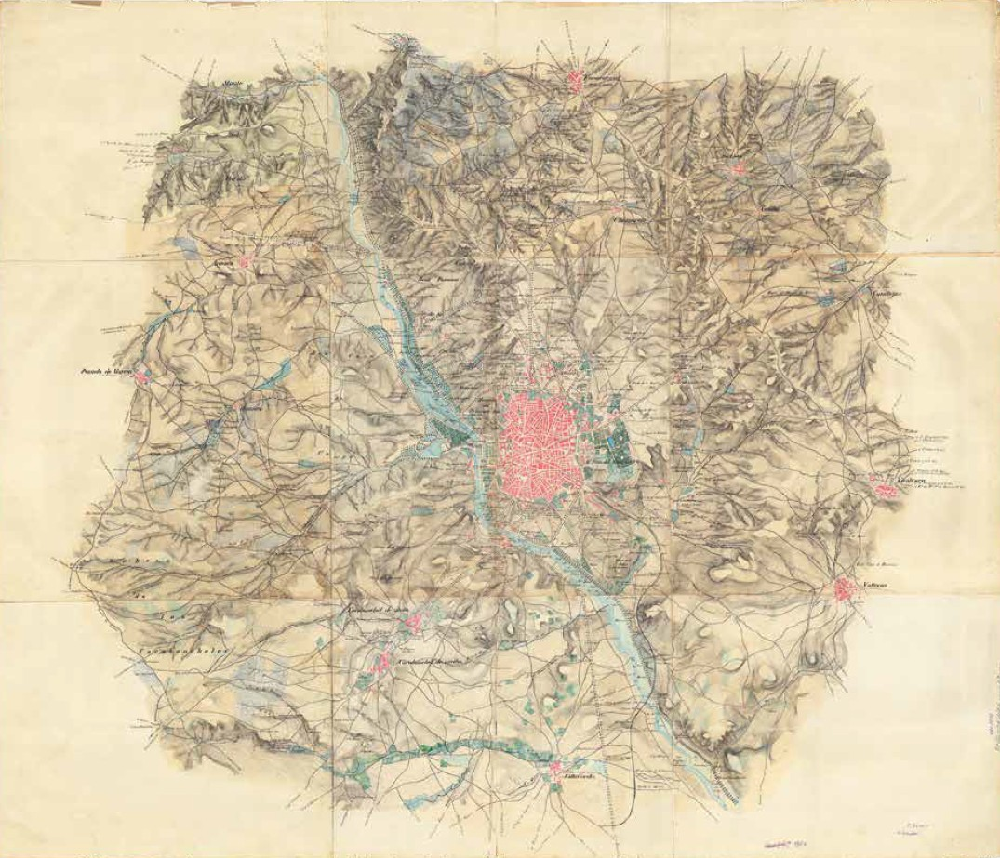
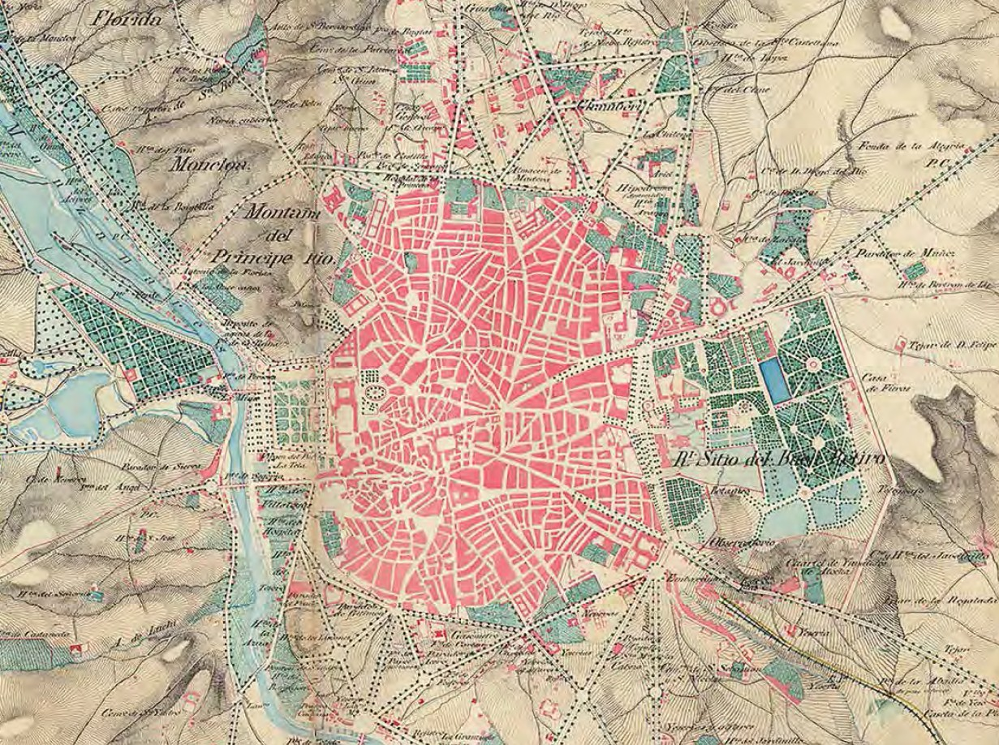

# Bitácora Octubre 2025

```
`⌛️ Fecha` `🗺️ Cartografía` `👀 Lecturas` `⛑️ Trabajo` `🧰 Recursos` `🎞️ Vídeos` `🍊 Genérico` 

`🔗 Enlace Web` `🎤 Ponencia` `📫 Mail` `⛲️ Fuentes` `💊 Tip` `💡 Destacado` `💿 Ruta Física` 

`🍉 Encabezado 1`  `🥝 Encabezado 2` `🥕 Encabezado 3` `🍋 Encabezado 3` `🔔2025-06-19 Fecha revisar tarea` `✅Terminado`

« » 
```

---

## ⌛️ 2025-10-21

Revisar la función setVal que no funciona.


## ⌛️ 2025-10-17

* Estamos a la espera del nuevo Excel con las entidades a crfear en NGBE y NGMEP para implementar la rutina
* Hablar con Ángela sobre Jaen
* Tareas de Deslindes
* Tareas de Cartoteca


## ⌛️ 2025-10-15

Creo entrada en SIDDOC

EverShop: plataforma de eCommerce OpenSource
🔹 React
🔹 GraphQL
🔹 TypeScript
https://github.com/evershopcommerce/evershop


https://github.com/seav/cahill-concialdi?tab=readme-ov-file


## ⌛️ 2025-10-09

En pruebas elimino C04032001001	La Mesa Roldán

## ⌛️ 2025-10-07

Si tras reprocear los datos del INE desde cero los cambios de población son cero, es casi seguro que los datos de población ya se han incoprorado al NGMEP. Faltartán por procesar las entidade nuevas y los cambios de nombre.

Normalmente la entidades resultantes del filtro **NGMEP no presentes en los nuevos datos INE** (967) se exportan en un fichero Excel para su análisis por parte de los operadores.

Lo mismo se hace con las **Entidades nuevas** (184), que hay que analizar a parte antes de cargarlas en el el sistema una vez se localicen sus coordenadas y se compruebe que realmente son nuevas y no son recodificaciones.


## ⌛️ 2025-10-02

La cartografía a gran escala de la provincia de Madrid muestra los resultados del levantamiento parcelario y Topográfico Distinguimos dos tipos de mapas y planos.

En una reunión de la JGE celebrada en abril de 1866 se discutió el sistema de proyección de la carta, la división de las hojas y se decidió adoptar la escala 1:100.000 para la publicación. La única hoja que llegó a editarse según este criterio es la titulada Madrid y sus contornos. El mapa se obtuvo por reducción de las hojas miriamétricas del municipio de Madrid y los términos vecinos, y fue grabada por Pedro Peñas. La  impresión de esta hoja pone de relieve la ambición de Coello de levantar a la par un detallado catastro parcelario y realizar el mapa topográfico de España.

* Atlas topográfico parcelario municipal
  * Hojas kilométricas a eslala 1:2 000. Eran planos topográfico-catastrales
  * Plano del parcelario urbana a escala 1:500
  * Planos topográficos de conjunto escala 1:20 000
    * Plano 289330: contiene un resumen de superficies y un resumen de parcelas
* Mapa topográfico general
  * Hojas miriamétricas a escala 1:20 000: . Eran planos topográficos a secas. su finalidad era la construcción de un mapa topográfico general, apoyado en el levantamiento catastral derivado de las hojas kilométricas. De estas [hojas fueron levantadas y editadas cuatro](https://bibliotecavirtual.defensa.gob.es/BVMDefensa/en/consulta/registro.do?id=127976), junto con su reducción en forma del [mapa de Madrid y sus contornos, escala 1:100 000](https://bibliotecavirtual.defensa.gob.es/BVMDefensa/en/consulta/registro.do?id=127975). La reunión de las cuatro hojas miriamétricas dio lugar a un mapa a escala más reducida y que mantenía la estructura original de la cuadrícula kilométrica.
    * Plano 286691
    * Plano 286764
    * https://bibliotecavirtual.defensa.gob.es/BVMDefensa/en/consulta/registro.do?id=127976
  * Hojas miriamétricas reducidas a escala 1:100 000 Madrid y sus contornos



Contornos ☝️ de Madrid en 1856. Plano de reunión/ Plano levantado por una comisión del Cuerpo de E.M. del ejército compuesto por un mapa llave de
47,5 x 42,0 cm. y composición de 9 hojas 102,5 x 119,5 cm. Escala 1.20.000. [Enlace](https://bibliotecavirtual.defensa.gob.es/BVMDefensa/en/consulta/registro.do?id=93083)
Archivo Cartográfico y de Estudios Geográficos del Centro Geográfico del Ejército, Ar. E-T.-9-C.2-62 bis. Detalle 👇




En julio de 1866, el General Narváez asumía de nuevo la Presidencia del Gobierno, y entre sus planes no figuraba precisamente el impulsar la estadística ni el catastro. El presupuesto de la Junta de Estadística sufrió de nuevo un recorte radical: en el ejercicio de 1866-67 el crédito disponible se limitaba a 800.000 pesetas, es decir, un tercio del de 1860. José Emilio de Santos fue obligado a dimitir como director de Estadística, y lo propio ocurrió con Francisco Coello. Francisco Coello es sustituido al frente de los levantamientos catastrales por Ángel Clavijo.

Mediante un decreto del 31 de julio de 1866, Narváez procedió a disolver la Dirección de Operaciones Geográficas. Semanas más tarde decretaba
el traslado de todas las competencias sobre la formación de la Carta Geográfica al Ministerio de la Guerra. Con ello se hacía recaer  exclusivamente en el cuerpo de Estado Mayor la responsabilidad de levantar el Mapa de España, marginando de esa tarea al servicio de Estadística. 

En noviembre Clavijo es sustituido por Eusebio Donoso Cortés. Se separan los trabajos catastrales de los del mapa topográfico de España. Esta pérdida de competencias sobre el Mapa de España, unido al traslado al Ministerio de Fomento de la responsabilidad sobre la cartografía  temática, suponía en la práctica la liquidación de los proyectos geográficos ideados por Coello. La utopía cartográfica puesta en marcha por la Ley de Medición del Territorio estaba a punto de ser enterrada.

Ahora los técnicos catastrales habrán de centrarse en determinar los perímetros de los términos municipales, reconocer los principales accidentes geográficos y obtener unos croquis topográficos de las masas de cultivo. Se trata de una cartografía de un rigor
y calidad infinitamente menores que la que se venía realizando. Esa reducción en el nivel de exigencia técnica, unida a la reducción en los presupuestos, hacía difícilmente sostenible la plantilla de profesionales que entonces tenía la Junta. Donoso se propuso buscar fuentes alternativas de financiación a partir de establecer colaboración con los ayuntamientos, lo que le llevó a proponer el levantamiento de planos de las ciudades y sus términos. En ese contexto es en el que hay que enmarcar los trabajos cartográficos que se llevan a cabo en las localidades de Almería, Granada, Cartagena, Murcia, Toledo, Soria, Cuenca, Huete y Valdeolivas. De todos ellos, salvo de Toledo, se ha localizado cartografía en el Archivo Topográfico del Instituto Geográfico Nacional, que actualmente se está estudiando. La Junta sólo levanta cartografía en otro municipio no madrileño, el Real Sitio de La Granja de San Ildefonso (Segovia), pero las razones por las que lo hace son de índole muy distinta.

Avance catastral. Plano del término de Bustares (Guadalajara), Escala 1:20.000. Por Juan García, 16 de agosto de 1867 (ATIGN).


Fuentesv
  2007 - Las realizaciones catastrales Junta General Estadistica - Jose Ignacio Muro Morales.pdf
  1998 - Francisco Coello en la JGE - Urteaga y Nadal

## ⌛️ 2025-10-01

En NGMEP hay 3677 EATIMS. Dos de estos EATIMS no tenían asociado el nº de REL. Por eso, al cruzar los datos con los descargados del REL, salían entre los candidatos a ser eliminados como EATIM. Al final, sólo hay uno de ellos (cuyo REL estaba bien asignado) que realmente hay que eliminar.

El funcionamiento de los procesos de desalfabetización los tienes explicados [en este 🔗 enlace](http://sapignmad200.ign.fomento.es/siddoc/nomenclator/nomenclator/ngmep/tasks/actualiz-pobl-ine#-procesos-previos). El proceso de **desalfabetización** se utiliza para los procesos del INE, más que para los del REL ya que en tre otras cosas impliza pasar de mayúsculas a minúsculas.

Cuando una entidad se marca como EATIM, la App pregunta por nº del REL, el nombre del EATIM y el nombre de la capital.

* Coordenadas
  * La actualización de las coordenadas que se pegan procedentes de Iberpix ya funciona. Pero seguimos sujetos a que vuelvan a cambiar el formato.
  * La altitud se introduce correctamente si contiene un valor válido
  * Si en las coordenadas que se van a pegar vienen más de una coordenada, se pregunta cual se quiere pegar
  * Cuando se pegan valores capturados, en el desplegable se fija automáticamente el modo "Investigación"
  * Las fuentes de datos de coordenadas y altitudes figuran en tablas de la base de datos `diccionario_tipos_altitud` y `diccionario_tipos_coor`.
* EATIMS
  * Cuando una entidad se marca como **NO EATIM**
    * EN **NGMEP** 
      * `eseatim = false`
      * `eatim_nombre = Null`
      * `eatim_capital = Null`
      * `idrel = 0`
    * En **NGBE**
      * Se buscan entidades relacionadas con NGBE de clases **1.4** y **2.1.4** Si se encuentran se eliminan y también su relación con NGMEP en la tabla `ngmep_to_ngbe`.
  * Cuando una entidad se marca como **EATIM** 
    * EN **NGMEP**
      * Se solicita la asignación del código REL
      * Se solicita nombre del EATIM
      * Se solicita nombre de la capital del EATIM
      * `eseatim = true`
    * EN **NGBE**
      * Hay que crear dos registros de tipo 1.4 y 2.1.4
  * Cuando se cambia el nombre de un EATIM
    * En **NGMEP**
      * Cambiamos el valor del campo `eatim_nombre`
    * En **NGBE**
      * Cambiamos el identificador geográfico
      * 

### Angélica

* ❓ Qué sucede con Tharsis. Por qué no tenemos asociado su `eatim_nombre`.
* ❓ El nombre que va en `ngbe_elaboracion.ngmep_to_ngbe` es el `identificador_geografico`
* Cosillas que me encuentro: entidades con `fuente_idg` nula (16). Te paso los `idngbe`
  * 2112140
  * 2112147
  * 442012
  * 2157396
  * 2004912
  * 2111760
  * 2111823
  * 403577
  * 2112149
  * 4038660
  * 4038659
  * 4038661
  * 4038770
  * 1852416
  * 4034904
  * 2721090

https://www.ine.es/dyngs/INEbase/operacion.htm?c=Estadistica_C&cid=1254736177010&menu=resultados&idp=1254735572981