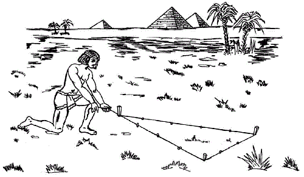
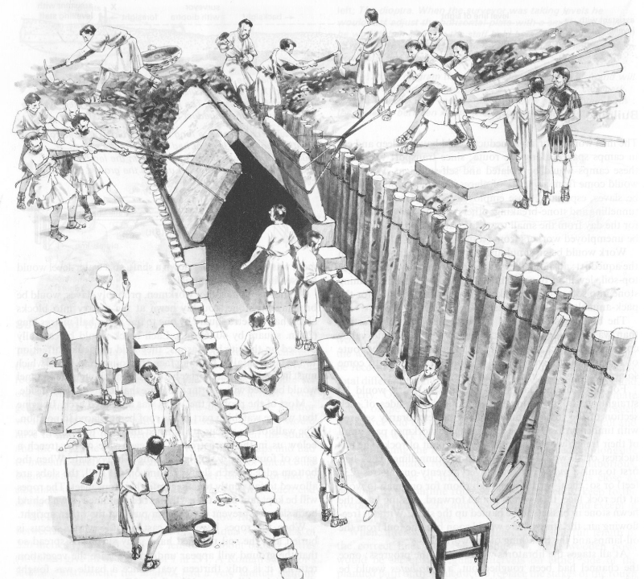
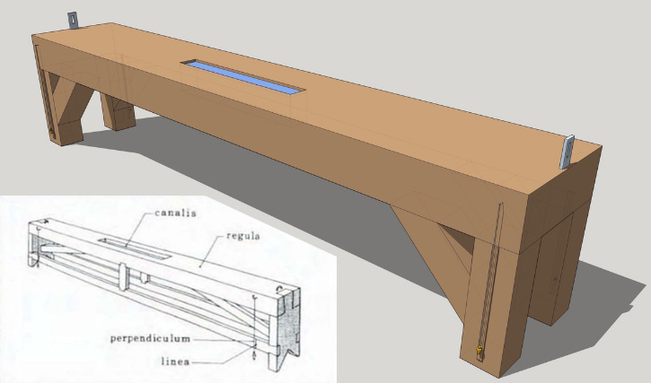
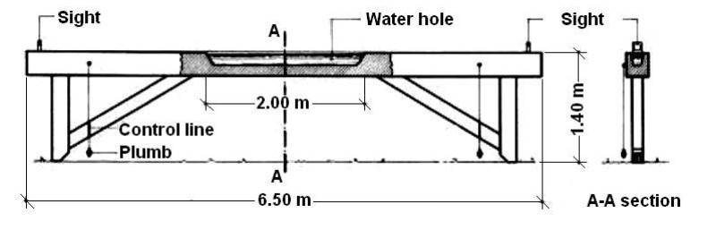
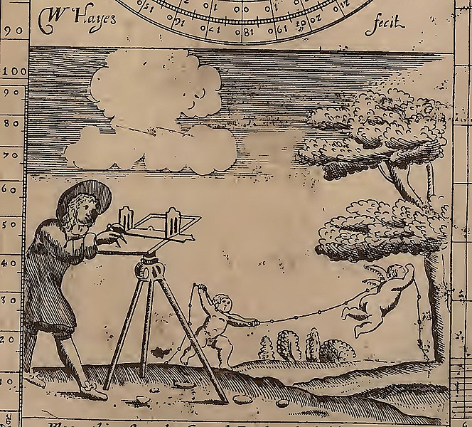
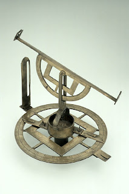
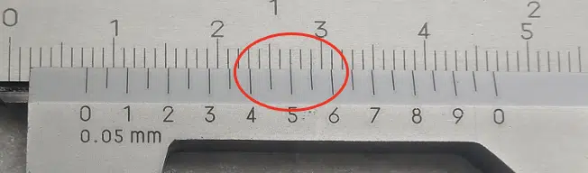
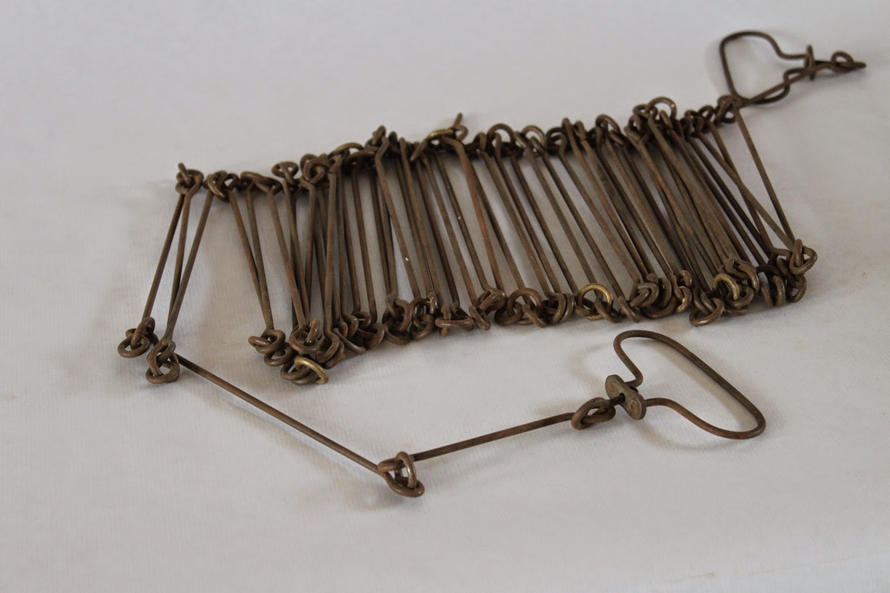

# 🍉 Evolución de la instrumentación topográfica hasta el S. XIX

📹 Conferencia sobre [Evolución de la instrumentación topográfica hasta el S. XIX](https://www.youtube.com/live/nLxGKWhhx24?si=FMl4T75ijCpOVSzf)

El desarrollo y los avances científicos permitieron la mejora de la instrumentación topográfica: Navegación , geometría, trigonometría, óptica...
Los técnicos del sector relojero aportaron técnicos con la precisión necesaria para la construcción de los nuevos instrumentos.
Las necesidades fiscales que dependían de disponer de mediciones precisas del terreno para la elaboración de un catastro o de realizar delimitaciones territoriales aportaron el apoyo estatal de la Hacienda.

Se necesitán medidas precisas de longitud, ángulo y de desnivel. Las primeras unidades de medida eran antropométricas: dedo, codo, palma, vara...

> 💊 Los romanos contaban doble paso.

## 🍌 Primeros instrumentos de agrimensura

Egipto. Los agrimensores egipcios se llamaban **harpedonaptas** o estiradores de cuerda. Se encargaban de replantear las parcelas tras las crecidas del Nilo, para volver a definir sus límites. En la **Tumba de Menna** se encuentran jeroglíficos que muestran la técnica. Usaban una cuerda con nudos equidistantes - «la cuerda de los doce nudos» - , que permite marcar triángulos rectángulos. 

En China se utilizaban herramientas como la plomada, la cinta de agrimensor o el nivel de agua, desde el año 1000 a.C. Y unos 200 años a.C se empezaron a utilizar las primras brújulas.

### 🍊 Cálculo de orientaciones

Tanto en Egipto como en Babilonia o en China se utilizaba el gnomon para en contrar orientaciones norte-sur: se trataba de un pequeño jalón cuya sombra proyectada por el sol, en el momento en que era más corta, indicaba la dirección sur. Con mayor precisión, se podía averiguar la dirección del norte. A comienzo del día se sitúa el gnomon y se marca un punto sobre la sombra proyectada. Se traza un arco desde ese punto con centro el gnomon, y se espera a que a lo largo del día la sombra vuelva a cruzar el arco marcado. En ese momento se calcula la bisectriz del arco, y ya tenemos la dirección norte.

A partir de estos cálculos de la meridiana  - Orientación norte sur - se hacían cálculos para la orientación de estructuras ortoigonales mediante una técnica llamada *«varatio»*. Se utilizaba un instrumento llamado escuadra de agrimensor.

Se trata de un cilindro en el que se realizan aberturas en lados contrapuestos, a ángulos ortogonales, de manera que al mirar a través de ellos pueden verse alineados una serie de jalones. ¡En el IGN tenemos una moderna, de 1890 que utilizaba espejos 🔗[Enlace](https://www.ign.es/web/ic-coleccion-instrumentos/-/coleccion-instrumentos/CTCinstrumentosDetalle?instrumento=118)  para conseguir este efecto.

La **groma romana** se utilizaba también para este fin, constaba de una cruz situada en plano paralelo al suelo, y de cada una de los brazos colgaba una plomada. Recordenmos que en su trazado urbano los romanos deban una gran importancia a la ortogonalidad, definiendo lo que llamaban el *«decumanus máximo»* (E-O) y el *«cardus máximo»* (N-S).

### 🍊 Medición de distancias

La *«decempeda»* o pértiga, era una vara de medir simple de unos 3 metros de longitud. También usaban cuerdas para longitudes mayores, untadas de cera y resina, que minimizaban las dilataciones.

El odómetro es otro instrumento utilizado para la medición de distancias. Cada vez que las ruedas recorrían una determinada distancia, una piedra caía en un recipiente. Por el número de piedras calculaban las distancias.

### 🍊 Cálculo de desniveles

Para la determinación de desniveles se utilizaba la *«libella»*, que era una escuadra de cuyo vértice colgaba una plomada. Una escala graduada permitía determinar si la superficie donde se situaba estaba nivelada o no.

También usaban la *«Libra aquaria»* o nivel del agua, muy similar a los niveles actuales que usamos. Para los romanos el cálculo de los desniveles con precisión era muy importante para una de sus obras más importantes, los acueductos.

Posteriormente se evolucionó con el chorobates. Se trataba de un bastidor con unas escuadras en los extremos de las que colgaban dos plomadas que permitían nivelar la barra horizontal. También para este propósito se usaba un canalillo que se rellenaba de agua.

Sobre él se encontraba una alidada de pínula, formado por una perforación vertical y situada a una distancia otra perforación vertical con un hilo.

La **dioptra** era otro instrumento, que permitía la orientación en dos planos, el vertical y el horizontal y disponía también de un sistema de alidada para dirigir las visuales que se hacían. Este sistema permitía realizar alineaciones en terrenos con desnivel.

### 🍊 Navegación y Astronomía

Las técnicas de navegación y astronómicas están muy relacionadas con la instrumentación topográfica. Los **astrolabios** se usaron en Babilonia y Grecia, pero es durante la Edad media cuando avanza su uso, y se aumenta su precisión. Permite medir alturas de estrellas sobre el horizonte con ayuda de un círculo graduado. Conociendo la declinación de una estrella en una determinada fecha era posible calcular la latitud a la que se encontraba el observador. Los primeros astrolabios solo calculaban la altura sobre el horizonte, y los cáculos de declinación se calculaban aaprte. Según evolucionan los astrolabios, incorporan el cálculo declinatorio en su estructura a través de una bóveda celeste dibujada en su estrcutura, lo que permitía obtener el cálculo automáticamente, dismuyendo el número de operaciones.

La **ballestilla** o **báculo de Jacob** permite la determinación de la altura de las estrellas. Es la evolución del llamado *«kamal»*, utilizado en la navegación oriental. El marino aplicana el ojo en un extremo del instrumento, lo dirigía hacia la estrella que quería medir y deslizaba la vara cruzada, hasta que la parte inferior de esta coincidía con el horizonte. La altura de la estrella - ángulo que forma con el horizonte - se leía en una graduación marcada en la vara.

La topografía enseguida entendió cómo aplicar este instrumento, no a la navegación, sino para la medida de ángulos y para determinar la semejanza de triángulos.

En la siguiente imagen Measuring the lunar distance, from Petrus Apianus, Introductio Geographica, Ingolstadt, 1533 de los National Maritime Museum/Royal Museum Greenwich, se aprecia como el autor muestra el paso de la utilización astronómica de la ballestilla a la utulización topográfica.

Otro instrumento astroníomico es el Torquetum descritom por Ptolomeo en el siglo II. Su permier constructor fue Jabir ibn Aflah en el siglo XII. Permite determinar diferentes tipos de ángulos usando los tres tipos de coordenadas astronómicas: las acimutales, las ecuatoriales  y las eclípticas

* Acimutales: elevación y azimut.
* Ecuatoriales: declinación y ascensión recta
* Eclípticas: latitud y longitud celeste

Uno de los instrumentos que supone un gran avance en la agrimensura es la plancheta. Leonard Zubier (1563-1609) es su primer constructor, aunque es Johannes Praetorius (1537-1616) quien divulga y extiende su uso con el nombre de *«ménsula praetoriana»*. Permite la elaboración de planos directamente en campo. 

Sigue utilizando como métodos de alineación las alidadas de pínula hasta la llegada del anteojo. Una vez orientada la plancheta al norte, se iba moviendo la alidada y visaban los elementos del paisaje que se querían cartografiar. Como con la alidada no se podían relizar mediciones de distancia, con la ayuda de elementos externos como la cadena del agrimensor, se añadían las mediciones de distancia a los trazados en el plano.

Con ayuda de una base conocida, también se podían realizar cálculos de distancia sin usar la cadena de agrimensor. Se situaba la plancheta en un extremo de la base conocida y se realizaban medidas. Seguidamente se iba al otro extremo y se visaban los mismos objetos, pudiéndose entonces relizar mediciones a partir de los ángulos medidos en ambos extremos de la base. A esto se le llama en topografía, intersección directa. El topógrafo William Mayo se ilustra así mismo utilizando este método en *«A new map of the island of Barbadoes in America»* realizado en 1722

El grafómetro es inventado por Niccolo Fontana Tartaglia (1500-1557). Lo que hace es coger una escuadra de agrimensor y le añade un círculo graduado junto con una alidada con visores de pínula y en ocasiones una brújula, lo que le permite el cálculo de azimuts. Es Philippe Danfrie (1531-1606) qien describe su uso.

Muy similar es el círculo holandés de Jan Pieterszoon Dou, que lo construye en 1612. Integra en un único instrumento un astrolabio y una brújula que, colocado sobre un trípide facilita la medición de ángulos horizontales. Este instrumento ayudó notablemente al desarrollo de la cartografía holandesa del XVII, un país donde la escasa orografía permitía la medición del territorio con ángulos horizontales.

Pero cuando el terreno es accidentado, este instrum,ental se queda corto. Será el teodolito el que supongo un gran avance.

### Teodolito

Leonard Digges (1515-1559), agrimensor inglés y posible primer constructor del teodolito. Aparece descrito por primera vez en el libro *«Pantometría»*  publicado en 1571 por su hijo Thomas Digges. El primer teodolito del que se tiene contacia lo fabrica en Londres Humphrey Cole en 1574, siguiendo los planos de Digges. 

Además del círculo horizontal similar al construido por Dou, lleva montado un semicírculo vertical graduado con una aliada, con el que también se pueden medir ángulos verticales. Esto es lo que ampliaba notablemente su utilidad, porque medir ángulos horizontales no es muy útil, ya que no puedes trabajar en zonas con orografía.

## Mejora en la instrumentación

En todos los instrumentos vistos hasta ahora, hay una serie de problemas relativos a la propia instrumentación que se reflejaba en las medidas efectuadas con ellas. Había tres grandes fuentes de error.

* Estabilidad y peso del material
* Obtención de viosuales (óptica)
* Graduación de los cículos.

### Óptica

La invención del telescopio contribuirá al avance en el campo de la óptica. Hans Lippershey (1570-1619) descubre el aumento de los objetos observados al combinar una lente cóncava con una convexa. Esto será mejorado, tanto en la reducción de las deformaciones como en el número de aumentos, por Galileo en 1609 y le permitirá la observación de las lunas de Júpiter.

Kepler (1571-1630) desarrollará el telescopio de imagen invertida o refractor.

Con mejores ópticas, afinamos más lejos, pero para mejorar nuestra observación es vital la aportación de Jean Picard (1620-1682) y Christian Huygens. Introducen la llamada cruz filar o retículo, ese punto de mira que se nos marca al mirar por el telesciopio exactamente el centro de la imagen observada. En un principio se hacían con hilos de araña.

Adrien Auzout (1622-1691) junto con Picard mejora el sistema con la introducción del hilo móvil, precursor del micrómetro. Cuando se quería medir el diámetro aparente de un astro, había que enfocar primero a un extremo y luego al otro, haciendo dos observaciones. Con este sistema esto no es necesario. Se enfoca una vez y se mueven los hilos sobre la lente mediante un tornillo, que permitía obtener la medida con una única observación

El primer telecopio con micrómetro lo construiría Geminiano Montanari (1633-1687). En 1674 contruye el primer anteojo diastimométrico. Sobre el anteojo disponía una serie de hilos paralelos y equidistantes. Según el número de hilos que aparacían en el campo del anteojo, se podía deducir la distancia al objeto. Este es el verdadero precursor del tornillo micrométrico.

### Mediciones angulares

Para mejorar las lecturas de las mediciones angulares, aparece el nonius, construido por Pedro Nunes en 1514 y desarrollado por Pierre Vernier en 1631, que dio el nombre a los calibres o pie de rey.

Sin nonius esta medición sólo podría aopreciarse entre 7 y 8 mm. El nonios nos permite afinar a 7.5 mm, ya que la división del 5 de la escala nonius es la que coincide con la muesca de la escala de orden superior.

Esto combinado con el tornilo micrométrico, cuyo paso de rosca lento permite avanzar poco a poco hasta ajustar la medida. Desarrollado por William Gascoigne (1612-1644) y Robert Hooke (1635-1703).

### Mediciones lineales

La cadena de agrimensor se desarrolla por Aaron Rathbone (1610) y Edmund Gunter (1620), que le da el nombre de **cadena de Gunter**. Está compuesta por 100 eslabones metálicos enlazados por sus extremos, formando un elemento de longitud 20,12 metros (66 pies).

### Nivelaciones

El nivel de burbuja, muy útil para nivelar el instrumental sobre una superficie, se lo debemos a Melquisedec Thevenot, que lo construye en 1661. Se trataba de una cápsula rellena de alcohol con una cierta curvatura, lo que originaba una burbuja que mediante marcas podía medir la horizontalidad.

## La Ilustración en la Topografía

La llegada del siglo XVIII y traerá la revolución científica a la Topografía en forma de instrumentación más precisa y la extensión de nuevos métodos de tranajo. Los grandes proyectos cartográficos iniciados por países como Inglaterra con la cartografía de Irlanda (Down Survey) y Francia con el levantamiento de la carte Genral de Francia contribuyeron a la extensión de nuevas técnicas.

### El Teodolito moderno

El fabricante de instrumentos Jonathan Sisson (1690 - 13 jun 1747) es considerado el inventor del teodolito moderno, al que incorporó varias mejoras antes descritas para mejorar la precisión de las mediciones. Como instrumento para visar las observaciones añadió un telescopio y añade una base para nivelar el instrumento en la superficie horizontal, que contaba de cuadro tornillos niveladores y burbujas niveladoras. También incorpora una escala vernier con una precisión de 5 minutos de arco.

Con el instrumento de Sisson, las observaciones se realizaban una a una, esto es, se realizaba una observación, se giraba el anteojo, y se leía la siguiente observación, y se determinaba el ángulo. Esta operativa se mejoró notablemente con el teodolito repetidor de Georg Friederich Brander, siguiendo las indicaciones de Tobías Mayer. Este teodolito no era necesario orientarlo al norte como el de Sisson, si no que la ubicación del origen de ángulos en el plano horizontal podía establecerse en cualquier medida del limbo horizontal.

### Fuentes

* [La reforma francesa de la cartografía](https://www.coleccioncartografiagm.com/informacion/item/73-la-reforma-francesa-de-la-cartografia)
* [Illustrated Classics of Engineering from the William Barclay Parsons Collection and Others](https://digitalcollections.nypl.org/collections/illustrated-classics-of-engineering-from-the-william-barclay-parsons-collection?filters%5Bgenre%5D=Playing+cards&keywords=#/?tab=navigation&scroll=18)
* *https://tierradetopos.blogspot.com/2009/11/el-teodolito.html
