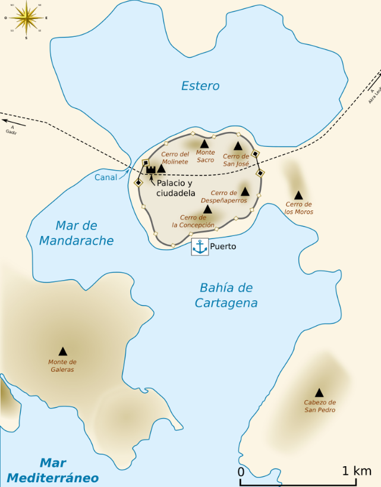
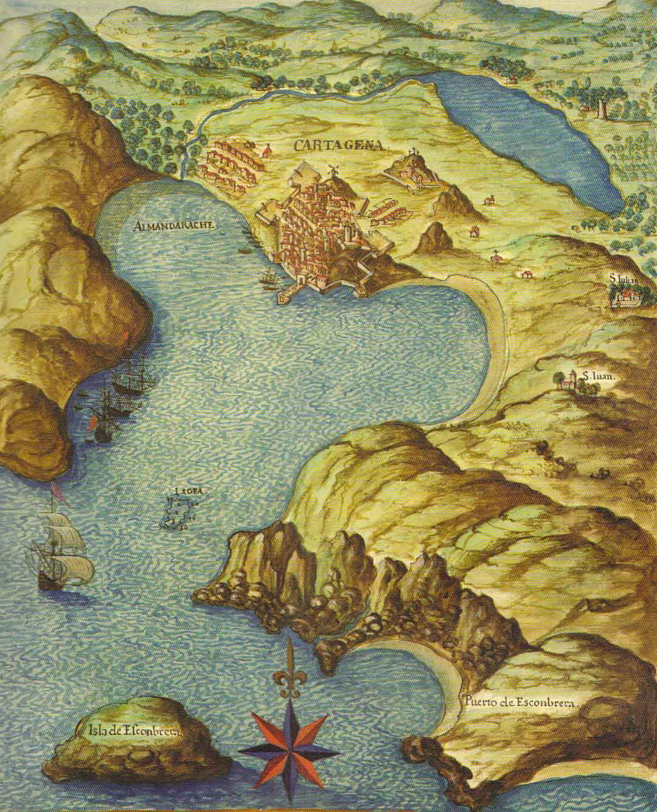

## ⛵ Mapas y cartas naúticas 

### 📰 *«Maps and nautical charts in the medieval and early modern ages»*, **Joaquim Alves Gaspar**, 2016 [🔗 Enlace](https://www.academia.edu/29046475/Maps_and_nautical_charts_in_the_medieval_and_early_modern_ages_two_of_a_kind_or_different_cartographic_paradigms_text_?email_work_card=view-paper)

Los mapas topográficos están destinados a representar todo tipo de información general relativa a la superficie de la Tierra y las cartas náuticas se construyen con el objetivo específico de apoyar la navegación marítima.

A pesar de que existe una idea extendida de que las cartas portulanas son muy precisas incluso para los standards actuales, esto no es así. Aunque el contorno general del Mediterráneo, con sus bahías, cabos e islas, es fácilmente reconocible, si nos fijamos hay imprecisiones importantes. Por ejemplo, cuando comparamos la carta de Angelino Dulcert de 1339 con una representación moderna del Mediterráneo, nos damos cuenta de que la dirección norte-sur en la carta antigua, tal como se define por sus líneas verticales, está inclinada en sentido contrario a las agujas del reloj en un ángulo cercano a los diez grados.

`💿 D:\Imagen\Mapas\Portulanos\1339 - Carte nautique de la Mer Baltique, de la Mer du Nord - Angelino Dulcert - BnF.jpeg`

`💿 D:\Documentos\Lecturas\Historia de la Cartografia por siglos\03 - Cartas nauticas\2016 - Maps and nautical charts in the medieval and early modern ages - Joaquim Alves.pdf`

La explicación de esta aparente inconsistencia es que estamos comparando dos modelos cartográficos distintos. La geometría de un mapa construido sobre la base de latitudes y longitudes suele ser muy diferente de la de una carta marina basada en rumbos magnéticos y distancias entre lugares.

---
## Cartografía de Estado. Francia

El **mapa de Cassini**, encargado por Luis XV, en 1747, al cartógrafo César-François Cassini de Thury es el primer mapa topográfico y geométrico de Francia. En su momento supuso una auténtica innovación al basarse en la nueva técnica de la triangulación geodésica mediante la que dividió el país en 180 rectángulos, cada uno de 80 por 50 kilómetros y comenzó a trabajar en un mapa a escala 1:86400. Las 180 láminas resultantes muestran el país a un nivel de detalle que no tenía precedentes. [🔗 Enlace en BVD](https://bibliotecavirtual.defensa.gob.es/BVMDefensa/es/consulta/registro.do?id=97752)

La **Carte d'État-Major**, a escala 1:80000, se considera la sucesora del mapa de Cassini cuya falta de actualización fue la razón por la que Napoleón ya en 1807 puso de manifiesto su interés en levantar un nuevo mapa de Francia. El mapa, muy detallado, permite descubrir el espacio regional anterior al crecimiento urbano del siglo XIX. [🔗 Enlace en BVD](https://bibliotecavirtual.defensa.gob.es/BVMDefensa/es/consulta/registro.do?id=92019)

---
## Cartagena

> Los tautopónimos son aquellos topónimos (nombres propios de lugares) que en el propio nombre repiten el accidente geográfico que designan o, en un caso más general, aquellos que muestran cualquier repetición. Río Guadalquivir, desierto del Sahara, La Val de Valle de Arán, Leza de Río Leza....

<section style="display:flex;">
  <figure style="width:50%;">
    
    <figcaption>Asentamiento en la época  de su fundación</figcaption>
  </figure>
  <article style="width:50%;">
La ciudad de Cartagena enclave estratégico del Mediterráneo desde la época de Fenicia. Los fenicios la fundaron con el nombre de *«Qart Hadašt»*, *«nueva ciudad»*, el mismo que le habían dado a Cartago. Su puerto se encuentran En el interior de una bahía natural, y la propia ciudad antiguamente se encontaraba en una península.

En la actual zona que ocupoa el Arsenal, se encontraba el mar de Mandarache, que se utilizaba como fondeadero. El canal que abastecía el **estero** desde el mar de Mandarache fue desecándose por un proceso de colmatación. El estero pasó a ser entonces alimentado por diferentes ramblas, y al poder sólo desembocar en el mar por su parte occidental, la zona se convirtió en un pantano, llamado popularmente por este motivo **El Almarjal**, y que constituyó un foco de enfermedades como la malaria.

Siglos más tarde, en el año 1732, el ingeniero militar **Sebastián Feringán** dio comienzo a las obras del Arsenal aprovechando parcialmente la desembocadura de la parte más abrigada de la laguna para la edificación del puerto militar.​ A la muerte de Feringán tomó el relevo **Mateo Vodopich**, de origen ragusio, quien lo concluyó en 1782.
  </article>
</section>

El Atlas del Rey Planeta, obra de Pedro Texeira, ya muestra el aspecto de la ciudad en el siglo XVII con sus baluartes defensivos y un estero más reducido.

Este persobaje es importante y desconocido, muy ligado a la cartografía de Cartagena.

> **Juan José Ordovás** nace en Sevilla, España, en 1760. Se gradúa como ingeniero en la prestigiosa Real Academia de Matemáticas de Barcelona, iniciando una espléndida carrera militar que culmina, al final de sus días, con el grado de mariscal. Para lo que nos interesa, llega destinado a Cartagena en 1791 con el grado de capitán, y permanece hasta 1800 cuando cambia este destino por el de Galicia. Así pues, el Atlas lo realiza entre estas dos fechas, con dos partes bien diferenciadas y ambas de importancia capital para el gobierno de la nación; una descriptiva y otra gráfica

### Las murallas

El frente de Muralla no es igual en todos sus planos, lógicamente. Dependiendo del tramo de muralla de defendía de distintas maneras.

Casi toda la Muralla utiliza parapetos con "merlones" y "cañoneras". Los merlones es lo que en Castillos medievales se llamaban almenas, aquí son frentes de muro que protegen al soldado de los disparos enemigos.
 Tan sólo tenían los agujeritos necesarios para poner los cañones (cañoneras), el resto era macizo.
En estas fotos se ven las cañoneras con los cañones y los merlones que son más altos que una persona de pie. Esto ocurre principalmente en los Baluartes (como esquinas que sobresalen de la muralla) porque en los lienzos 
de muralla generalmente no se ponían cañoneras, eran parapetos contínuos, salvo que la defensa de ese frente fuese muy importante (puertas, etc...).

En el tramo que da al Mar, como no era peligroso, la disposición de la artillería (cañones) era a BARBETA, es decir, sin protección alguna para el artillero (sea soldado o no). La protección es "rodillera", 
es decir sólo llega hasta las rodillas de las personas. De esta manera se pueden colocar muchos cañones uno al lado del otro porque pasan por encima del parapeto, que era continuo. 
Los parapetos estaban coronados con una forma inclinada hacia fuera, que se llama "declive". Este declive podía estar acabado con mampostería, cemento, ladrillo o piezas de piedra. 
Además, para el retroceso de los cañones que tenían al disparar, en el suelo se utilizaba una pequeña rampa con caída hacia el parapeto, por lo que la parte alta de la rampa, prácticamente era la 
misma altura que la del parapeto. Con el tiempo y el desuso, se niveló la calle Muralla del Mar y se puso la balaustrada de Beltrí. Evidentemente el declive era un problema por lo que lo enrasaron y punto. 
En algunas zonas quitarían más hileras que en otras, pero en la mayor parte del frente de muralla del mar está el parapeto completo, y sólo le faltaba el "declive".

