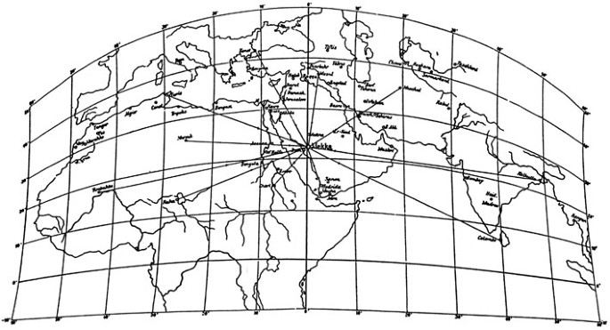

# Bitácora

`⌛️ Fecha` `🗺️ Cartografía` `👀 Lecturas` `⛑️ Trabajo` `🧰 Recursos` `🎞️ Vídeos` `🍊 Genérico` `💿 Ruta Física` `🔗 Enlace Web` `🎤 Ponencia`

`📫 Mail` `⛲️ Fuentes` `💊 Tip` `💡 Destacado` 

`🍉 Encabezado 1`  `🥝 Encabezado 2` `🥕 Encabezado 3` `🍋 Encabezado 3`

---

## ⌛️ 2024-11-15

Convirtiendo un proyecto de CSS a SAAS (SCSS) - 1° Parte
https://www.youtube.com/watch?v=9bUjziHp4Es

Artículo extenso sobre la Carta General del reino [🔗 Enlace](https://cuadernosdedomingofontan.com/2021/04/06/la-carta-general-del-reino/) muy importante para explicar el siglo XVIII en la cartografía de Europa y España.

Proyecto de Celestino del Piélago en el partido judicial de Getafe (1856-1859)

> **18 de octubre de 1853**: se constituyó la Junta Directiva del Mapa de España, a quien se encomendó la labor de levantar el Mapa Topográfico de todo el país mediante técnicas modernas de geodesia y topografía.

> **3 de noviembre de 1856**; se fundó la Comisión de Estadística General del Reyno, de carácter civil, y se le asignaron las competencias en Censo y Catastro.

Sin embargo a efectos prácticos, y aunque era un proyecto civil, los trabajos los realizaron militares de la Junta del Mapa, que eran quien tenían los medios técnicos y conocimiento.

Celestino del Piélago presenta un proyecto 15 de febrero de 1857. El plan consistía en elegir un partido
judicial, medir dos bases topográficas bastante distantes entre sí y triangular el territorio. Posteriormente, debían deslindarse los municipios de dicho partido, calcular la superficie de cada término municipal, y plantear un catastro por masas de cultivo —en las zonas rústicas— o por manzanas —en las áreas urbanas—. Este era un catastro menos detallado que el que se estaba realizando desde las Administraciones Municipales catalanas y mallorquinas. Sin embargo, la Administración Central sí proyectaba un catastro tanto rústico como urbano. Los mapas generales del municipio debían levantarse a escala 1:20.000, y los planos catastrales, a 1:5.000 los rústicos y a 1:2.000 los urbanos.

Se midieron dos bases: una entre Getafe y Villaverde (Madrid), con una longitud de 3562,27 m; otra entre Ocaña y Noblejas (Toledo), con una longitud de 5500,80 m. 

Se conservan cinco Croquis y Planos de Perímetros: dos de ellos correspondientes a Polvoranca (286512, 286513), otros dos a Leganés (286514,286515) y uno a Getafe (286520).


### Canarias en el Mapa

La colocación de Canarias en los mapas ha sido objeto de polémica durante años , hasta el punto de que en 1995 el entonces ministro para las Administraciones Públicas, el canario Jerónimo Saavedra (PSOE), presentó un nuevo mapa oficial de España (titn:16229), que colocaba al archipiélago en el Atlántico, en una posición más próxima a su situación real.

Cuatro años después, el ministro de Fomento de entonces, Rafael Arias Salgado (PP) , presentó el nuevo Mapa General de España, que ubicaba al archipiélago canario en su correcta posición relativa (zona suroeste) y ampliaba las aguas del océano Atlántico.

https://www.abc.es/espana/canarias/abci-canarios-recuerdan-gobierno-islas-mapas-no-estan-debajo-baleares-201702202250_noticia.html

El PSOE propone cambiar la ubicación de Canarias en los mapas de España()
https://elpais.com/diario/1994/11/03/espana/783817212_850215.html

A menudo descubrimos que las islas son borradas directamente del mapa, como cuando aquel real decreto de julio de 1900 firmado por Francisco Silvela dejaba a Canarias fuera en el huso horario por el que se regirían los organismos públicos de España.
En 1915, el puerto de Las Palmas era el segundo del mundo en tráfico de mercancías. Durante casi cien años Londres pidió que se concretara el huso horario de Canarias para que sus barcos pudiesen orientarse por los faros. Solo la insistencia de la Armada británica logra que un real decreto de Alfonso XIII en 1922 Canarias adopte la hora del Reino Unido.

https://ctxt.es/es/20200401/Firmas/31985/canarias-mapa-puerto-turismo-historia-ana-sharife.htm

26 de dicembre
https://elordenmundial.com/mapas-y-graficos/el-mapa-del-espacio-postsovietico-en-europa-30-anos-despues-de-la-caida-de-la-urss/

el 26 de diciembre de 1933, a los pocos días de haber sido nombrado presidente del gobierno, Lerroux nombró a Enrique Gastardi Peón (Cádiz, 1882-Madrid, 1957) nuevo director del Instituto Geográfico. Bajo la dirección de Gastardi prosiguieron las obras del Observatorio Central Geofísico de Toledo en Buenavista

MApa del ataque a pearl harbor mostrado al emperador
https://mapasmilhaud.com/mapas-antiguos/reporte-de-danos-de-pearl-harbor-1941/
https://www.loc.gov/resource/g4382p.ct010991/

Mediante el decreto 2000-12, Francia adopta la proyeccion Lambert-93 como su proyección oficial para la publicación de cartografía de la Francia metropolitana a través del IGN.

La región situada entre el cabo Bojador y el cabo Blanco fue reclamada por España en 1884, durante la conferencia de Berlín (establecimiento de una factoría en la península de Villa Cisneros y dependencias en la bahía de Cintra y en Cabo Blanco a finales de 1884 por Emilio Bonelli). En 1885, comenzó la construcción de Villa Cisneros y el establecimiento de factorías en Río de Oro y Cabo Blanco. Los españoles siguieron su avance hacia el interior y el norte del cabo Bojador.
https://infosaharaoccidental.org/wp-content/uploads/2019/04/Real-Orden-1884.pdf


## ⌛️ 2024-11-12

Colecciones de mapas en Pixeum [🔗 Enlace](https://pixeum.org/featured-exhibits). Espectacular


## ⌛️ 2024-11-11

Página de mapas del Islam dentro de la plataforma **Album-online**. [🔗 Enlace](https://www.album-online.com/es/search?iSF=3&sT=MAPAS+DEL+ISLAM&iSp=0&sGs=mosaic&iPP=2))


---
## ⌛️ 2024-11-06

### 👀 Lecturas

* *Cartography Unchained* es un blog con artículos muy interesantes sobre cartas naúticas, mapas medievales, cartografía romana [🔗 Enlace](https://www.cartographyunchained.com/category/charts/)


---
## ⌛️ 2024-11-04

Página en holandés que hay que revisar sobre la medición de topografía en el XVII que está relacionado con el grabado colgado en el túnel entre los edificios A y B.

* https://www.dirtsyndicate.nl/Ameland/amelandtekaart.webklik.nl/page/landmeten.html
* https://rijksmuseumboerhaave.nl/collectie/verhalen/canon/Beemster/Landmeetkunde/
* https://www.amelanderhistorie.nl/products/uit-de-rijke-historie-van-ameland-jan-bleeker/
* https://www.blikkenemmer.nl/upload/18A%20nieuwsbrief%20Landmeter%20van%20Beurdenweg%208e%20%20%20def%20versie%2027-1-16%2024.00%20u.pdf

---
## ⌛️ 2024-10-29

### 👀 Lecturas

* Cuando se pensaba que California era una isla [🔗 Enlace](https://www.vistaalmar.es/ciencia-tecnologia/historia/9998-cuando-pensaba-california-una-isla.html)
* Database de Mapas históruicos de la Universidad de Yokohama [🔗 Enlace](https://www-user.yokohama-cu.ac.jp/~ycu-rare/pages/WC-0_27.html)
  * https://www-user.yokohama-cu.ac.jp/~ycu-rare/list1.html
* 🧭 Portulanos 
  * ¿Cómo se usaba una carta plana? [🔗 Enlace](https://blogcatedranaval.com/2018/09/18/como-se-usaba-una-carta-plana/)
  * Rule of marteloio [🔗 Enlace](https://en.m.wikipedia.org/wiki/Rule_of_marteloio)
  * Red de rumbos [🔗 Enlace](https://en.wikipedia.org/wiki/Rhumbline_network)
  > Las líneas rectas que se muestran entrecruzadas en los mapas portulanos representan las dieciséis direcciones (o rumbos) de la brújula del navegante desde un punto determinado, que se convirtieron en treinta y dos direcciones a partir de 1450 aproximadamente.

  > Las líneas se llaman Marteloio y son las llamadas loxodromas (líneas de dirección de brújula constante)
* 🎦 PIRI REIS, Dibujando el Mundo (Promo) [🔗 Enlace](https://www.youtube.com/watch?v=B92kjBsgzvI) 
* 🎦 Vídeos sobre la conferencia de Astronomía *Star Lore from Babylonia to Brahe* en la Universidad de Michigan [🔗 Enlace](https://early-astronomy.classics.lsa.umich.edu/conference_video.php)
* 🎦 Kurt Vonnegut, Shape of Stories (subtitulos castellano) [🔗 Enlace](https://youtu.be/GOGru_4z1Vc?si=jtEOE8c-f2KyseYH)
* El litoral del Reino de Granada en los portulanos de Piri Reis [🔗 Enlace](https://www.elindependientedegranada.es/cultura/litoral-reino-granada-portulanos-piri-reis-ca1470-1554)
* Cuando el mayor científico de todos los tiempos corrigió en 1799 la posición de Ferrol en el mapa [🔗 Enlace](https://vadebarcos.net/2021/05/15/cuando-el-mayor-cientifico-de-todos-los-tiempos-corrigio-la-posicion-de-ferrol-en-el-mapa/)
* El georama: la Tierra como espectáculo [🔗 Enlace](https://historia.nationalgeographic.com.es/a/georama-tierra-como-espectaculo_13848)
* La vida de Philliper Buache. Espectacylar [🔗 Enlace](https://fr.wikipedia.org/wiki/Philippe_Buache)
* Mapa con la fotos de J. Laurent [🔗 Enlace](https://www.google.com/maps/d/u/0/viewer?mid=1GmM2ld5utYdI385S3Q1ZAPkWU8sbomJh&ll=40.73659453500983%2C-4.746914089680545&z=6)
* Mujeres impresoras. Micrositio de la BNE [🔗 Enlace](https://www.bne.es/es/Micrositios/Guias/MujeresImpresoras/Introduccion/)

### 🧰 Recursos

* Charts CSS: gráficas sin usar JavaScript. HTML semántico [🔗 Enlace](https://chartscss.org/)

### 🧑‍🏫 Aprendiendo

* Expresiones regulares [🔗 Enlace](https://www.youtube.com/watch?v=MRKpVxn5fqI)


## ⌛️ 2024-10-28

* 💡 Aplicación  para ver [🔗 map files de Mapserver online](https://app.mapserverstudio.net/) y [nueva versión MS4W](https://ms4w.com/index.html) de Mapserver para Windows, septiembre 2024.
* 💊 Los antiguos paneles de información de las estaciones de tren como Chamartín se llamaban  [🔗 split-flap display](https://en.wikipedia.org/wiki/Split-flap_display)


### 👀 Lecturas

* [Atlas of Mutual Heritage](https://www.atlasofmutualheritage.nl/) es una base de datos en crecimiento con información e imágenes de lugares en el área de operación de la VOC (Compañía Holandesa de las Indias Orientales) y la WIC (Compañía Holandesa de las Indias Occidentales). Se puede buscar información, mapas, dibujos, grabados y pinturas de lugares relacionados. Proyecto con la colaboración de Dutch National Archive (Nationaal Archief), Dutch Heritage Agency (Rijksdienst voor het Cultureel Erfgoed), y el Rijksmuseum y la Biblioteca Nacional (Koninklijke Bibliotheek).
*  Blog de cátedra naval [🔗 Enlace](https://blogcatedranaval.com/)
   *  Cartografía de Tomás López [🔗 Enlace](https://blogcatedranaval.com/2018/06/05/la-cartografia-del-taller-de-tomas-lopez/)
* Exposición online Cartografía persuasiva en la Cornwell University [🔗 Enlace](https://rmc.library.cornell.edu/latitude/introduction.php)
* Why was this Sea in North America on Old Maps? [🔗 Video](https://www.youtube.com/watch?v=PFYwf3nqf7I)
* 📆 Ephemeris: El 26 de marzo de 2023 fallece a los 96 años Virginia T. Norwood, la madre de Landsat. [🔗 Enlace](https://landsat.gsfc.nasa.gov/article/bidding-farewell-to-virginia-t-norwood-the-mother-of-landsat/)
  * Virginia Norwood fue una física estadounidense, más conocida por sus contribuciones al programa Landsat, ya que diseñó el escáner multiespectral que se utilizó por primera vez en Landsat 1. Por este trabajo, obtuvo el título de "Madre de Landsat".
  * El 18 de noviembre de 2022, la Sociedad Geográfica Estadounidense reconoció a la Sra. Norwood por sus inmensas contribuciones al campo de la cartografía y la geodesia al otorgarle la Medalla cartográfica OM Miller durante la Ceremonia de premios y honores en el Simposio anual de Geografía 2050.
* Mapa de Mercator del Artico [🔗 Enlace](https://arctic.rhewlif.xyz/)
* 💡Expo en la JCB Library. [Interesante manera de mostrar un storymap, mezclando gallerys con parallax](https://jcblibrary.org/exhibitions/bodies-waterbodies-work)
* A Comparison Of Major Worldviews in the last 2000 years. Comparación entre la cosmogonía budista, islámica... [🔗 Enlace](https://www.swaen.com/articles-about-maps/a-comparison-of-major-worldviews-in-the-last-2000-years)
* A “Radically Different” World Map? [🔗 Enlace](https://www.mappingasprocess.net/blog/2021/2/17/a-radically-different-world-map)


---

## ⌛️ 2024-10-25

### 🧑‍🏫 Aprendiendo

* Taller de Prisma ORM con Node.JS y MongoDB [🔗 Enlace](https://www.youtube.com/playlist?list=PLIGDNOJWiL1_ygbYCizW9ORMazELD9foK)
* Taller de formación IIIF [🔗 Enlace](https://doc.biblissima.fr/formation-iiif/)
* Catalogación
  * Reglas de catalogación de los recurso cartográficos en Yale [🔗 Enlace](https://web.library.yale.edu/cataloging/cartographic)
  * Libro interesante en [🔗 Enlace](https://www.amazon.com/RDA-Cartographic-Resources-Paige-Andrew/dp/0838911315)
  * Vídeo sobre la catalogación de mapas [🔗 Enlace](https://www.youtube.com/watch?v=KD48Q9gNg5w) de Carolyn Hansen de la [AGSL](https://uwm.edu/libraries/agsl/)
  * Map Cataloger Toolbox [🔗 Enlace](https://www.acsu.buffalo.edu/~dbertuca/maps/cat/map-cat-toolbox.html)

### 👀 Lecturas

* Web de digitalización de sellos de mapas [🔗 Enlace](https://mapsonstampsdb.com/)
* Mapa de Tequaltiche (Jalisco) [🔗 Enlace](https://twitter.com/arcdelahistori/status/1621901791238438915)

### 🧰 Recursos

* 🧰 Diccionario de la RAE 2024. [Lista de palabras](https://github.com/JorgeDuenasLerin/diccionario-espanol-txt) 


---


## ⌛️ 2024-10-24

### ⛑️ Trabajo

* Copìados los cuadernos interiores restantes para el CdD

### 🗺️ Cartografía

* 🍊 Páralax con historia de la cartografía  [🔗 Enlace](https://www.ign.fr/reperes/30-cartes-qui-racontent-lhistoire-de-la-cartographie)
* 💻 Desarrollo de la Carta de Cassini por el IGN.FR [🔗 Enlace](https://macarte.ign.fr/carte/FxwkSm/Ma-Cassini)
* 🍊 Historia de la Infografía [🔗 Enlace](https://history.infowetrust.com/)
* 💻 Generador de panoramoas usando MDT [🔗 Enlace](https://www.udeuschle.de/panoramas/makepanoramas_en.htm)

### 🧑‍🏫 Aprendiendo

* 🍊 Detail page de un mapa en Simurg (CSIC) con **IIIF** embebido [🔗 Enlace](http://simurg.csic.es/view/990009207890204201) 
* 🍊 Detail page de un mapa en Osher con **IIIF** embebido [🔗 Enlace](https://oshermaps.org/map/57908.0001) 
* 🍊 Curating, georeferencing and exploring for **IIIF** maps [🔗 Enlace](https://allmaps.org/)
  * https://www.leventhalmap.org/about/jobs/allmaps-ux-ui-developer/
* 🍊 Blog de Historia con AI [🔗 Enlace](https://www.historica.org/blog)
* 🎞️ PHP Slim con React y WebTokens [🔗 Videos](https://www.youtube.com/watch?v=blNngUuEKjg&list=PLCQLrBX0OZkjnQe3Gt1RBm5IJizlkURrm)
* 🐋 Taller de **Docker** [🔗 Enlace](https://www.youtube.com/watch?v=QOtOv3h42ew)
* 🐘 **PostgreSQL** Tips de Administración [🔗 Enlace](https://www.crunchydata.com/postgres-tips)

### 👀 Lecturas

* 🍊 Cartes-à-figures, a short-lived fashion promoted by Blaeu and Hondius. Sobre los mapas orlados o paneles decorativos [🔗 Enlace](https://www.cartahistorica.com/blog/journal/cartes-a-figures-a-short-lived-fashion-promoted-by-blaeu-and-hondius/) Los inglesed les llaman **vignette Maps**.
* 🍊 Artículo: Sobre los Atlas de Geografía del siglo XIX
* 📘 Libro sobre el tema: [Geografía 1880](https://www.kickstarter.com/projects/alpoma/make100-geography-1880) [📫 mail](mailto:alpoma@gmail.com)

### 🧰 Recursos

* 🧰 Repositorio de marcas y logos. En SVG descargables [🔗 Enlace](https://svgl.app/)
* 💊 Ejecutar el comando `npx npkill` para que muestra las carpetas node_modules y sus tamaños


---
## ⌛️ 2024-10-22

Comienzan las conferencias ICA - Digital Approaches to Cartographic Heritage
https://cartography.web.auth.gr/ICA-Heritage/Bologna2024/Conference_Program_2024.pdf

https://unminify.com/#google_vignette
https://www.tradingview.com/lightweight-charts/


CSS Overview: Extensión de Chrome para optimikzar CSS

Coleccion cartografico del archivo nacional Torre do tombo https://digitarq.arquivos.pt/details?id=4162622

Regnum Chinae: The Printed Western Maps of China to 1735
https://brill.com/display/title/39120

Elementos ARIA
https://youtu.be/SEbsmQRB2go?si=drRQ1xxVpD9mppw_

Puzzles cartograficos
https://historia.nationalgeographic.com.es/a/mapas-fuente-inspiracion-para-crear-primer-puzle_20765


Busqueda texto en PGSQL
https://blog.kaleidos.net/como-usar-busqueda-de-texto-en-postgresql/

Conceptos tipograficos
https://avark.agency/typeterms/

https://blogs.loc.gov/maps/2024/03/fabricating-the-world-copperplate-printing/

COnceptos de Coleccion dCartografia
https://www.raremapsandprints.co.uk/blog/collecting-antique-maps-is-it-original-or-reproduction-where-to-start

Libros de referencia
https://www.raremapsandprints.co.uk/reference-books.html

Mapas turísticos de España, por Jacques Liozu (1953)
https://newsletter.mapasmilhaud.com/p/mapas-turisticos-de-espana-por-jacques

California, Isla o península?
https://www.atlasobscura.com/articles/california-island-maps

https://adit.co.uk/clock.html


El TRÍPODE TOPOGRÁFICO moderno, resistente pero portátil, con patas articuladas a un cabezal metálico triangular, fue inventado y fabricado por 1ª vez para su venta por el ingeniero inglés Sir Francis Ronalds sobre 1830.


Plataforma Omeka S
https://omeka.org/s/


https://www.youtube.com/playlist?list=PLrtk2b5KQ79YP_L8Lr-6qcwcc1xP2lJzQ

IIIF
https://universalviewer.io/

---

## ⌛️ 2024-10-17

Ejemplos de búsquedas en PARES https://pares.cultura.gob.es/pares-htr/help


## Ibercarto

### 🎤 Carla sobre mapas provinciales 1765-1865

Noelia Ramos habla sobre los mapas provinciales entre los siglos XVIII y XIX. Concretamente entre los dos cartógrafos más destacados, Tomás López y Francisco Coello. Vincula los mapas a la creación del estado mediante la división de la administración territorial.

Han utilizado herramientas de ARCGIS Storymaps para hacer [este proyecto](https://storymaps.arcgis.com/collections/968f6459a645438fb3c7d274bf14a315)

Es un trabajo en colaboración con Jesús Burgueño de la Universitat de Lleida

Mapas muy curiosos como la *baraja de naipes* de **Heraclio Fournier** con la división provincial española.

Los mapas en su mayor parte son enlazables, esto es, el mapa no se descarga, se vincula como servicio (tecnologías IIIF)


### 🎤 Carme Muntaner sobre Cartografía y Mapa

La representación del territorio se llamaba en un principio *carta*, luego evolucionó a la palabra *mapa*, que previene del italiano *mappa*, servilleta, manta. Después se le llamó **Cartografía**.

El mapa es el objeto físico, la **Cartografía** es la disciplina.

La palabra cartografía es una palabra relativamente moderna, del siglo XIX. Malte Brun la usa por primera vez en 1808. 

Cartografía es una palabra de origen latin neutro, luego desde el punto de vista de la Filología no deberia tener plural, aunque sí se lo demos habitualmente.

En América se usa Mapoteca en vez de Cartoteca. El concepto Cartoteca no estaba en la RAE. Tanto Luísa Martín Merás con la colaboración desde dentro de la RAE de Perez-Reverte consiguieron incluirla

Los ingleses para hacer mappas utilizan una palabra: **mapping**

El Arte ha hecho uso de la palabra **Cartografía**, prefiriéndola a la palabra mapa, quizás por tener un origen más culto. La palabra **cartografía** usada en estos términos, deja de ser una disciplina, para convertirse en un objeto. Y nos muestra ejemplos de Antonio Álvarez Gordillo, Reena Saini Kallat o de Fernando Vicente, que hacen arte a partir de mapas. Pero después el Arte da un paso más, y una vez objetivizada, la palabra es pluralizada, **cartografías**, ampliando su significado a conceptos que no tienen por qué ser geográficos: cartografías del sentimiento,m cartografías del deseo, ... estamos rodeados de ejemplos.

### 🎤 Salamanca

Presentación exponiendo las obras de la Biblioteca, haciendo una pequeña historia de la cartografía. Biblioteca de la Universidad de Salamanca se nutre entre sus fondos del Colegio Mayor de Cuenca y del Colegio de los Jesuitas. 

Manuscrito 1257 Unico mapa moderno con una representación del norte de africa. Se inserta posteriormente

Ediciones impresas

* Joan Schott en 1513 (mapa de la lotaringia) basado en waldsmuller
* 1578 geografia de mercator. En salamanca tienen la del 1584 . tienen la de 1605 de Hondius
* descriptiones ptolemaica argumentom. Mapas regionales americanos
* Primera edición de Münster de 1544.

**Ortelius**: primer autor de mapas seriados y reducidos al mismo tamaño (Por lo tanto, distintas escalas): primera edicón en 1570: ediciones en 1573, 1574. Primera traducción en 1588. Edición postrera de 1612

El mapa de españa tuvo 5 estados de plancha, del que salamanca tiene 4

Un competidor de Ortelius fue **Gerard de Jode**. En 1573 pide permiso de impresion pero se lo deniegan hasta 1578 en que se lo conceden y publica su *Speculum Orbis Terrarum*. Su hijo **Cornelis de Jode** hace una posterior en 1593 y son los que hay en Salamanca.

**Mercator**: sus hijos editan hasta 1602 en que las planchas son compradas por **Jodocus Hondius** y **Cornelius de Claenz**. Mantienen el nombre por el prestigio del autor. Su primera edicion es de 1606. Atlas Mercator Hondius: presenta 36 mapas nuevos que no hizo mercator, como el del lago Leman.

Thomas Schoepf's, mapa antiguo de berna en 18 hojas. en 1612 una de las obras prohibidas es esta. frontis de retratos calvinistas oculta por una cenefa, realziada posiblemente
por fray placido de todos los dantos, abad de  del convento san martind e madrid y general de la orden de los benedictinos. Segun parece el expurgo lo hixo en enero de 1613
es una teoria al no tener el exlibris de la portada


Gabriel de toledo y avalos. 22 mapas. Atlas facticios. formato a doblar mapa sobre si mismos.

Blaeu
los globos mas grandes de 68 centimetros, terretsre y celeste. son el septimo estado hacia 1640. aparece california por priemra vez como una isla. en el primer estado del globo era peninsula. 
la expedicion de vizcaino, fray antonio de la ascenson, salmantino que relata la expedicion y sucesivas cartas a felipe3 y felipe4, transmite que california era una isla

Ediocnes en español, dos


civitates orbis terrarum
Planos y mapas de Francesco Guicciardini


Islario de Bordone (3 de bordone) y Tomaso Porcacchi 1572 (7 ediciones). En el IGN tenemos la de 1620

islario de vellerino de villalobos https://gredos.usal.es/handle/10366/129725

libros de wagennaer, tienen dos atlases

Johannes jansonius

Atlas de la bohemia de tomas lopez https://bdh.bne.es/bnesearch/detalle/bdh0000001267;jsessionid=F88773222B0BB9912C85525234620619


OJO: mapas de lopez de arregui por encargo del virrey para separar obistaps de guadalajara y del nueva galicia

Vista de plasencia 1573 wyngaerde hoefnagel entre 1531 y 1537. wyngaerde llega un poc dospes. algunod e sus oficieles que vino con e,los piudo hacerlo

mapa españa jose fores

mapas leones en los paises bajos

repositorio gredos


---

mapas militares frente norte 1936-1939

114,escalas 50 y 25.Archivo francisco iglesias brage
mitad nborte de españa: asturias, leon, cantabria, euskadi, sierra madrid, plasencia
Se le nom,bra jefe del estado mayor de las fuerzas aereas.

https://rcg.cat/contingut/ingeniera-y-ciencia-en-el-siglo-xx-a-travs-de-la-coleccin-cartogrfica-e-iconogrfica-de-francisco-iglesias-brag


---


## ⌛️ 2024-10-11

### 🧵 Nociones de caligrafía [Enlace en Twitter](https://x.com/bne_biblioteca/status/1821876681293914427?s=48)
### ⚗️ Desarrollo de mapas interactivos con Quarto [Enlace al tutorial](https://neocarto.github.io/geounivr2024/VEN1_geoviz_TP/docs/index.html)
### 😎 Artículo: The Way to Mecca [Revista de LOC](https://loc.gov/lcm/pdf/LCM_2024_0708.pdf)
### 📰 Disponible nueva versión de Natural Earth [Version 6](https://shadedrelief.com/ne-draft/)
### 🧰 drawDB. Esquemas de base de datos [🔗 Enlace](https://www.drawdb.app/)
### 🧰 Swapy. Librería para hacer dragdrop en JS [🔗 Enlace](https://swapy.tahazsh.com/)
### 🧰 Two-Up-Element. Librería de comparación de dos imágenes [🔗 Enlace](https://github.com/GoogleChromeLabs/two-up)
### 😎 Artículo: Las Guias Freytag & Berndt [🔗 Enlace](https://www.geografiainfinita.com/2017/06/freytag-berndt-los-mejores-mapas-de-carreteras-del-mundo) 

### 🌐 Carte Topographique De La France de l'Etat-Major, Levee et Publi

Creada entre 1832 y 1876 a escala 1:80.000. [🔗 Mosaico de 267 imágenes](https://www.davidrumsey.com/luna/servlet/s/1fn8qy)

Tenemos artículo seobre esto `2022 - La cartografia de Francia 1832-1876 - Jean-Luc Arnaud.pdf` [🔗 Enlace](https://shs.hal.science/halshs-03688084v1/document)

### 🐳 Docker del Catálogo de la Cartoteca

Ya me he logado y actualizado la contraseña a la habitual italiana


---
## ⌛️ 2024-10-10

Comienzo los contactos con TAYSA para el Catálogo

> https://meet.google.com/jxf-hehs-ofb

Me crean una máquina de desarrollo con Docker

10.67.33.46
esteban.emolin // Cnig.2024

Tienes que entrar con por SSH ( putty ) y la primera vez pedirá un cambio de contraseña.
Tu directorio de trabajo en /docker/cartoteca puedes dejar ahí los ficheros.

---
## ⌛️ 2024-10-09

Documentación de SIDDAE preparada para el CdD

* 1322 documentos nuevos (25Gb)
* 297 documentos modificados (4Gb)

💿 `D:\volcadosCDD`

### 🔍 Averiguar sobre el Planisferio de Vesconte Maggiolo de 1531

[Este mapa de La biblioteca de Macao](http://lunamap.must.edu.mo/luna/servlet/view/search/when/1527?q=maggiolo&sort=identifier%2Ctitle%2Ccontributor%2Ctype) es de 1527

Echar un vistazo a estos [catálogos de Daniel Crouch](https://crouchrarebooks.com/catalogues-rare-maps-atlases-books/)

España dividida segun acostumbran los geografos - El mapa regional 1456-1850 - Jesus Burqueño

### 😎 Lecturas

* La historia de Europa de Péres-Reverte [Artículos 🔗](https://www.zendalibros.com/tag/una-historia-de-europa/)
* Mapas italianos Guerra Civil [Artículo 🔗](https://www.geografiainfinita.com/2021/05/los-mapas-italianos-de-espana-para-la-guerra-civil/)


### 💻 Desarrollo

¡TRUCAZO para liberar GIGAS de tu disco duro! Si eres programador y usas NPM...

Ejecuta el comando: `npx npkill`

Muestra las carpetas node_modules y lo que ocupan. Dale [Espacio] para eliminar las que no uses ↓


## ⌛️ 2024-10-08

🍉 Cargando datos de Colmenares

```sql
select * from bdsidschema.archivodocmtn where sellado in
(
503691,503692,503693,503750,504173,504174,504175,504176,504177,504178,504179,504180,504181,504182,504183,504184,504185,504186,504187,504188,504189,504190,504191,504192,504231,504232,504233,504234,506204,506205,506206,506207,506208,506209,506210,506211,506212,506213,506343,506344,506345,503647
);
```

💿 `D:\WorkLocal\Archivo Topografico\20231024 - Escaneado masivo de cuadernos interiores `

20241007 - Suma de datos - Duplicados Segunda revision - Colmenares.xlsx
Lo último actulziado han sido el campo zona_num


🍉 Analizo los históricos

\\sbdignmad801.ign.fomento.es\DELIMITACIONES_TERRITORIALES\Historicos\Historico\Shape-1995\SHP


🍉 Añadimos etiquetas a los eventos de efemérides:

* **HistoCarto**: evento relacionado con la historia de la cartografía o vida de un cartógrafo, geógrafo, matemático, grabador, impresor, editor de mapas...
* **CartoEvent**: evento relacionado directamente con un mapa o conjunto de mapas.
* **HistoEvent**: evento histórico que hemos conectado con algún mapa de la cartografía.
* **HistoIGN**: evento o personaje relacionado con el IGN


## ⌛️ 2024-10-04

### Mapas de España siglo XIX y om,ienzos siglo XX

El mapa de España de 1884, tengo [una ficha interesante 🔗](http://guiadigital.uam.es:90/SCUAM/documentacion/1884Mapa.php)
En el ICGC tienen un mapa de España que creo nosotros no tenemos [Enlace 🔗](https://cartotecadigital.icgc.cat/digital/collection/espanya/id/2492/rec/1) es un mapa de 1913 a escala 1:500 000 que tiene la misma escala que el mapa colgado en el pasillo del despacho de Matesanz.


### 👨 James Renell

* Considerado el padre del levantamiento geodésico de la India
* Exposición en la Universidad e Michigan [🔗 Enlace](https://apps.lib.umich.edu/online-exhibits/exhibits/show/india-maps) sobre metodologías, instrumentos y mapas relacionados

### 🕌 Busco mapas relacionados con la cartografía Safávida

Tengo material para hablar de los otomanos y del periodo Mughai en la India con los mapas Jainistas con [un podcast 🎧 de William Dalrymple en Oculi Mundi](https://oculi-mundi.com/william-dalrymple). Incluso pàra la época post Mughai con el levantamiento geodésico de la India. Pero me falta la parte safávida.

Me gustaría encontrar algo relacionado con los mapas de la *qibla*, y entender el trazado de esos mapas en los astrolabios.

* Material: 
  * [A sine on the road to Mecca](https://www.islamicity.org/5434/a-sine-on-the-road-to-mecca/))
  * [Muslim Mathematicians on the Road to Makkah](https://www.islamicity.org/2363/muslim-mathematicians-on-the-road-to-makkah/)

Hay un libro, [ 📚 World-maps for Finding the Direction and Distance to Mecca](https://brill.com/display/title/1073) de David King, que trata sobre dos mapamundis dafávidas encontrados en 1989 y 1995.  Ambos están hechos de latón y datan del siglo XVII en Irán. La Meca está en el centro y una sofisticada cuadrícula de longitud y latitud permite al usuario determinar la dirección y la distancia a la Meca desde cualquier lugar del mundo entre Andalucía y China. Antes del descubrimiento de estos mapas, se creía que dichas cuadrículas cartográficas se habían concebido en Europa alrededor de 1910. Este libro profusamente ilustrado presenta una descripción general de las formas en que los musulmanes a lo largo de los siglos han determinado la dirección sagrada hacia la Meca ( qibla ) y luego describe los dos mapamundis en detalle. El autor muestra que los datos geográficos derivan de una fuente de Asia Central del siglo XV y que las matemáticas subyacentes a la cuadrícula se desarrollaron en Bagdad en el siglo IX.

<section style="display:flex; text-align: center; justify-content: center; align-items:center;">
  <figure>
    
    <figcaption>Mapa deformado conservando las distancias a La Meca, situada en el centro</figcaption>
  </figure>
</section> 

Hay un documento e imágenes en mi Cartoteca sobre este tema: `1600-1700 - Safavid Mecca-centered World Map.md`

### Efemérides Encontradas

Facundo Cañada López, del que no hay fechas en Wiki, es jubilado del servicio activo del ejercito en la primera quincena de junio de 1903. Esto se firma el 11 de julio de 1903 y se publica en la Gaceta del 13 de julio de 1903.

Su plano de Madrid datado en 1902 y en cuya ejecución se invirtieron cuatro años, es un plano realizado a escala 1:7.500, y consta de seis hojas que al unirlas forman un mapa continuo de gran detalle (ver figura 1). Este plano fue realizado a partir de tomas de datos topográficos de campo y de información de los trabajos catastrales que hasta la fecha obraban en poder del Instituto Geográfico Nacional (en ese tiempo denominado Instituto Geográfico y Estadístico) y otros parcelarios inéditos cedidos por Corporaciones o particulares.

Por este plano le concedieron a Facundo Cañada el “Premio de Honor de la Cámara Internacional de Industria, Comercio y Ciencias de Madrid de 1902” 

En noviembre de 1854, llega a
Madrid y es instalado el Circulo Meridiano Repsold. Fue construido en Hamburgo y comprado por 22.000 francos,
siendo el instrumental que durante un
siglo ha permitido más horas de observación, considerándose el elemento fundamental del Observatorio, ya que en
combinación con un reloj de péndulo,
es utilizado para determinar la posición
absoluta de los astros en la esfera celeste.


* Johan Georg Justus Perthes (Rudolstadt, Turingia, 11 de septiembre de 1749 - Gotha, Turingia, 2 de mayo de 1816) 
* Adolf Stieler (26 February 1775 – 13 March 1836) 
* Heinrich Karl Wilhelm Berghaus (3 May 1797 – 17 February 1884)
* Christian Gottlieb Reichard (26 June 1758 – 11 September 1837)
* Augustus Heinrich Petermann (18 April 1822 – 25 September 1878)
* Joan Blaeu (Alkmaar, 23 de septiembre de 1596-Ámsterdam, 28 de mayo de 1673) 
* Jodocus Hondius (versión latinizada de Joost de Hondt) (Wakken, 17 de octubre de 1563-Ámsterdam, 12 de febrero de 1612)
* Gerardus Mercator (Rupelmundo, Flandes; 5 de marzo de 1512-Duisburgo, Sacro Imperio Romano Germánico; 2 de diciembre de 1594),
* Regnier Gemma Frisius (Dokkum, Frisia, 9 de diciembre de 1508 - Lovaina, Brabante, 25 de mayo de 1555) f
* Abraham Ortelius (Amberes, 14 de abril de 1527 - Amberes, 28 de junio de 1598),
* Benito Arias Montano (Fregenal de la Sierra, 1527 - Sevilla, 6 de julio de 1598)
* Georg Braun (también Brunus, Bruin; Colonia, 1541-10 de marzo de 1622) 
* Sebastian Muenster— (Nieder-Ingelheim, 20 de enero de 1488-Basilea, 26 de mayo de 1552)
* Nicolás de Fer (1646 – 25 de octubre de 1720)
* Johann Baptist Homann (Kammlach, Baviera, 20 de marzo de 1664 - Núremberg, 1 de julio de 1724) 
* Jan Huyghen van Linschoten (o Huijgen) (Haarlem, ca. 1563 - Enkhuizen, 8 de febrero de 1611)
* Matthäus Merian der Ältere (Matthäus Merian, el Viejo, Basilea, 22 de septiembre de 1593-Bad Schwalbach, 19 de junio de 1650)
* John Speed (1552 – 28 de julio de 1629)
* Alexis-Hubert Jaillot (1632 – 2 November 1712)
* Guillaume de l'Isle, or Guillelmo Delille (French pronunciation: [ˌɡi:yom ˈthe:líl]; 28 February 1675, Paris – 25 January 1726, Paris[1])
* Nicolas Sanson (20 December 1600 – 7 July 1667) 
* Jacques Nicolas Bellin (1703 – 21 March 1772)
* Michel-Étienne Turgot (/tʊərˈɡoʊ/; French: [tyʁgo]; 9 June 1690 in Paris – 1 February 1751 in Paris) 
* Charles-François Delamarche (August 1740 – 31 October 1817)
* Jean-Baptiste Bourguignon d'Anville (French pronunciation: [ʒɑ̃ batist buʁgiɲɔ̃ dɑ̃vil]; born in Paris 11 July 1697 – 28 January 1782)
* Mary Ann Rocque (c. 1725 - 8 May 1774)  
* Adam Friedrich Zürner (15 August 1679 – 18 December 1742)
* John Ogilby, Ogelby, or Oglivie (17 November 1600 – 4 September 1676) 
* Nicolaes Visscher I (25 January 1618, Amsterdam – buried 11 September 1679, Amsterdam)
* Claes Janszoon Visscher (1587 – 19 June 1652) 
* Gerard de Jode (also known as Petrus de Jode; c. 1511 – 5 February 1591)
* Willem Barentsz (Dutch pronunciation: [ˈʋɪləm ˈbaːrənts]; c. 1550 – 20 June 1597),
* Vincenzo Maria Coronelli (August 16, 1650 – December 9, 1718)
* Stefano Bonsignori or Buonsignori (died 21 September 1589, in Florence)
* Ignazio (or Egnazio) Danti, O.P. (April 1536 – 10 October 1586)
* Urbano Monti (16 August 1544 – 15 May 1613)
* Matteo Ricci (6 October 1552 – 11 May 1610)
* Conrad Malte-Brun (Thisted, Dinamarca, 12 de agosto de 1755 - París, Francia, 14 de diciembre de 1826) 
* Pascual Madoz e Ibáñez (Pamplona, 17 de mayo de 1806-Génova, 11 de diciembre de 1870)
* López de Vargas Machuca, Tomás. Madrid, 1730 – 19.VII.1802.
* Adolf Repsold (* 31. August 1806 in Hamburg; † 13. März 1871 ebenda)
* Jerónimo Pedro Mathet Rodríguez (Madrid, 7 de abril de 1878-Madrid, 28 de noviembre de 1936)
* Rigobert Bonne (Raucourt, 6 de octubre de 1727 - 2 de noviembre de 1795)
* Celestino del Piélago y Fernández de Castro. Comillas (Cantabria). 6.IV.1792 – 2.VIII.1880.

