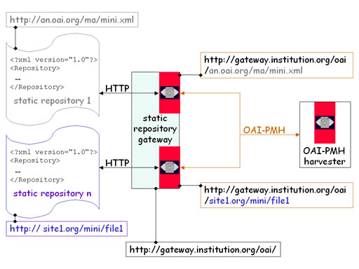
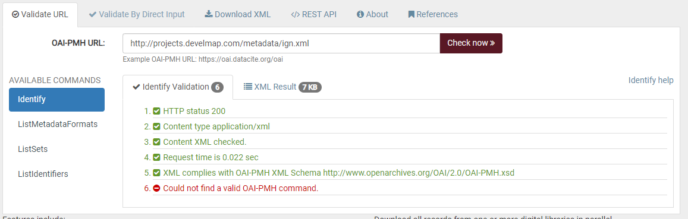

# Hispana y Europeana

## ☎  Protocolo OAI-PMH

**O**pen **A**rchives **I**nitiative Protocol for **M**etadata **H**arvesting permite la interoperabilidad entre repositorios de información. Los archivos y bibliotecas que tienen implantado este protocolo de servicio puede ofrecer información acerca de cuantos documentos han dado de alta, cuantos han dado de baja, de manera que mediante un proceso de harvesting, los organismos recolectores como **Hispana** y **Europeana** pueden consultar qué registros se han dado de alta, cuales se han dado de baja y sincronizar sus propias bases de datos de registros.



Los sistemas de registro de archivos suelen tener implementado este protocolo de servicio como una utilidad más, como DigiBIS, ExLibris, Odilo o Koha. **ABSYS** para implementarlo requiere el pago de una extensión de la licencia básica.

## 🚀  Funcionamiento

El sistema es muy similar al de otros servicios a los que estamos más acostumbrados en el mundo GIS, como WMS y WFS, o más aplicado a este caso, los servicios WCS. A una URL base se la añaden una serie de parámetros. Unos son los llamados verbos que definen acciones. Otros llamados de predicado permiten definir más concretamente la respuesta y por último los de formato nos permiten definir en qué formato de los disponibles pdoemos obtener los datos.

Lo habitual es ofrecer un volcado inicial de los datos al organismo recolector, y ofrecer este servicio de consulta **OAI-PMH**, de manera que periódicaamente el recolector lanzará procesos de Harvester para detectar variaciones: nuevos registros, modificaciones y eliminaciones del sistema origen.

### Ejemplo: OAI BNE

La Biblioteca Nacional dispone de su servidor OAI. Podemos accader a él smplemente con la url [http://oai.bne.es/OAIHandler?](http://oai.bne.es/OAIHandler?), lo que nos devuelve un valor similar a cuando pedimos datos a un WMS pero no especificamos parámetros de consulta. Lo que nos devuelve es información sobre la versión del protocolo OAI que utiliza, así como información de los esquemas utilizados en las respuestas. Vamos a ver cómo podemos hacer diversas peticiones o *request* a este servicio.

#### ❓  Request: identificación básica del servicio
👉 [http://oai.bne.es/OAIHandler?verb=Identify](http://oai.bne.es/OAIHandler?verb=Identify)

ofrece entre otras la siguiente información 

```xml
<protocolVersion>2.0</protocolVersion>              <!-- Versión OIA-MH implementada-->
<adminEmail>admin_repox@bne.es</adminEmail>         <!-- Persona de contacto para el mantenimiento del servicio-->
<earliestDatestamp>1970-01-01</earliestDatestamp>   <!-- Registro más antiguo que devuelve -->
<deletedRecord>no</deletedRecord>                   <!-- No devuelve datos de registros borrados -->
<granularity>YYYY-MM-DD</granularity>               <!-- Permite consultas por fecha, pero no baja hasta el dato por hora -->

```

#### ❓  Request: lista de los formatos de respuesta a las peticiones que hagamos
👉 [http://oai.bne.es/OAIHandler?verb=ListMetadataFormats](http://oai.bne.es/OAIHandler?verb=ListMetadataFormats)

Según la respuesta podemos obtener los resultados en MARCXML utilizando el parámetro **marcxml** o en Dublin Core utilizando el parámetro **oai_dc**. También nos da información de donde se encuentran definidos dichos esquemas  de protocolo, que figurarán en los encabezados de las respuestas.

#### ❓  Request: lista de los conjuntos de recursos sobre los que se puede consultar.
👉 [http://oai.bne.es/OAIHandler?verb=ListSets](http://oai.bne.es/OAIHandler?verb=ListSets)

Para facilitar la agregación de contenidos, los registros se encuentran clasificados en grupos o conjuntos de datos, los *sets*. Las peticiones de consulta que devuelven listas de registros deben llevar entre los parámetros de consulta el nombre del conjunto sobre el que se quiere realizar las consultas. La Biblioteca Nacional maneja los siguientes conjuntos.

```xml
<ListSets>
<set>
<setSpec>monografias_modernas</setSpec>
<setName>Monografías modernas de la BNE</setName>
</set>
<set>
<setSpec>mapas</setSpec>
<setName>Mapas y planos de la BNE</setName>
</set>
<set>
<setSpec>videos</setSpec>
<setName>Videos de la BNE</setName>
</set>
<set>
<setSpec>graficos_pro</setSpec>
<setName>Gráficos proyectables de la BNE</setName>
</set>
<set>
<setSpec>seriadas</setSpec>
<setName>Seriadas de la BNE</setName>
</set>
<set>
<setSpec>monografias_antiguas</setSpec>
<setName>Monografias antiguas de la BNE</setName>
</set>
<set>
<setSpec>manuscritos</setSpec>
<setName>Manuscritos de la BNE</setName>
</set>
<set>
<setSpec>grabaciones_sonoras</setSpec>
<setName>Grabaciones sonoras de la BNE</setName>
</set>
<set>
<setSpec>recursos_electronicos</setSpec>
<setName>Recursos electrónicos de la BNE</setName>
</set>
<set>
<setSpec>kits</setSpec>
<setName>Kit o multimedia de la BNE</setName>
</set>
<set>
<setSpec>graficos</setSpec>
<setName>Grabados, dibujos y fotografías de la BNE</setName>
</set>
<set>
<setSpec>partituras</setSpec>
<setName>Partituras de la BNE</setName>
</set>
<set>
<setSpec>material_mixto</setSpec>
<setName>Material mixto de la BNE</setName>
</set>
</ListSets>
```

#### ❓  Request: lista de registros del conjunto _**mapas**_ en MARC21.
👉  [http://oai.bne.es/OAIHandler?verb=ListRecords&set=mapas&metadataPrefix=marcxml](http://oai.bne.es/OAIHandler?verb=ListRecords&set=mapas&metadataPrefix=marcxml)

Devuelve los registros en fornato MARC21 dados de alta, generalmente desde comienzo del mes en curso, si no se especifican parámetros temporales como es en este caso. Los datos se devuelven en este caso con una cabecera del protocolo **OAI**. Después se hace un eco de los parámetros de consulta y la fecha en que se ha realziado la petición en hora UTC.

```xml
<OAI-PMH xmlns="http://www.openarchives.org/OAI/2.0/" xmlns:xsi="http://www.w3.org/2001/XMLSchema-instance" xsi:schemaLocation="http://www.openarchives.org/OAI/2.0/ http://www.openarchives.org/OAI/2.0/OAI-PMH.xsd">
    <responseDate>2020-06-15T12:03:04Z</responseDate>
    <request verb="ListRecords" set="mapas" metadataPrefix="marcxml">http://oai.bne.es/OAIHandler</request>
    <ListRecords>
    (...)
    (...)
    (...)
    (...)
    (...)
    </ListRecords>
</OAI-PMH>
```

A continuación y encerrado entre etiquetas **ListRecords** se devuelven los registros, cada uno dentro de una etiqueta *record* que satisfacen el criterio de la petición. Cada registro a su vez se compone de una etiqueta cabecera o *header* y una etiqueta *metadata* con los datos en el formato solicitado, **MARCXML** o **Dublin Core**. En el caso de un registro en MARC21:

```xml
<record>
    <header>
        <identifier>oai.bne.esmapas:bica0000000101</identifier>     <!-- Identificador -->
        <datestamp>2020-06-01</datestamp>                           <!-- Fecha de modificación o inserción -->
        <setSpec>mapas</setSpec>                                    <!-- Conjunto de datos -->
    </header>
    <metadata>
        <!-- Registro en formato MARC 21-->
        <marc:record xmlns:marc="http://www.loc.gov/MARC21/slim" xmlns:xsi="http://www.w3.org/2001/XMLSchema-instance">      
            <!-- 
                    Campos MARC21
                    (...)
                    (...)
                    (...)
                    (...)        
             -->
        </marc:record>
    </metadata>
</record>
```

Y en el caso de una petición en **Dublin Core**.

```xml
<record>
    <header>
        <identifier>oai.bne.esmapas:bica0000000101</identifier>     <!-- Identificador -->
        <datestamp>2020-06-01</datestamp>                           <!-- Fecha de modificación o inserción -->
        <setSpec>mapas</setSpec>                                    <!-- Conjunto de datos -->
    </header>
    <metadata>
        <!-- Registro en formato MARC 21-->
        <oai_dc:dc xmlns:oai_dc="http://www.openarchives.org/OAI/2.0/oai_dc/" xmlns:xsi="http://www.w3.org/2001/XMLSchema-instance" xmlns:dc="http://purl.org/dc/elements/1.1/" xsi:schemaLocation="http://www.openarchives.org/OAI/2.0/oai_dc/ http://www.openarchives.org/OAI/2.0/oai_dc.xsd">      
            <!-- 
                    Campos Dublin Core
                    (...)
                    (...)
                    (...)
                    (...)        
             -->
        </oai_dc:dc>
    </metadata>
</record>
```
Como hemos visto si no acotamos con fechas nos devuelve los registros modificados o dados de alta desde principios del mes en curso. Pero el protocolo **OIA-MH** permite incluir un atributo para que devuelva los registros desde otra fecha de origen, así:

👉  [http://oai.bne.es/OAIHandler?verb=ListRecords&set=mapas&from=2020-04-15&metadataPrefix=marcxml](http://oai.bne.es/OAIHandler?verb=ListRecords&set=mapas&from=2020-04-15&metadataPrefix=marcxml)

o incluso los registros entre dos intervalos de fecha, así

👉  [http://oai.bne.es/OAIHandler?verb=ListRecords&set=mapas&from=2020-04-15&until=2020-04-16&metadataPrefix=marcxml](http://oai.bne.es/OAIHandler?verb=ListRecords&set=mapas&from=2020-04-15&until=2020-04-16&metadataPrefix=marcxml)

aunque en el caso del servicio de la BNE, no contempla el acotamiento entre fechas, y devuelve siempre los registros modificaos o creados desde el primer día del mes en curso.

#### ❓  Request: lista de identificadores del conjunto _**mapas**_ en MARC21.

Estas peticiones son costosas, dada la gran cantidad de datos que devuelve por cada regitros. En ocasiones puede ser necesario solicitar sólo los identificadores de los documentos, así

👉 [http://oai.bne.es/OAIHandler?verb=ListIdentifiers&set=mapas&metadataPrefix=marcxml](http://oai.bne.es/OAIHandler?verb=ListIdentifiers&set=mapas&metadataPrefix=marcxml)

devolviéndonos en este caso una lista de encabezados con los identificadores de registro.

```xml
<ListIdentifiers>
    <header>
        <identifier>oai.bne.esmapas:bica0000000101</identifier>
        <datestamp>2020-06-01</datestamp>
        <setSpec>mapas</setSpec>
    </header>
    <!-- 
            Resto de encabezados
            (...)
            (...)
            (...)
            (...)        
    -->
</ListIdentifiers>
```

#### ❓  Request: atributos en MARC21 de un determinado registro.

A continuación podemos selectivamente solicitar los datos de uno de esos registros.

👉 [http://oai.bne.es/OAIHandler?verb=GetRecord&identifier=oai.bne.esmapas:bica0000000101&metadataPrefix=marcxml](http://oai.bne.es/OAIHandler?verb=GetRecord&identifier=oai.bne.esmapas:bica0000000101&metadataPrefix=marcxml)

Este es el resultado. Como vemos la estructura *metadata* dentro del *record* es la misma que  generamos en los metadatos del catálogo, salvo que se encuentra encapsulada en el formato de respuesta que exige el protocolo **OAI-PMH** y las etiqyetas pertenecen al *namespace* **marc:**.

```xml
<OAI-PMH xmlns="http://www.openarchives.org/OAI/2.0/" xmlns:xsi="http://www.w3.org/2001/XMLSchema-instance" xsi:schemaLocation="http://www.openarchives.org/OAI/2.0/ http://www.openarchives.org/OAI/2.0/OAI-PMH.xsd">
<responseDate>2020-06-15T15:35:09Z</responseDate>
<request verb="GetRecord" metadataPrefix="marcxml" identifier="oai.bne.esmapas:bica0000000101">http://oai.bne.es/OAIHandler</request>
<GetRecord>
<record xmlns="http://www.openarchives.org/OAI/2.0/">
<header>
<identifier>oai.bne.esmapas:bica0000000101</identifier>
<datestamp>2020-06-01</datestamp>
<setSpec>mapas</setSpec>
</header>
<metadata>
<marc:record xmlns:marc="http://www.loc.gov/MARC21/slim" xmlns:xsi="http://www.w3.org/2001/XMLSchema-instance">
<marc:leader>00838nem a2200277 4500</marc:leader>
<marc:controlfield tag="001">bica0000000101</marc:controlfield>
<marc:controlfield tag="003">SpMaBN</marc:controlfield>
<marc:controlfield tag="005">20150817000000.2</marc:controlfield>
<marc:controlfield tag="007">aj canzn</marc:controlfield>
<marc:controlfield tag="008">930621s1992 sp a 0 o eng </marc:controlfield>
<marc:datafield tag="016" ind1="7" ind2=" ">
<marc:subfield code="a">bicaBNE19930001247</marc:subfield>
<marc:subfield code="2">SpMaBN</marc:subfield>
</marc:datafield>
<marc:datafield tag="017" ind1=" " ind2=" ">
<marc:subfield code="a">B 31203-1992</marc:subfield>
<marc:subfield code="b">Oficina Depósito Legal Barcelona</marc:subfield>
</marc:datafield>
<marc:datafield tag="034" ind1="1" ind2=" ">
<marc:subfield code="a">a</marc:subfield>
<marc:subfield code="b">011700000</marc:subfield>
</marc:datafield>
<marc:datafield tag="035" ind1=" " ind2=" ">
<marc:subfield code="a">(OCoLC)431265533</marc:subfield>
</marc:datafield>
<marc:datafield tag="040" ind1=" " ind2=" ">
<marc:subfield code="a">SpMaBN</marc:subfield>
<marc:subfield code="b">No</marc:subfield>
<marc:subfield code="c">SpMaBN</marc:subfield>
<marc:subfield code="e">rdc</marc:subfield>
</marc:datafield>
<marc:datafield tag="080" ind1=" " ind2=" ">
<marc:subfield code="a">(5)</marc:subfield>
</marc:datafield>
<marc:datafield tag="130" ind1="0" ind2=" ">
<marc:subfield code="a">Asia</marc:subfield>
<marc:subfield code="k">Mapas políticos</marc:subfield>
<marc:subfield code="f">1992</marc:subfield>
</marc:datafield>
<marc:datafield tag="245" ind1="1" ind2="0">
<marc:subfield code="a">Asia</marc:subfield>
<marc:subfield code="h">[Material cartográfico]</marc:subfield>
<marc:subfield code="b"> : political</marc:subfield>
</marc:datafield>
<marc:datafield tag="255" ind1=" " ind2=" ">
<marc:subfield code="a">[ca.1:11.700.000]</marc:subfield>
</marc:datafield>
<marc:datafield tag="260" ind1=" " ind2=" ">
<marc:subfield code="a">Esplugues de Llobregat</marc:subfield>
<marc:subfield code="b">Edigol</marc:subfield>
<marc:subfield code="c">D.L. 1992</marc:subfield>
</marc:datafield>
<marc:datafield tag="300" ind1=" " ind2=" ">
<marc:subfield code="a">1 mapa</marc:subfield>
<marc:subfield code="b">col.</marc:subfield>
<marc:subfield code="c">104 x 82 cm</marc:subfield>
</marc:datafield>
<marc:datafield tag="501" ind1=" " ind2=" ">
<marc:subfield code="a">Al verso: Mapa de: "Asia: physical"</marc:subfield>
</marc:datafield>
<marc:datafield tag="521" ind1="8" ind2=" ">
<marc:subfield code="a">Mapa escolar</marc:subfield>
</marc:datafield>
<marc:datafield tag="592" ind1=" " ind2=" ">
<marc:subfield code="a">Toponimia en inglés</marc:subfield>
</marc:datafield>
<marc:datafield tag="710" ind1="2" ind2="1">
<marc:subfield code="a">Edigol Ediciones</marc:subfield>
</marc:datafield>
<marc:datafield tag="730" ind1="0" ind2="1">
<marc:subfield code="a">Asia</marc:subfield>
<marc:subfield code="k">Mapas físicos</marc:subfield>
<marc:subfield code="f">1992</marc:subfield>
</marc:datafield>
</marc:record>
</metadata>
</record>
</GetRecord>
</OAI-PMH>
```

## 🛠  Validación de datos

Existe una herramienta que nos permite evaluar si laa respuesta de un metadato es válida para el protocolo **OAI-PMH**. la herranienta es:

👉  [http://validator.oaipmh.com/](http://validator.oaipmh.com/)



La respuesta que vemos a nuestro metadato es correcta. Como estamos proporcionando un único fichero XML y no la URL del servicio, lo que nos dice en rojo es simplemente que no hay respuestas a comandos **OAI-PMH**, que antes hemos mencionado. Pero la estructura es correcta.

## 🌐  Servicios OAI-PMH activos

* Biblioteca Nacional de España 👉 [http://oai.bne.es/OAIHandler?verb=Identify](http://oai.bne.es/OAIHandler?verb=Identify)
* Cornell University 👉 [http://export.arxiv.org/oai2?verb=Identify](http://export.arxiv.org/oai2?verb=Identify)

## 📚  Bibliografía

* FAQ: 👉 [http://www.bne.es/export/sites/BNWEB1/es/Servicios/PreguntasMasFrecuentes/docs/BDH.pdf](http://www.bne.es/export/sites/BNWEB1/es/Servicios/PreguntasMasFrecuentes/docs/BDH.pdf)
* OAI-PMH  Protocol 2.0 👉 [http://www.openarchives.org/OAI/openarchivesprotocol.html#ListRecords](http://www.openarchives.org/OAI/openarchivesprotocol.html#ListRecords)
* Proceso de *Harvesting* usando Jupyter Notebooks 👉 [https://rdrr.io/cran/OAIHarvester/man/verb.html](https://rdrr.io/cran/OAIHarvester/man/verb.html)
* Últimas noticias con el hashtah oficial **#OAIPMH** 👉  [https://twitter.com/hashtag/OAIPMH](https://twitter.com/hashtag/OAIPMH)
