# **Los Mapas del Terror II** - _Twitter Thread_ para el 31 de octubre

## Tweet 1 - Presentación
En la Edad Media y el Renacimiento los cartógrafos usaban monstruos y criaturas mitológicas para advertir de peligros en zonas inexploradas. Conozcamos a estos seres que habitan los oscuros Fondos de la Cartoteca de @IGNSpain #Halloween🎃 #MapasDelTerror2

## Tweet 2 - Mapamundi de la Biblioteca Estense
>Las sirenas son habituales en mares y océanos. En el Atlas Catalán Estense, 1460 vemos las sirenas representadas de tres maneras distintas. #Halloween🎃 #MapasDelTerror2 👉
[http://www.ign.es/web/catalogo-cartoteca/resources/html/031255.html](http://www.ign.es/web/catalogo-cartoteca/resources/html/031255.html "Mapamundi de la Biblioteca Estense")

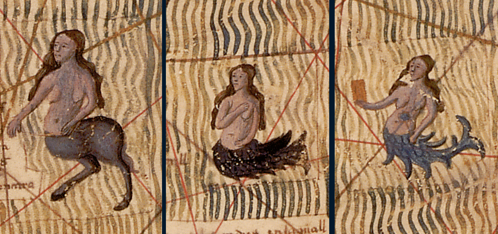

## Tweet 3 - Atlas de Cresques
>Esta imagen de una sirena de dos colas aparece en el Atlas de Cresques, 1345, en el océano Índico. La sirena de dos colas en Alquimia simboliza la dualidad, la unidad de tierra y agua, cuerpo y alma. #Halloween🎃 #MapasDelTerror2 👉 [http://www.ign.es/web/catalogo-cartoteca/resources/html/028743.html](http://www.ign.es/web/catalogo-cartoteca/resources/html/028743.html "Atlas de Cresques")

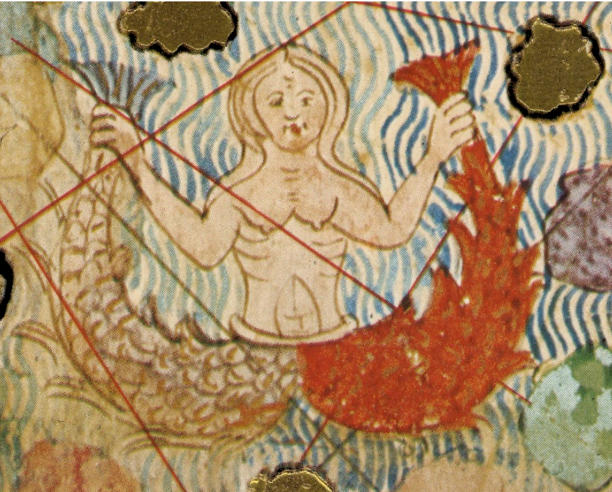

## Tweet 4 - Mapa de Walsperger
>Las imágenes de caníbales devorando hombres era un recurso muy utilizado para ilustrar zonas inexploradas. En el mapa de Walsperger, 1448, un caníbal aparece devorando un cuerpo humano #Halloween #MapasDelTerror2 👉
[http://www.ign.es/web/catalogo-cartoteca/resources/html/003866.html](http://www.ign.es/web/catalogo-cartoteca/resources/html/003866.html "Mapamundi de Andreas Walsperger")

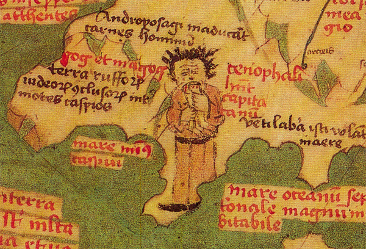

## Tweet 5 - Atlas Vallard
>El Atlas Vallard de 1547 muestra escenas macabras de descuartizaciones en las islas de la actual Indonesia. Las prácticas antropófagas tienen su origen en las historias de Marco Polo sobre los habitantes de Java Menor, o sea, de Sumatra. #Halloween🎃 #MapasDelTerror2 👉
[http://www.ign.es/web/catalogo-cartoteca/resources/html/031682.html](http://www.ign.es/web/catalogo-cartoteca/resources/html/031682.html "Atlas Vallard")

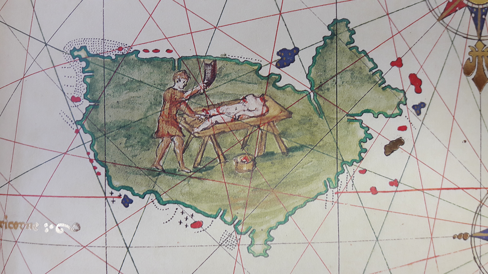

## Tweet 6 - Atlas de Diogo Homem
>Esta escena del atlas de Diogo Homem de 1565, en la que se muestra otra imagen de pesadilla con un hombre asando a otro al fuego, el autor la sitúa en la selva amazónica, en Brasil #Halloween🎃 #MapasDelTerror2 👉
[http://www.ign.es/web/catalogo-cartoteca/resources/html/031683.html](http://www.ign.es/web/catalogo-cartoteca/resources/html/031683.html "Atlas Diogo Homem")

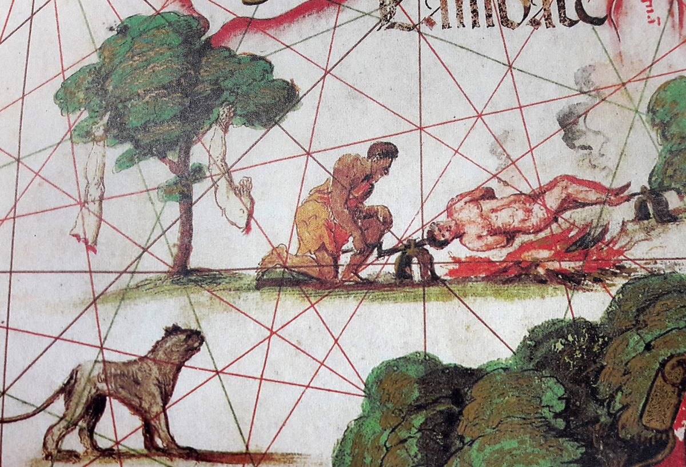

## Tweet 7 - Liber Chronicarum
>En el mapa del mundo del Liber Chronicarum, 1493 Hartmann Schedel dibuja en su margen criaturas fantásticas que pueblan las regiones más remotas: blemias, ambaris, arimaspos, cinocéfalos, hipopodios o panottis entre otros. #Halloween🎃 #MapasDelTerror2 👉
[http://www.ign.es/web/catalogo-cartoteca/resources/html/003866.html](http://www.ign.es/web/catalogo-cartoteca/resources/html/003866.html "Liber chronicarum")

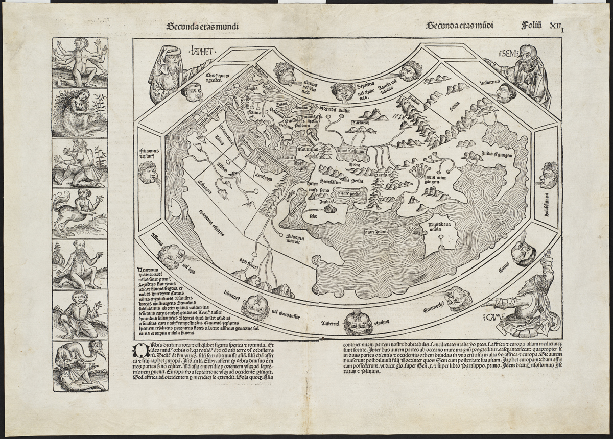

## Tweet 8 - Beato del Burgo de Osma
>El uso de criaturas fantásticas se remonta a la Edad Media. El esciápodo tenía un solo pie que usaba para protegerse del sol. Vivía en los lugares tórridos. Beato del Burgo de Osma, 1086 #Halloween🎃 #MapasDelTerror2

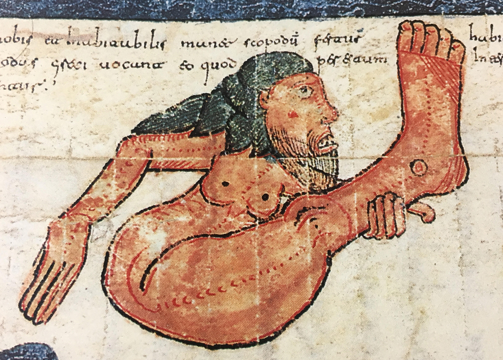

## Tweet 9 - Atlas de Diogo Homem
>Durante muchos años se creía que en la Patagonia vivían humanos gigantescos, los patagones. En esta imagen del atlas de Diogo Homem se muestran dos de estos seres #Halloween🎃 #MapasDelTerror2

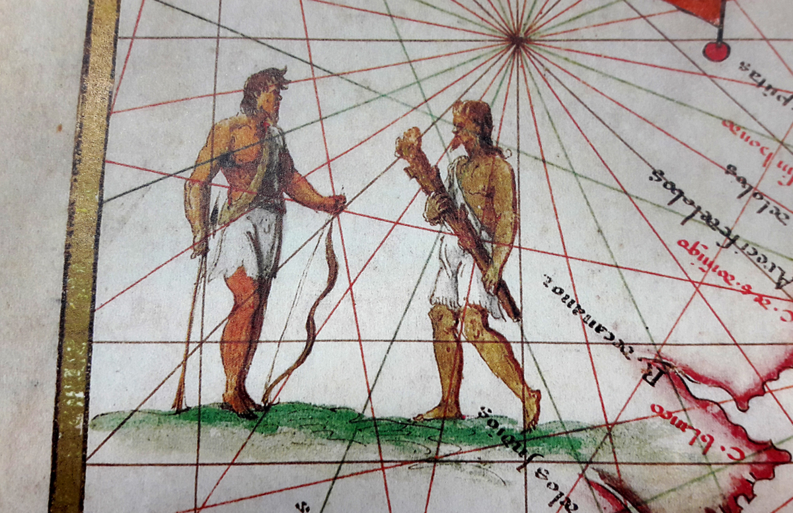

## Tweet 10 - Carta Marina de Olaus Magnus
>Carta Marina de Olaus Magnus, 1539. Ballenas grandes como islas donde podían desembarcar las tripulaciones, monstruos bicéfalos, langostas que atrapan marineros entre sus pinzas o barcos que ahuyentan ballenas con trompetas. #Halloween🎃 #MapasDelTerror2 👉
[http://www.ign.es/web/catalogo-cartoteca/resources/html/031696.html](http://www.ign.es/web/catalogo-cartoteca/resources/html/031696.html "Carta marina de Olaus Magnus")

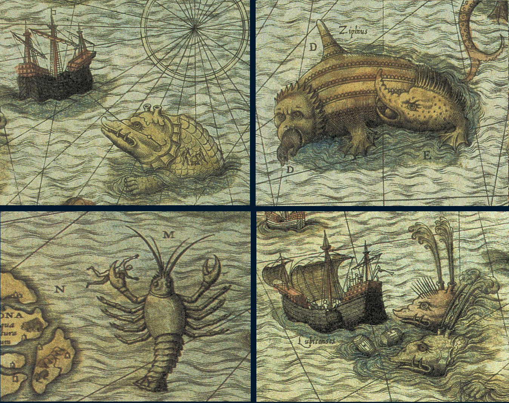

## Tweet 11 - Carta Marina de Olaus Magnus
>HC SVNT DRACONES, aquí hay dragones, una frase utilizada para los territorios inexplorados. Aparece en el Globo de Lenox grabado en cobre en 1510. Aquí mostramos una serpiente de mar de la Carta marina de Olaus Magnus en la versión de Antoine Lafrery.

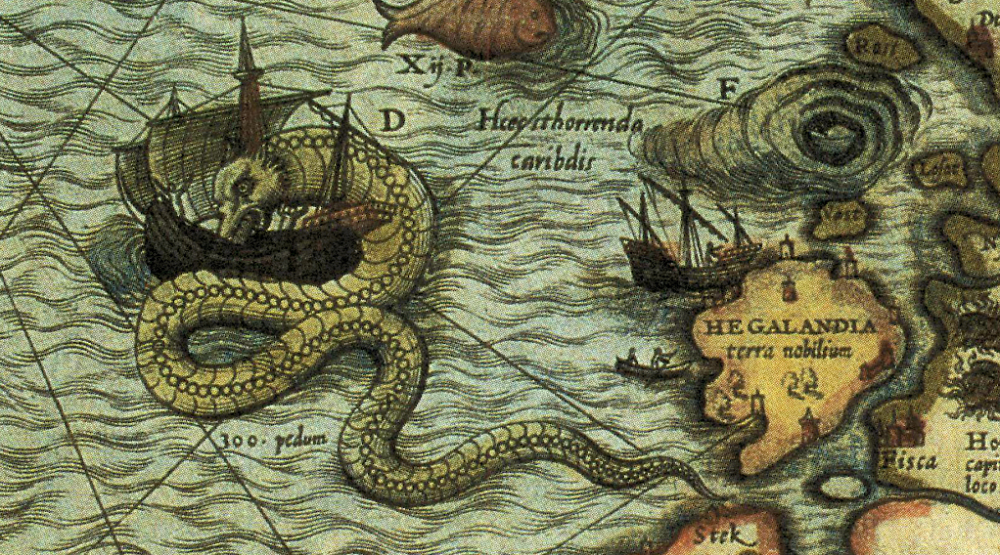

## Tweet 12 - Mapa de Gerard Van Keulen
>Las figuras mitológicas también son un recurso muy utilizado. Van Keulen muestra en la cartela de su carta nº 84 del Zee Atlas de 1709 al dios Neptuno blandiendo un tridente y montado en su carro, escoltado por dos tritones. #Halloween🎃 #MapasDelTerror2 👉
[http://www.ign.es/web/catalogo-cartoteca/resources/html/027475.html](http://www.ign.es/web/catalogo-cartoteca/resources/html/027475.html "Mapa de Gerard Van Keulen")

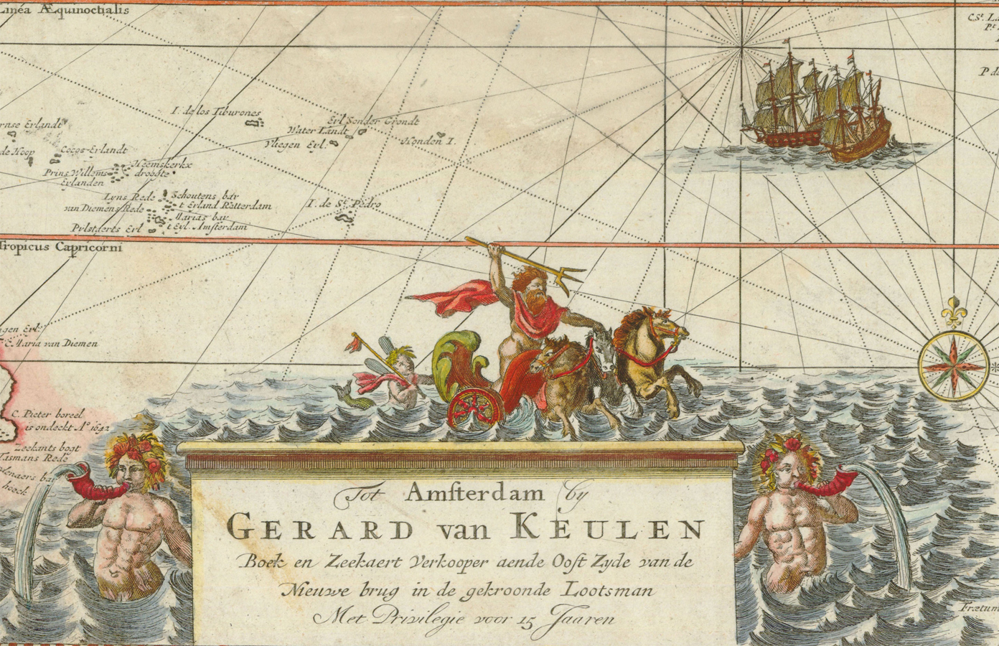

## Tweet 13 - Atlas Miller
>El Atlas Miller fue realizado por Lopo Homem, Pedro Reinel y su hijo Jorge. Antonio de Holanda participó como iluminador. En la hoja dedicada al Extremo oriente y el mar de la China, aparece la figura de este grifo. #Halloween🎃 #MapasDelTerror2 👉
[http://www.ign.es/web/catalogo-cartoteca/resources/html/031264.html](http://www.ign.es/web/catalogo-cartoteca/resources/html/031264.html "Atlas Miller")

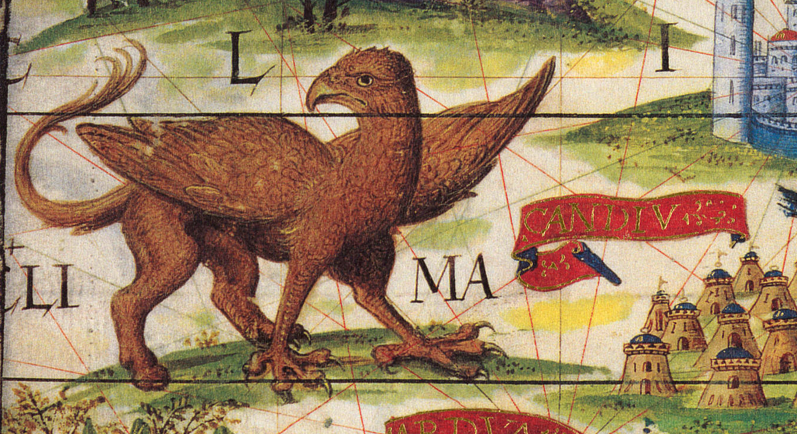

## Tweet 14 - Atlas Vallard
>En el Atlas Vallard de 1547 también aparecen criaturas mitológicas. En este caso un grupo de sátiros acompañando a un hombre ebrio a lomos de un burro sirve para decorar las cifras que indican la latitud en el margen de la hoja. #Halloween🎃 #MapasDelTerror2 👉
[http://www.ign.es/web/catalogo-cartoteca/resources/html/031682.html](http://www.ign.es/web/catalogo-cartoteca/resources/html/031682.html "Atlas Vallard")

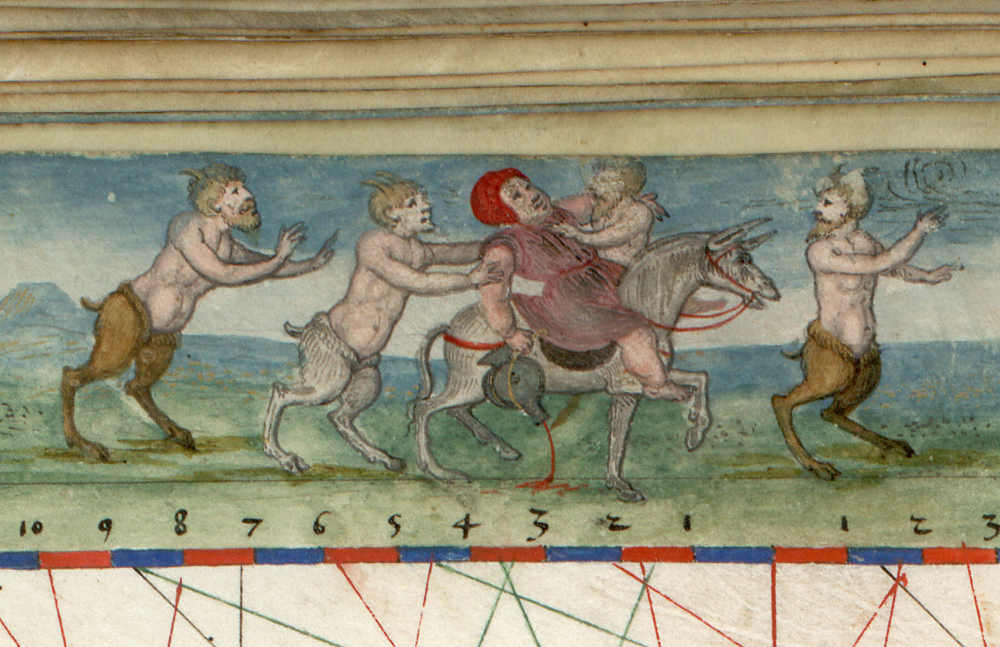

## Tweet 15 - Carta marina de Waldseemüller
>Carta marina de Waldseemüller, 1516. Aquí se representa al rey Manuel I de Portugal sobre un monstruo marino. La criatura marina se usa políticamente, como supremacía del hombre sobre las bestias del océano. #Halloween🎃 #MapasDelTerror2 👉 [http://www.ign.es/web/catalogo-cartoteca/resources/html/030952.html](http://www.ign.es/web/catalogo-cartoteca/resources/html/030952.html "Carta marina de 1516")

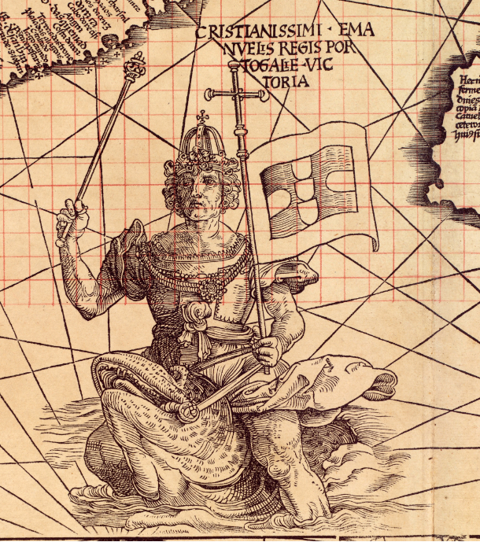
