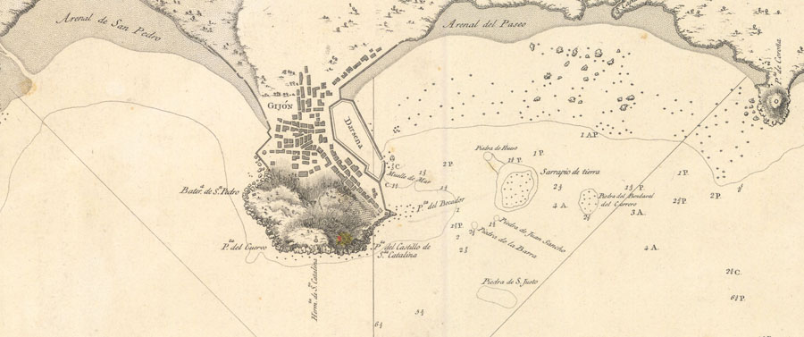
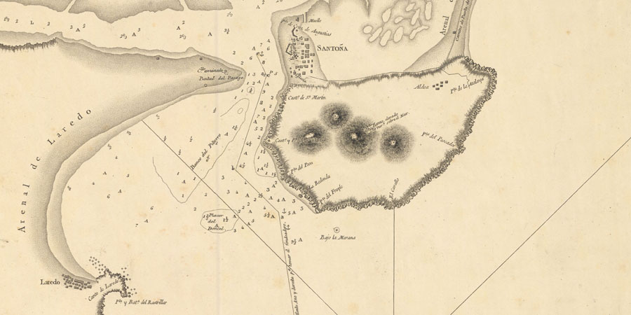
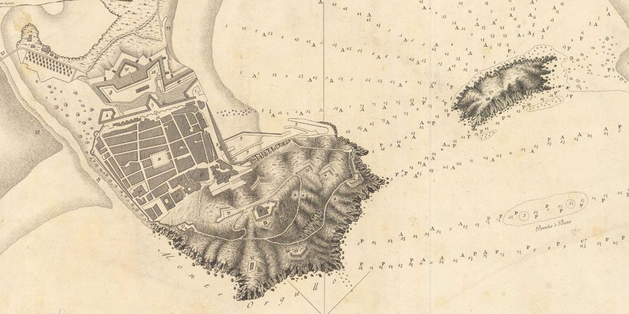
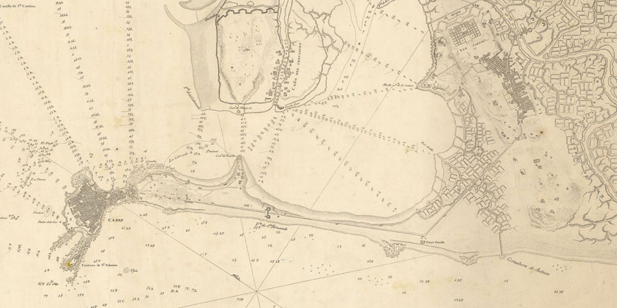
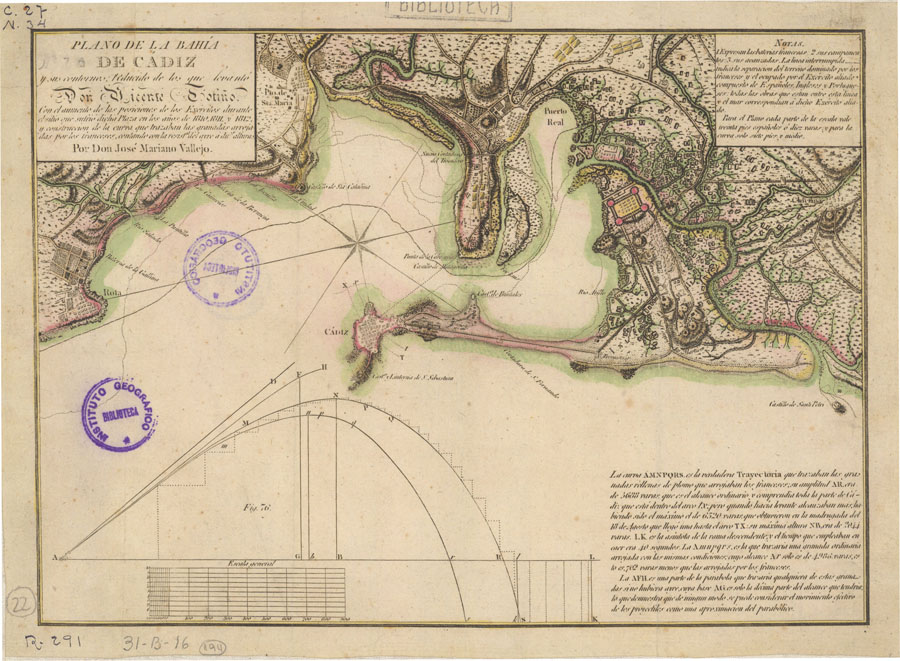

# Vicente Tofiño

1. **\#TalDíacomoHoy** en 1732 nace Vicente Tofiño en la ciudad de Cádiz. **\#cartonautas** **\#cartohilo**. 
2. Vicente Tofiño, marino y cosmógrafo, nació  **\#TalDíacomoHoy** en la ciudad de Cádiz en  1732.
3. Estudió física experimental. En 1755 fue llamado por Jorge Juan, como maestro de matemáticas de la Academia de Guardia Marinas de Cádiz.
4. Plano de la Concha de Gijón, 1787, disponible en http://www.ign.es/web/catalogo-cartoteca/resources/html/000904.html @ignspain

5. Fue miembro de la Academia de la Historia. Elaboró un Atlas Marino de España, islas Azores y adyacentes.
6. Vicente Tofiño. Puerto de Santoña y arenal de Laredo, 1788, disponible en http://www.ign.es/web/catalogo-cartoteca/resources/html/000752.html @ignspain

7. Tofiño fue director de las Academias de Guardiamarinas de Cádiz, El Ferrol y Cartagena. Detalle del plano de la concha de San Sebastián, disponible en http://www.ign.es/web/catalogo-cartoteca/resources/html/000825.html @ignspain

8. Vicente Tofiño. Cádiz, su bahía y la Isla del León, disponible en http://www.ign.es/web/catalogo-cartoteca/resources/html/000138.html @ignspain

9. Mariano Vallejo. Plano del sitio de la Bahía Cádiz a partir de los planos de Vicente Tofiño, disponible en http://www.ign.es/web/catalogo-cartoteca/resources/html/016358.html @ignspain

