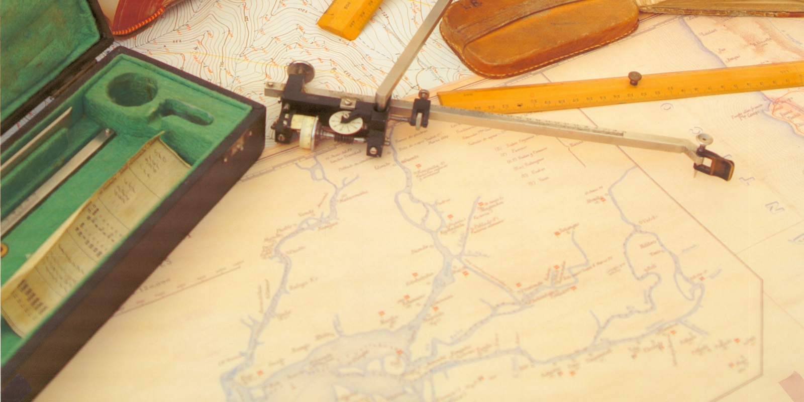
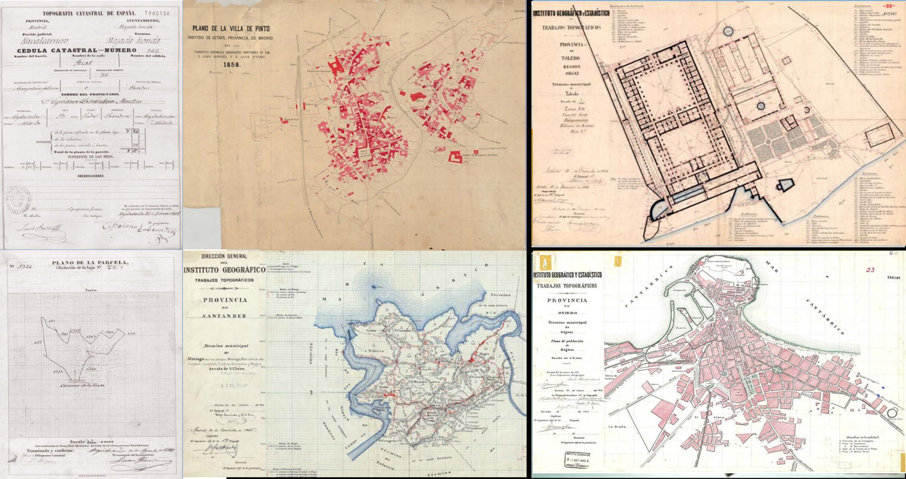
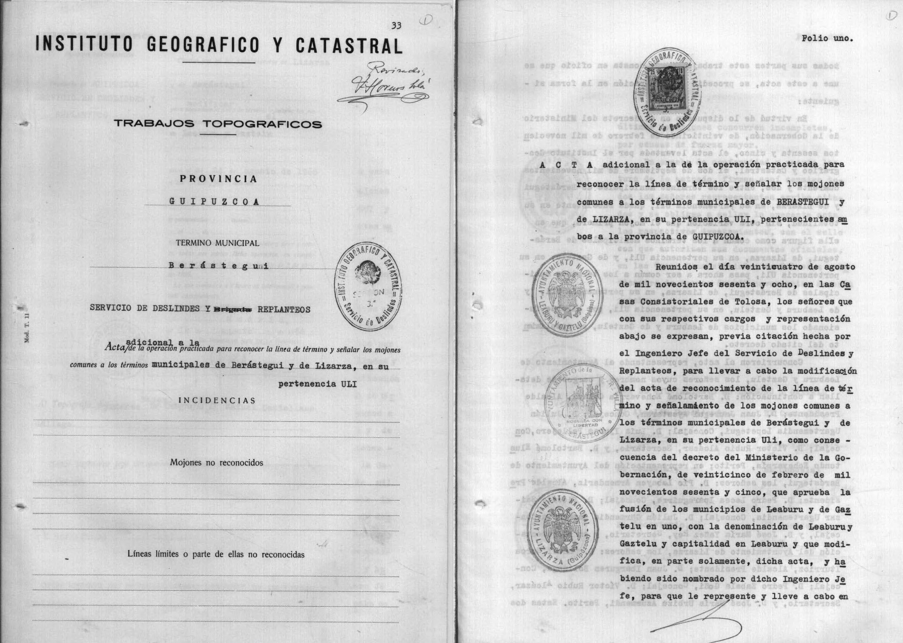
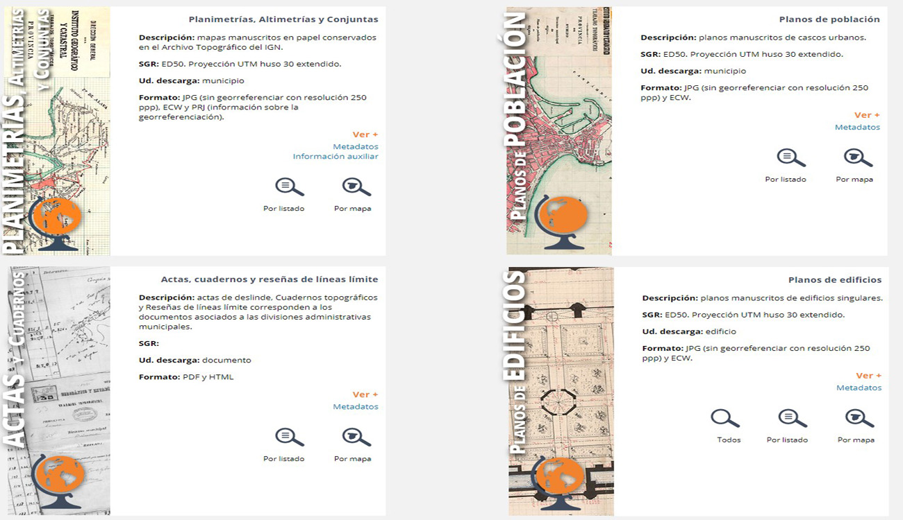
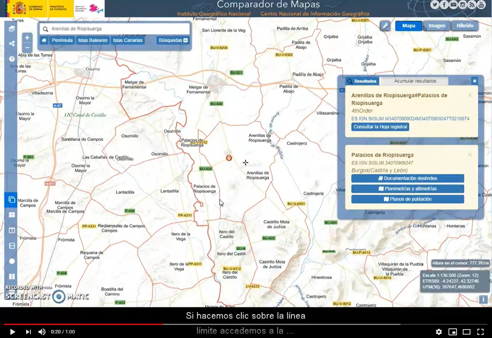
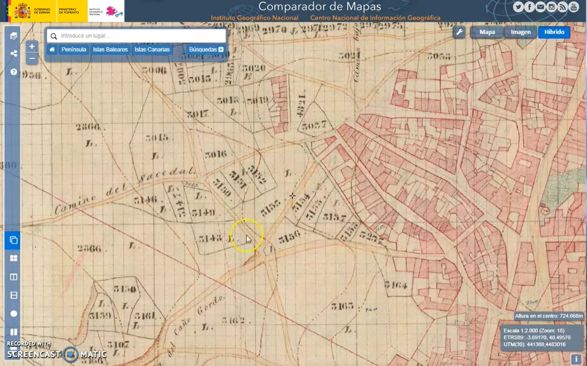

# 🗄 Tweets de Archivo Topográfico

Propuestas de mensajes para difundir en redes sociales. Los mensajes están pensados para Twitter, aunque también puede mostrarse en Instagram o Facebook. Si al pegar en el editor de tweets se supera el tamaño máximo, utilizar acortador de URL´s o los hashtags vigentes del día que toque, que no se pueden averiguar con mucha antelación, porque responden a los *trending topics* del día, para obtener mensajes dentro de la longitud máxima permitida.

Los tweets contienen también *hashtags* propuestos y en ocasiones menciones a otras cuentas que pretenden establecer relaciones. El uso de emoticonos también está incluido.

* [Tweets por día.](#Tweets-por-día)
* [Hilos disponibles.](#Hilos-disponibles)

## Tweets por día

---
### ⌛14 de abril

En el **Día del Bando**, día grande de las fiestas de #Murcia, os mostramos este plano del parcelario urbano de Murcia de la Junta General de Estadística #IGN150años #IGNAniversario🎂 

* 📜 Manuscrito 300816 - ⌛ 1860 
* 🗄 Archivo Topográfico de @IGNSPAIN - Sign.05B03
* 🔗 Descarga  https://centrodedescargas.cnig.es/CentroDescargas/buscar.do?filtro.codFamilia=PLPOB&filtro.codIne=34143030030

---
### ⌛26 de abril

#TalDíaComoHoy en 1822 nace en Jaén Francisco Coello. Destacó en su labor al frente de los trabajos catastrales en la Junta General de Estadística. Las hojas kilométricas que custodia el #ArchivTopo🗄 son fruto de su contribución. #OTD #IGN150años #IGNAniversario🎂

### ⌛28 de abril

Hoy día de San prudencio, patrón de Álava, os traemos esta planimetría del municipio de Vitoria-Gasteiz.

* 📜 Manuscrito 010084 - ⌛ 1922 
* 🗄 Archivo Topográfico de @IGNSPAIN - 🗃01A01
* 🔗 Descarga  https://centrodedescargas.cnig.es/CentroDescargas/busquedaIdProductor.do?idProductor=010084&Serie=MIPAC

## Hilos disponibles

### 🧵 Hilo presentación del Archivo topográfico
---
#### Tweet 1/6

Este año @IGNSpain celebra sus 150 años. En su interior, guarda unos de los tesoros cartográficos manuscritos más importantes de los siglos XIX y XX. El Archivo Topográfico #ArchivTopo🗄. #IGN150años #IGNAniversario🎂

[🔗 https://www.ign.es/web/ign/portal/ic-servicio-documentacion](https://www.ign.es/web/ign/portal/ic-servicio-documentacion)

#### Tweet 2/6

El #ArchivTopo🗄 almacena la documentación técnica generada por el @IGNSpain desde su fundación hasta la llegada de los métodos de fotogrametría aérea. También los documentos procedentes la Junta General de Estadística. #IGN150años #IGNAniversario🎂

#### Tweet 3/6

Nuestro #ArchivTopo🗄 está en constante crecimiento. En la actualidad almacena documentación generadas por el Servicio de Delimitaciones Territoriales: actas de línea límite, cuadernos de itinerarios y reseñas de mojones. #IGN150años #IGNAniversario🎂

#### Tweet 4/6

El #ArchivTopo🗄 ha digitaliziado sus fondos para ponerlos a disposición de todos los ciudadanos, distribuyendo su información desde el Centro de Descargas de @IGNSpain #IGN150años #IGNAniversario🎂
[🔗 http://centrodedescargas.cnig.es/CentroDescargas/](http://centrodedescargas.cnig.es/CentroDescargas/)

#### Tweet 5/6

La consulta de los fondos cartográficos del #ArchivTopo🗄 también es posible a través del visor de Mapas antiguos de @IGNSpain

[🔗🎬 https://youtu.be/CrZqW9ZknuQ](https://youtu.be/CrZqW9ZknuQ) #IGN150años #IGNAniversario🎂

#### Tweet 6/6

El Comparador del #ArchivTopo🗄 permite el acceso a las Hojas Kilométricas 📜 de la Junta Gral de Estadística, levantadas en la década de 1860, y sus cédulas catastrales. Primer Catastro parcelario realizado en 🇪, disponible para todos #IGN150años #IGNAniversario🎂

[🔗🎬 https://youtu.be/Y7muqFk1UoY](https://youtu.be/Y7muqFk1UoY) 

