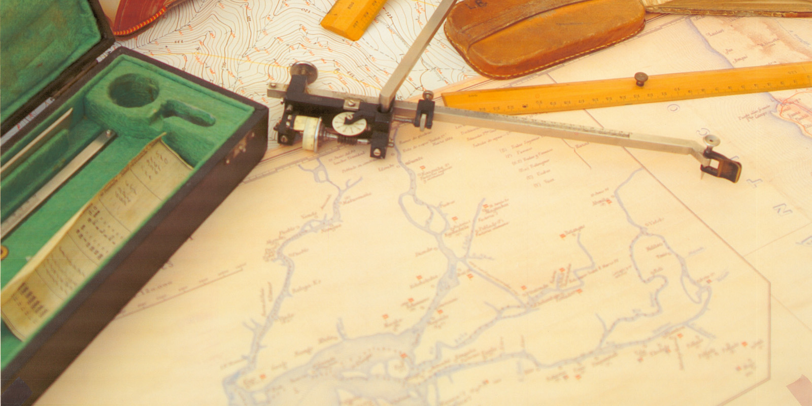
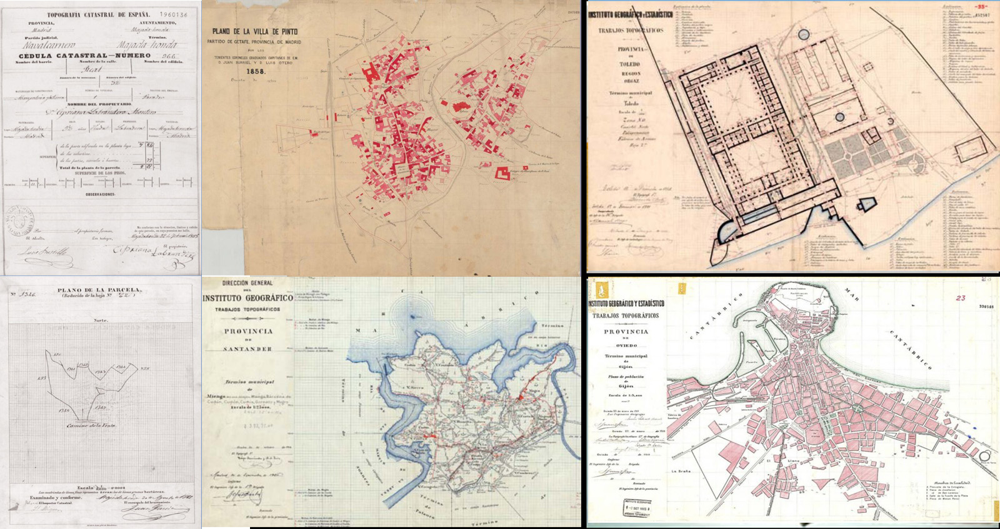
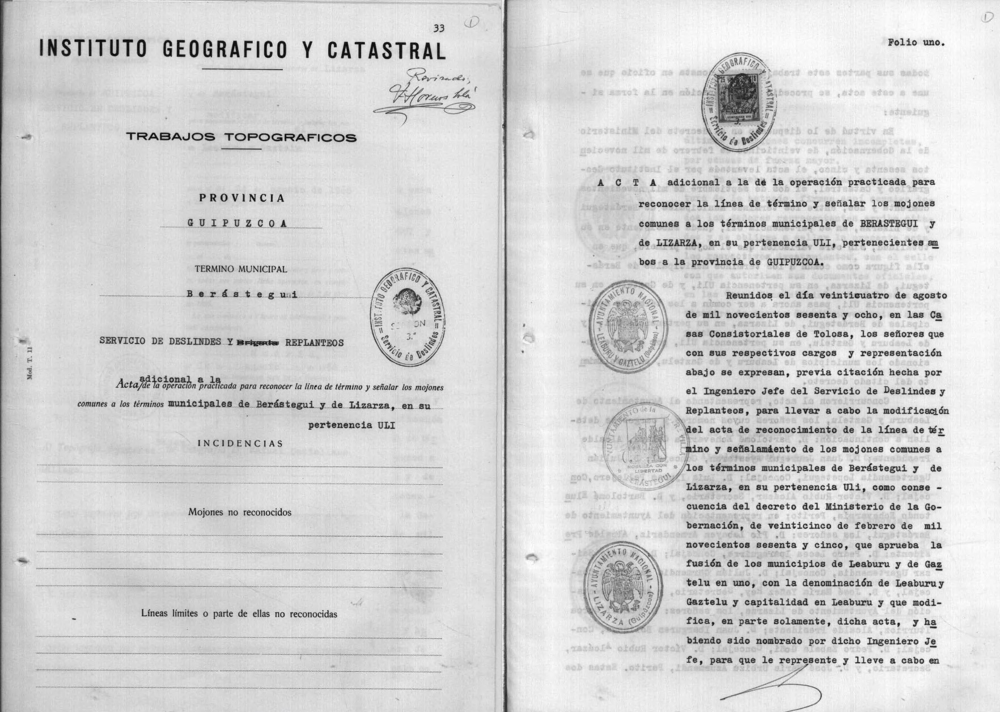
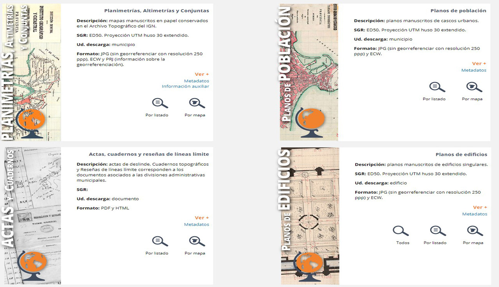
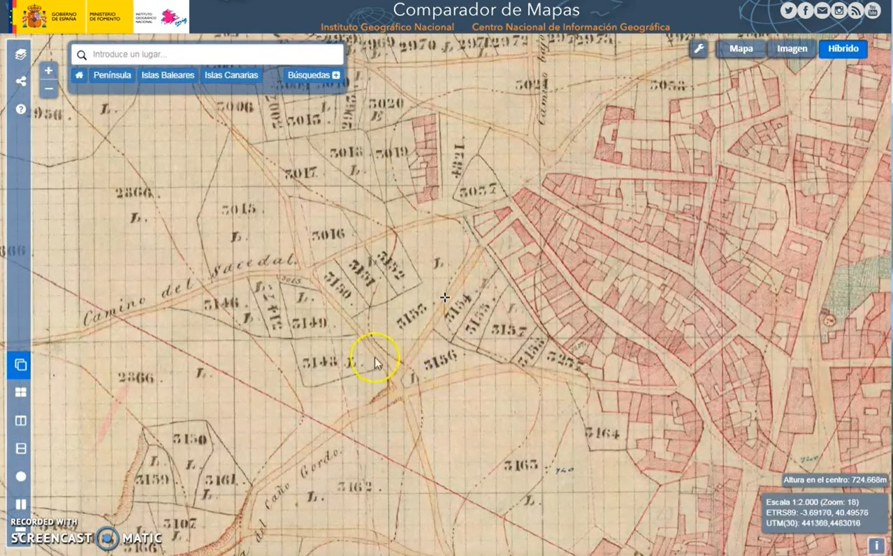

# Hilos del Archivo Topográfico 🗄

## Hilos disponibles

### 🧵 Hilo presentación del Archivo topográfico
---
#### Tweet 1/6

Este año @IGNSpain celebra sus 150 años. En su interior, guarda unos de los tesoros cartográficos manuscritos más importantes de los siglos XIX y XX. El Archivo Topográfico #ArchivTopo🗄. #IGN150años #IGNAniversario🎂

[🔗 https://www.ign.es/web/ign/portal/ic-servicio-documentacion](https://www.ign.es/web/ign/portal/ic-servicio-documentacion)

#### Tweet 2/6

El #ArchivTopo🗄 almacena la documentación técnica generada por el @IGNSpain desde su fundación hasta la llegada de los métodos de fotogrametría aérea. También los documentos procedentes la Junta General de Estadística. #IGN150años #IGNAniversario🎂

#### Tweet 3/6

Nuestro #ArchivTopo🗄 está en constante crecimiento. En la actualidad almacena documentación generadas por el Servicio de Delimitaciones Territoriales: actas de línea límite, cuadernos de itinerarios y reseñas de mojones. #IGN150años #IGNAniversario🎂

#### Tweet 4/6

El #ArchivTopo🗄 ha digitalizado sus fondos para ponerlos a disposición de todos los ciudadanos, distribuyendo su información desde el Centro de Descargas de @IGNSpain #IGN150años #IGNAniversario🎂
[🔗 http://centrodedescargas.cnig.es/CentroDescargas/](http://centrodedescargas.cnig.es/CentroDescargas/)

#### Tweet 5/6

La consulta de los fondos cartográficos del #ArchivTopo🗄 también es posible a través del visor de Mapas antiguos de @IGNSpain

[🔗🎬 https://youtu.be/CrZqW9ZknuQ](https://youtu.be/CrZqW9ZknuQ) #IGN150años #IGNAniversario🎂

#### Tweet 6/6

El Comparador del #ArchivTopo🗄 permite el acceso a las Hojas Kilométricas 📜 de la Junta Gral de Estadística, levantadas en la década de 1860, y sus cédulas catastrales. Primer Catastro parcelario realizado en 🇪, disponible para todos #IGN150años #IGNAniversario🎂

[🔗🎬 https://youtu.be/Y7muqFk1UoY](https://youtu.be/Y7muqFk1UoY) 