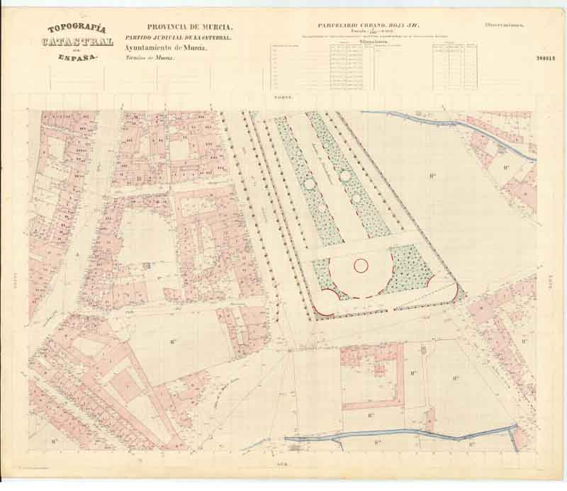
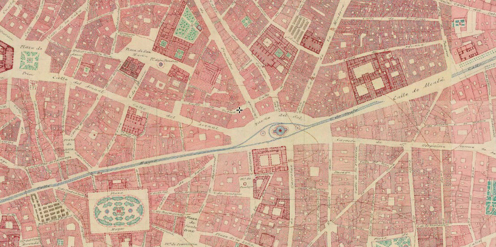
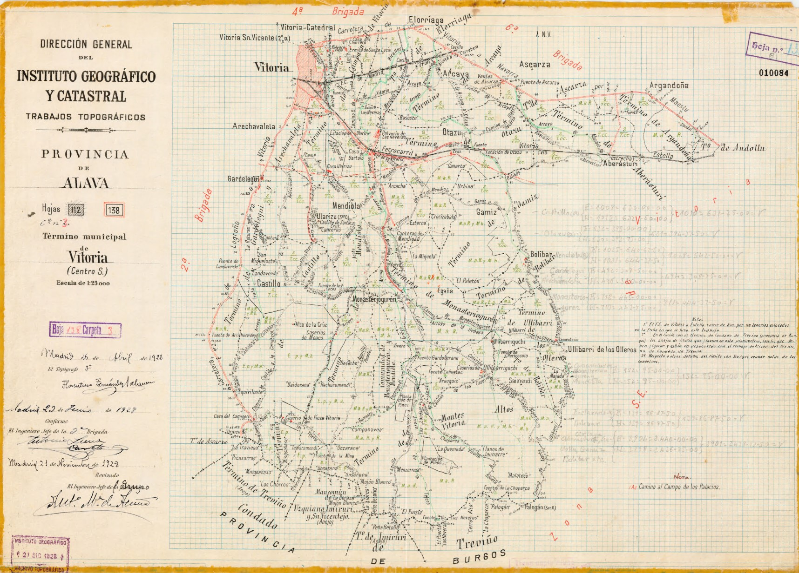

# 🗄 Tweets de Archivo Topográfico mes de abril

Propuestas de mensajes para difundir en redes sociales. Los mensajes están pensados para Twitter, aunque también puede mostrarse en Instagram o Facebook. Si al pegar en el editor de tweets se supera el tamaño máximo, utilizar acortador de URL´s o los hashtags vigentes del día que toque, que no se pueden averiguar con mucha antelación, porque responden a los *trending topics* del día, para obtener mensajes dentro de la longitud máxima permitida.

Los tweets contienen también *hashtags* propuestos y en ocasiones menciones a otras cuentas que pretenden establecer relaciones. El uso de emoticonos también está incluido.

* [Tweets por día.](#Tweets-por-día)
* [Hilos disponibles.](#Hilos-disponibles)
* [Volvera la página principal](README.md)

## Tweets por día

---
### ⌛14 de abril

En el **Día del Bando**, día grande de las fiestas de #Murcia, os mostramos este plano del parcelario urbano de Murcia de la Junta General de Estadística #IGN150años #IGNAniversario🎂 

* 📜 Manuscrito 300816 - ⌛ 1860 
* 🗄 Archivo Topográfico de @IGNSPAIN - Sign.05B03
* 🔗 Descarga  https://centrodedescargas.cnig.es/CentroDescargas/buscar.do?filtro.codFamilia=PLPOB&filtro.codIne=34143030030

---
### ⌛26 de abril

#TalDíaComoHoy en 1822 nace en Jaén Francisco Coello. Destacó en su labor al frente de los trabajos catastrales en la Junta General de Estadística. Las hojas kilométricas que custodia el #ArchivTopo🗄 son fruto de su contribución. #OTD #IGN150años #IGNAniversario🎂

---
### ⌛28 de abril

Hoy día de San prudencio, patrón de Álava, os traemos esta planimetría del municipio de Vitoria-Gasteiz.

* 📜 Manuscrito 010084 - ⌛ 1922 
* 🗄 Archivo Topográfico de @IGNSPAIN - 🗃01A01
* 🔗 Descarga  https://centrodedescargas.cnig.es/CentroDescargas/busquedaIdProductor.do?idProductor=010084&Serie=MIPAC

