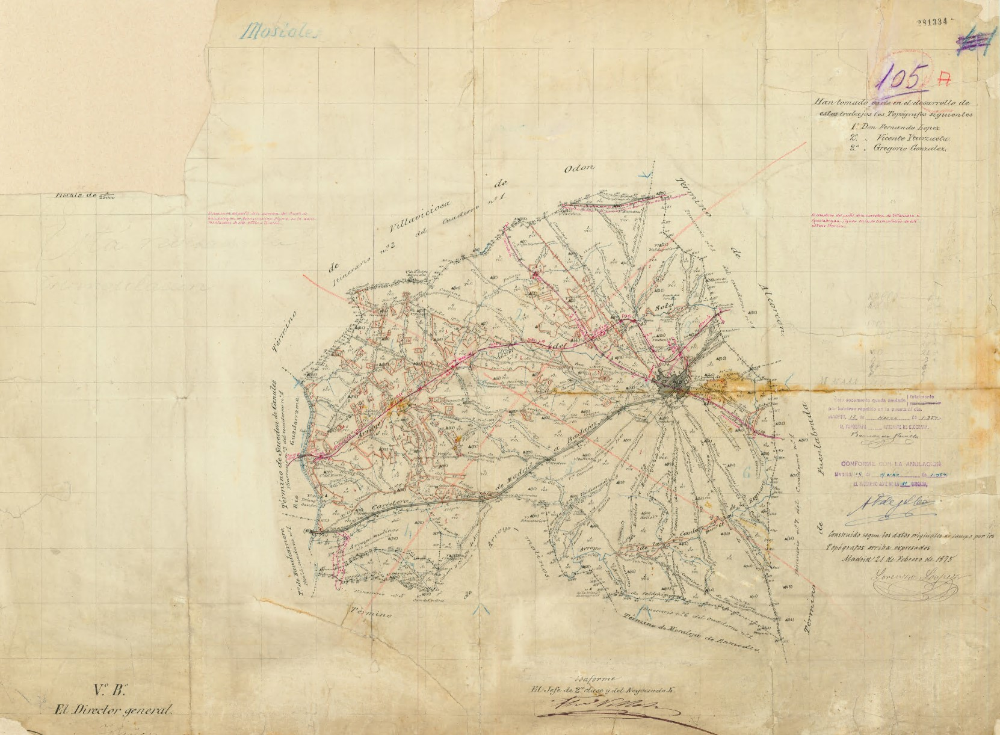

# 🗄 Tweets de Archivo Topográfico mes de mayo

Propuestas de mensajes para difundir en redes sociales. Los mensajes están pensados para Twitter, aunque también puede mostrarse en Instagram o Facebook. Si al pegar en el editor de tweets se supera el tamaño máximo, utilizar acortador de URL´s o los hashtags vigentes del día que toque, que no se pueden averiguar con mucha antelación, porque responden a los *trending topics* del día, para obtener mensajes dentro de la longitud máxima permitida.

Los tweets contienen también *hashtags* propuestos y en ocasiones menciones a otras cuentas que pretenden establecer relaciones. El uso de emoticonos también está incluido.

* [Tweets por día.](#Tweets-por-día)
* [Hilos disponibles.](#Hilos-disponibles)
* [Volvera la página principal](README.md)

## Tweets por día

---
### ⌛2 de mayo

En este día en que recordamos el levantamiento contra la invasión francesa en 1808, os traemos esta planimetría de 1875 de municipio de Móstoles, primera ciudad en lanzarse a la calle

* 📜 Manuscrito 281334 - ⌛ 1875 
* 🗄 Archivo Topográfico del IGN - 🗃05A06
* 🔗 Descarga  https://centrodedescargas.cnig.es/CentroDescargas/busquedaIdProductor.do?idProductor=281334&Serie=MIPAC

---
### ⌛13 de mayo

Hoy es la festividad de San Pedro Regalado, patrón de Valladolid. En el #ArchivTopo🗄 de @IGNSpain tenemos las hojas del plano de población de Valladolid de 1915. En la imagen la hoja del 🌳 Parque Campo Grande

* 📜 Manuscrito 470702 - ⌛ 1915 
* 🗄 Archivo Topográfico del IGN - 🗃07B14
* 🔗 Descarga [http://centrodedescargas.cnig.es/CentroDescargas/buscar.do?filtro.codFamilia=PLPOB&filtro.codIne=34074747186](http://centrodedescargas.cnig.es/CentroDescargas/buscar.do?filtro.codFamilia=PLPOB&filtro.codIne=34074747186)
