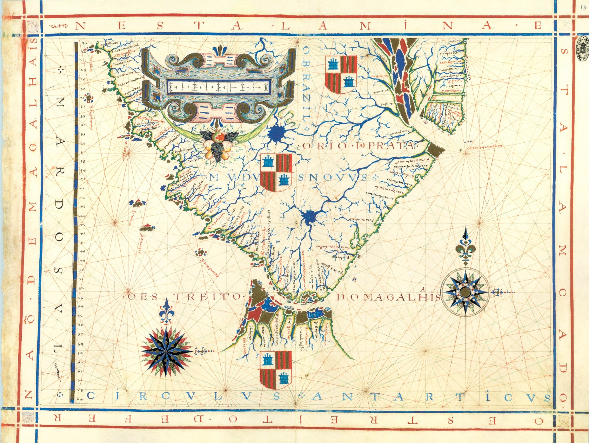
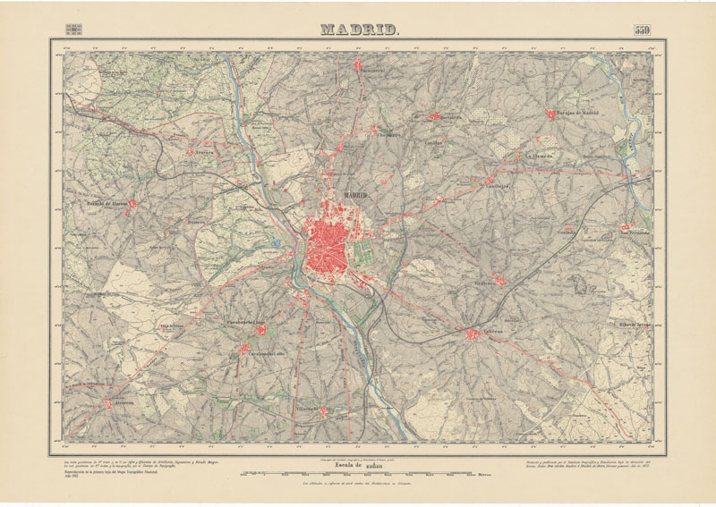
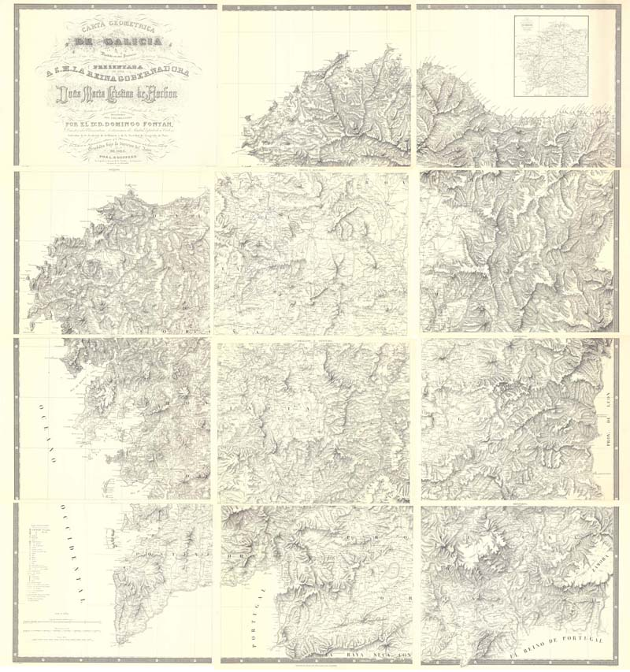
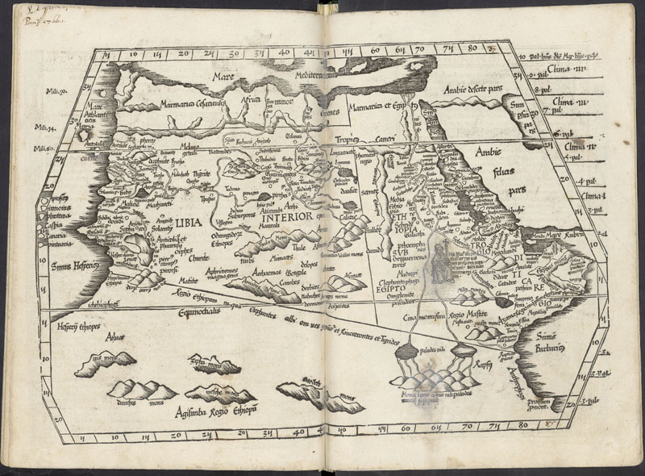
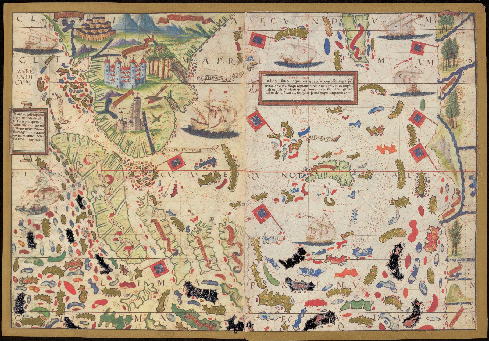
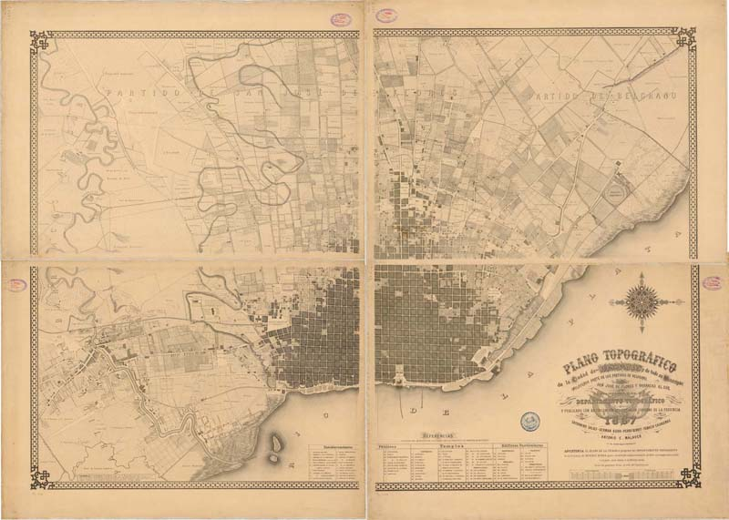

#  🧭️ Tweets de Cartoteca

Relación de tweets propuestos para publicar en redes sociales. Twitter cuenta los caracteres del tweet de forma poco ortodoxa cuando hay enlaces presentes, luego es difícil saber cuantos caracteres asignará al twwet. Por ello, alguno puede superar los 280 caracteres permitidos. En esos casos, pueden hacerse varias cosas:

* Reducir los hashtags o utilizar los hashtags del día o *trending topics*.
* Utilizar emoticonos [👉 Emojipedia ](https://emojipedia.org/)
* Acortadores de URL.
* Reestructurar el enunciado variando verbos y contracciones.

Los *tweets* se escriben para fechas concretas, pero en ocasiones el mensaje es válido para cualquier día del mes. Utilizar según conveniencia. Es importante vincular con otras cuentas, oficiales y de organismos extranjeros relacionados con la cartografía, que nos permitan crear sinergias entre instituciones que mejoren el posicionamiento del *tweet*. Consultar siempre los *trending topics* del día por si alguno encaja.

A ser posible homogeneizar los *hashtags* como *#VCentenario*, *#TalDíaComoHoy*, *#MapasAntiguos*,  *#OldMaps*, *mapaDelViernes* y meter siempre que se pueda los *#IGN150años* y  *#IGNAniversario🎂*.

Hay iniciativas cartográficas que se repiten con relativa tradición en Twitter, como *#mapaDelViernes* ó *#FridayMap* o la de *#MapMonsterMonday* que comenzaron en [@LOCMaps](https://twitter.com/LOCMaps) hace años y muchas cartotecas del mundo se suman. Recientemente por la crisis del **COVID-19** la inciativa *#mapsAtHome* se ha puesto de moda. Con todo esto quiero decir que puede ser interesante instaurar rutinas, aunque sea una sola, de tal manera que los seguidores se acostumbren a que ciertos días hay ciertas publicaciones. Esto ayuda a las búsquedas y ayuda a crear *tweets* de gran difusión.

Si utilizamos otras redes sociales como **Instagram**, donde no se pueden meter enlaces, sí es necesario aportar suficientes etiquetas como: *#Mapas&Historia #mapasantiguos #cartografiaantigua #mapamanuscrito #primerosmapas #edaddeorocartografia #historia #mapascuriosos #curiosidadescartograficas #maps #cartography #history #first #antiquemaps #navigation #history #instrument #antiques #old #raremap #instamaps #instaantiques #collection  #antiquemaps #antique #history  #map #globe #antiquebooks*. En esta red social sí se podría meter el contenido completo del campo **T500**, ya que permiten textos largos.

## Índice

* [Tweets por día.](#Tweets-por-día)
* [Hilos disponibles.](#Hilos-disponibles)

## Tweets por día

---
### ⌛Mes de abril

Abril hace 500 años. La expedición de #MagallanesElcano comenzó su invernada en el Puerto de San Julián. Estuvieron atracados tres meses.  #VCentenario #QuédateEnCasa

* 📜 Atlas Universal - Hoja 4 ⌛1565
* 🎨 Diogo Homem
* 🏛 Cartoteca de @IGNSpain - 🗃 92-201
* [🔗 https://www.ign.es/web/catalogo-cartoteca/resources/html/031683.html](https://www.ign.es/web/catalogo-cartoteca/resources/html/031683.html)

---
### ⌛14 de abril

El general Ibáñez de Ibero, primer director de @IGNSpain, nació #TalDíaComoHoy de 1825 en Barcelona. Bajo su dirección se publicó la primera hoja del MTN50. #OTD #IGN150años #IGNAniversario🎂 #MapasAntiguos #OldMaps

* 📜 Hoja MTN50 nº559, ⌛1875 
* 🏛 Cartoteca de @IGNSpain - 🗃32-C-35
* [🔗 https://www.ign.es/web/catalogo-cartoteca/resources/html/030863.html](https://www.ign.es/web/catalogo-cartoteca/resources/html/030863.html)

---
### ⌛17 de abril

Domingo Fontán nació #TalDíaComoHoy en 1788 en Portas, provincia de #Pontevedra. Geógrafo y matemático. Director del @RObsMadrid. Autor del primer mapa topográfico y científico de Galicia. #OTD #IGN150años #MapasAntiguos #OldMaps

* 📜 Carta geométrica de Galicia, ⌛1845
* 🏛 Cartoteca de @IGNSpain - 🗃41-L-1
* [🔗 https://www.ign.es/web/catalogo-cartoteca/resources/html/002693.html](https://www.ign.es/web/catalogo-cartoteca/resources/html/002693.html)

---
### ⌛21 de abril

Pedro Páez llega a las fuentes del Nilo en 1618 #TalDíaComoHoy. Representación ptolemaica del Nilo, desde los Montes de la Luna al delta #MapasAntiguos #OldMaps

* 📜 Tabula IIII. Aphricae ⌛1525
* 🎨 Laurentius Phrisius
* 🏛 Cartoteca de @IGNSpain - 🗃912-19(28B)
[🔗 https://www.ign.es/web/catalogo-cartoteca/resources/html/031058.html](https://www.ign.es/web/catalogo-cartoteca/resources/html/031058.html)

---
### ⌛22 de abril

El Tratado de Zaragoza entre España 🇪🇸 y Portugal 🇵 se firmó #TalDíaComoHoy en 1529. Delimitaba las zonas de influencia portuguesa y española en Asia. #Mapas&Historia #OTD #MapHistory

* 📜 Atlas Miller. Molucas ⌛1525
* 🎨 Reinel, Homem y Antonio de Holanda
* 🏛 Cartoteca de @IGNSpain - 🗃NC424
* [🔗 https://www.ign.es/web/catalogo-cartoteca/resources/html/032013.html](https://www.ign.es/web/catalogo-cartoteca/resources/html/032013.html)

---
### ⌛27 de abril

La carta marina de Antonio Lafrery, copia de la original de Olaus Magnus, contiene decenas de monstruos, como esta serpiente marina frente a las costas holandesas #MapMonsterMonday #oldmaps 

* 📜 Carta Marina. Molucas ⌛1539
* 🎨 Antonio Lafréry
* 🏛 Cartoteca de @IGNSpain - 🗃F-21-12
* [🔗 https://www.ign.es/web/catalogo-cartoteca/resources/html/031696.html](https://www.ign.es/web/catalogo-cartoteca/resources/html/031696.html)

---
### ⌛30 de abril

El gran matemático Carl F. Gauß nace en Brunswick 🇩 #TalDíaComoHoy en 1777. La proyección Gauss-Krüger es usada en la representación de países como Argentina.

* 📜 Buenos Aires ⌛1867
* 🎨 Carlos Glade
* 🏛 Cartoteca de @IGNSpain - 🗃S1-138-L-25
* [🔗 https://www.ign.es/web/catalogo-cartoteca/resources/html/001508.html](https://www.ign.es/web/catalogo-cartoteca/resources/html/001508.html)