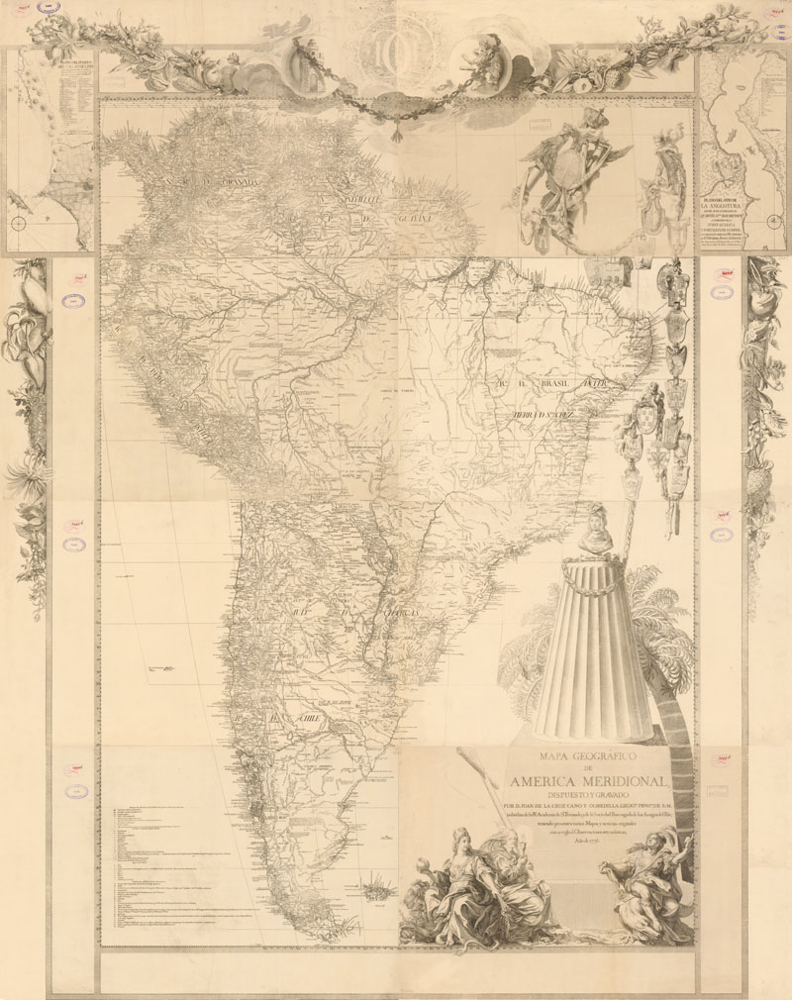

# 🧭️ Tweets de Cartoteca mes de mayo

## Índice

* [Tweets por día.](#Tweets-por-día)
* [Hilos disponibles.](#Hilos-disponibles)
* [Volvera la página principal](README.md)

## Tweets por día

---
### ⌛14 de mayo

El cartógrafo Juan de la Cruz Cano nació #TalDíaComoHoy en 1734. Realizó el mapa más completo de América de Sur del siglo XVIII. Compuesto de ocho hojas, el mapa mide más de 2 metros de altura #OTD #IGN150años #IGNAniversario🎂 #MapasAntiguos #OldMaps

* 📜 Mapa geográfico de América meridional, 1775 
* 🏛 Cartoteca de @IGNSpain - 🗃S1-138-M-5
* [🔗 https://www.ign.es/web/catalogo-cartoteca/resources/html/001500.html](https://www.ign.es/web/catalogo-cartoteca/resources/html/001500.html)

---
### ⌛26 de mayo

 #TalDíaComoHoy fallece Sebastian Münster en 1552. En 1544 realizó la primera traducción de la Cosmographia de Ptolomeo al alemán. Contenía 471 xilografías y 26 mapas en seis volúmenes #OTD #IGN150años #IGNAniversario🎂 #MapasAntiguos #OldMaps

* 📜 Moderna Europeau Descriptio, 1550 
* 🏛 Cartoteca de @IGNSpain - 🗃13-D-39
* [🔗 https://www.ign.es/web/catalogo-cartoteca/resources/html/031100.html](https://www.ign.es/web/catalogo-cartoteca/resources/html/031100.html)

