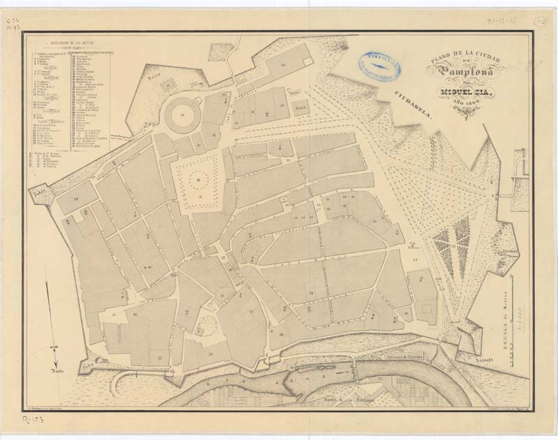

# 🧭️ Tweets de Cartoteca mes de julio

## Índice

* [Tweets por día.](#Tweets-por-día)
* [Hilos disponibles.](#Hilos-disponibles)
* [Volvera la página principal](README.md)

## Tweets por día

---
### ⌛7 de julio

Hoy es el día de grande de las fiestas de San Fermín, y traemos este plano de la ciudad de Pamplona del siglo XIX. #SanFermines2020 #IGN150años #IGNAniversario🎂 #MapasAntiguos #OldMaps

* 📜 Plano de la Ciudad de Pamplona, 1866 
* 🎨 Miguel Cía
* 🏛 Cartoteca de @IGNSpain - 🗃31-D-16
* [🔗 https://www.ign.es/web/catalogo-cartoteca/resources/html/016379.html](https://www.ign.es/web/catalogo-cartoteca/resources/html/016379.html)
