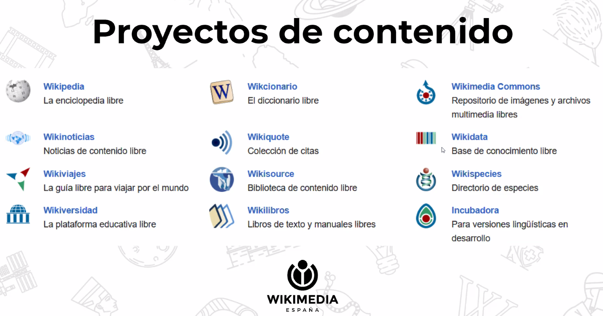
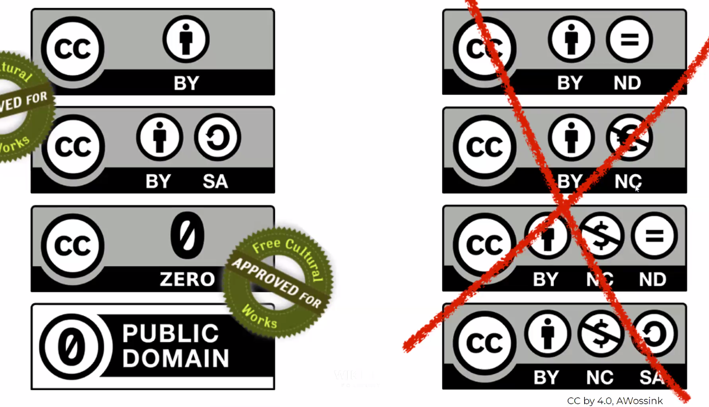
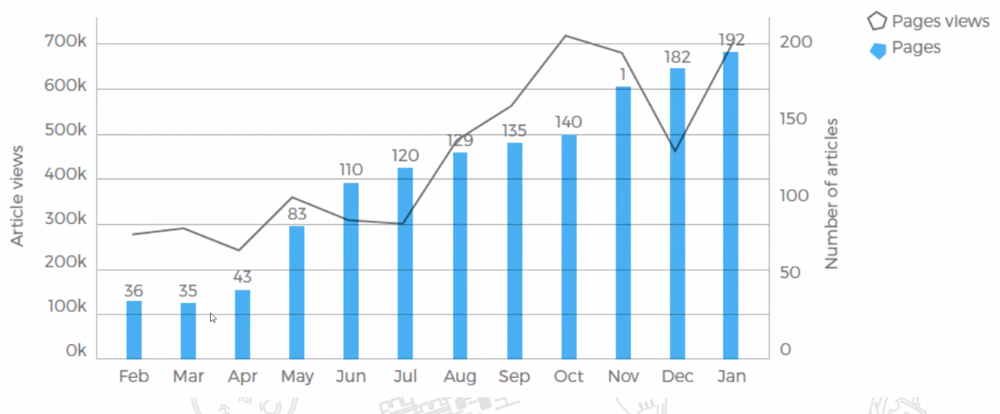
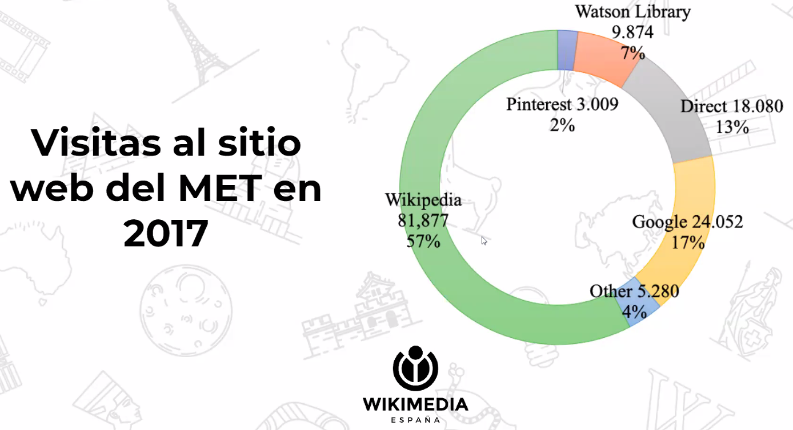
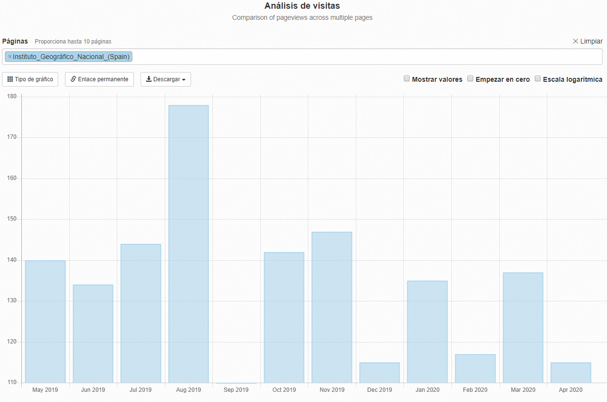
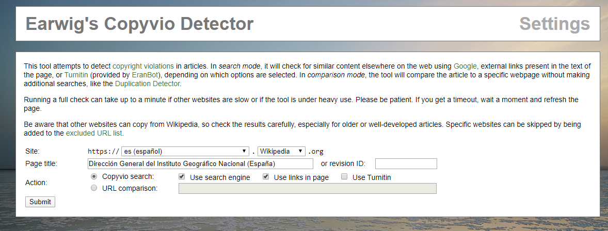
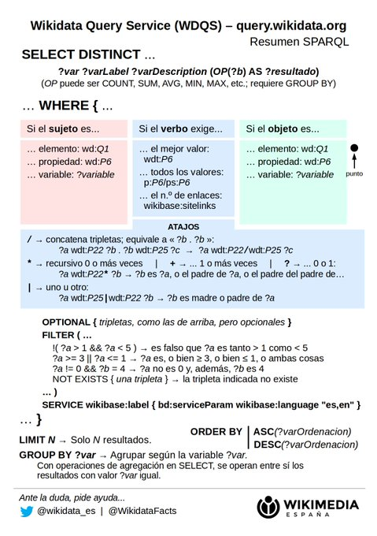
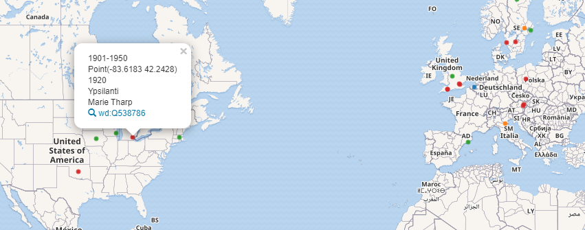

# Wikipedia y GLAM 

La charla estaba destinada a la integración de Wikipedia con GLAM, acrónimo inglés de *galleries, libraries, archives and museums*, nuestras galerías, bibliotecas, archivos y museos.



De todos los proyectos que hay detrás de Wikimedia, lo más interesantes serían Wikicommons, para un volcado de la documentación digitalizada de Cartoteca y Archivo Topográfico, Wikipedia para la redacción de artículos que nos permitan desarrollar algunos documentos cartográficos o conjuntos de obras más en profundidad, así como completar artículos ya existentes aportando las imágenes de IGN suboidas a Wikicommons. Por ejemplo, tenemos gran cantodad e documentos del Depósito de la Guerra. Una vez subidos sería interesante crear una entrada sobre la institución, al igual que en francés existe el artículo sobre el [*Dépôt de la Guerre* 🇫](https://fr.wikipedia.org/wiki/D%C3%A9p%C3%B4t_de_la_Guerre).

También es importante completar **Wikidata** con información acerca de las autoridades de autor de obra que tenemos en  ABSYS. Previamente al volcado de información digitalizada en Wikicommons, hay que asegurarse que tenemos referencias en Wikidata para enlazar toda la información que subamos. Ya yenemos casi el **26%** de nuestros datos enlazados a Wikidata, y es posible que en breve superemos el 50%. Al menos de las obras que subamos, sus autores deben estar previamente dados de alta, con su correspondiente control de autoridades. El control de Autoridades es el que nos permite asegurar que un autor existe, al encontrar referencias suyas no sólo en nuestro catálogo de datos, sino también en otros catálogos como la BNE, BnF, LoC...

## Pilares básicos

* Wikimedia tiene un caráceter enciclopédico 📚 y divulgativo.
* No es un escaparate de investigaciones personales 👉 Información verificada
* Información libre, reutilizable y modificable 👉 Contenidos para cualquier tipo de uso

* Civismo. Evitar contenidos políticos y discusiones subjetivas. Usos de manuales de estilo.

## Primeros pasos

Sería interesante empezar haciendo unos artículos que describieran la Biblioteca, Cartoteca y el Archivo Topográfico, puestas en contexto como parte del IGN, que ya dispone de entrada en Wikipedia. Es una manera de poner unos cimientos para la información gráfica que se subirá a posteriori a Wikicommons. Para ello creo que tenemos bastantes artículos describiendo funciones y presentando la sección. También habría que crear su asociación con la base de datos de Wikidata, que es la base de datos libre que entre otras cosas, respalda con su control de autoridades lo artículos de Wikipedia o las imágenes de Wikicommons. 

Con motivo del Aniversario 150, una labor importante sería completar la página web del IGN, bastante pobre en general. Hay suficiente material como para completar todas las secciones, la lista de directores desde el comienzo...Es muy importante disponer de la página en inglés. La comunidad anglosajona es la más activa de todas y suelen contribuir de manera notable.

* Ejemplo de institución descrita de manera básica 👉 [Museo Arqueológico de Andelo](https://es.wikipedia.org/wiki/Museo_Arqueol%C3%B3gico_de_Andelo).
* Importante el control de autoridades. Ejemplo muy concreto 👉  [Museo Nacional de Cerámica y Artes Suntuarias González Martí](https://es.wikipedia.org/wiki/Museo_Nacional_de_Cer%C3%A1mica_y_Artes_Suntuarias_Gonz%C3%A1lez_Mart%C3%AD)
* Mapa Polomeo subido a WikiCommons relacionado con Wikidata [👉 aquí ](https://commons.wikimedia.org/wiki/File:Prima_Europe_tabula.jpg)
  * Descripción con los parámetros básicos: título, autor, fecha, dimensiones
  * Enlace externo al catálogo de National Library of Wales.


## Estrategia

La fundación Wikipedia no ve con buenos ojos que una institución escriba sobre sí misma. Un usuario oficial del IGN no debería crear contenido en el artículo sobre el IGN. Ni tampoco ser el que crea o redacta artículos sobre material digital aportado por el IGN. 
¿Cual es la labor del usuario oficial entonces? Lo primero sería darlo de alta y contactar con Wikipedia España para informar que este usuario es el usurio oficial de la Institución, y por tanto tiene auridad como para subir los contenidos de la institución sin miuedo a que suba elementos de los que no tiene licencia. También hay que asegurarse de que este usuario no exista ya, y si existe intentar recuperarlo y averiguar quien tiene sus credenciales. No sería de extrañar que nos encontráramos con este último caso.

La labor del usuario oficial sería la de subir todo el contenido digital a WikiCommons, con el debido respaldo que le da su condicion de oficialidad, y el de completar las referencias en la database Wikidata. Para redactar y editar artículos existentes, seria necesario que aquellos que colaboran en estas labores crearan sus propias cuentas de usuario, para añadir contenido. Por supuesto las contribucuones de estos usuarios serían a largo plazo, aunque redactar artículos sobre el Archivo Topográfico y la Cartoteca y completar la información sobre la propia institución sí que serían interesantes de realizar en las primeras fases.


## Retorno en visibilidad web

La inclusión de contenidoen Wikipedia tiene un amplio retorno en visibilidad de la institución en Internet. El MET,*Metropolitan Museum of New York*, incorporó a Wikicommons más de 360 000 imagenes en el primer trimestre de 2017. En el gráfico se muestra el incremento de artículos de Wikipedia citando elementos de la colección del MET, así como los números de visitas de esos artículos.



En cuanto al incremento del tráfico de Internet hacia su sitio web, aumentó el origen de las visitas cuya procediencia era Wikipedia, esto es, la visita de esos artículos. 



Otros ejemplos son:

* Archivo Federal de Alemania: +83 000 imágenes.
* Biblioteca Nacional de Gales: +19 000 imágenes.

MET 367000
Alemania 83000

## Herramientas de explotación de datos.

### Analisis de visitas

Wikipedia ofrece multitud de herramientas para analizar el tráfico de visitas de una determinada página con [Pageviews](https://tools.wmflabs.org/pageviews/?project=en.wikipedia.org&platform=all-access&agent=user&redirects=0&range=latest-20&pages=Instituto_Geogr%C3%A1fico_Nacional_(Spain)) podemos ver las visitas de manera gráfica por días o meses.



Otras herramientas para analizar tendencias son

* Daily Top 100 Wikimedia pages [👉 enlace](https://top.hatnote.com/es/).
* Testing deadlinks: comprueba si una página de Wikipedia tiene enlaces externos rotos [👉 enlace](http://dispenser.info.tm/~dispenser/view/Checklinks)
* Detección de plagios: dado un artículo de Wikipedia, examina si tiene trozos de otras páginas webs [👉 enlace](https://tools.wmflabs.org/copyvios/?lang=es&project=wikipedia)

 

### BaGLAMa 2 - Consultas WikiCommons

Una vez subamos los contenidos a Wikipedia, esta herramienta es muy últil para ver analizar el uso de los ficheros multimedia subidos por una institución a WikiCommons. [BaGLAMa 2](https://tools.wmflabs.org/glamtools/baglama2/) permite ver el nombre de la institución, el número de meses de los cuales se dispone su tracking de visitas, el último mes registrado y el número de visitas totales.


### WikiShootMe

Con esta herramienta podemos ver los elementos de Wikipedia y WikiCommons georreferenciados localizados sobre un mapa. Entrando en la web de la herramienta [en este enlace](https://tools.wmflabs.org/wikishootme/#lat=40.4456&lng=-3.7098&zoom=18) podemos navegar por el mapa y obtener información de los elementos georreferenciados. A mí me ha sido muy útil por ejemplo para ver que la **Biblioteca del IGN** está dada de alta como entidad Wikidata. Eso sí, le falta asociar una imagen. ¿Voluntarios?


### Wikidata Query Service

Permite hacer consultas sobre Wikidata. Utiliza un lenguaje pseudo-sql realizando consultas SPARQL sobre Base de datos de Wikidata. En Wikidata todo se almacena en forma de tripletas que contienen **Sujeto - Predicado - Objeto**. Todos los sujetos y predicados tienen su entrada en Wikidata. Los objetos pueden ser entradas en Wikidata o cadenas de textos, números o fechas.



* Lista de propiedades [👉 https://www.wikidata.org/wiki/Wikidata:List_of_properties/es](https://www.wikidata.org/wiki/Wikidata:List_of_properties/es)
* Lista de prefijos [👉  https://www.mediawiki.org/wiki/Wikibase/Indexing/RDF_Dump_Format#Full_list_of_prefixes](https://www.mediawiki.org/wiki/Wikibase/Indexing/RDF_Dump_Format#Full_list_of_prefixes)


#### Ejemplos: Consulta de imágenes

```sql
#added before 2016-10
#defaultView:ImageGrid
SELECT *
WHERE
{
  ?item wdt:P31 wd:Q3305213 .
  ?item wdt:P170 wd:Q34661 .      
  ?item wdt:P18 ?pic
}
```
Las dos primeras líneas predecidad de almohadilla son parámetros por defecto en los que se establece que los datos sean anteriores a **octubre de 2016** y que el resultado de la consulta se muestre en forma de **rejilla de imágenes**. Luego se eligen los campos a mostrar y despuás tras la partícula WHERE, se establecen las condiciones. El prefijo *wdt* es indicativo de propiedad de entidad y el prefijo *wd* enlaza con una entidad determinada. Con el signo del punto, concatenamos condiciones.

 
* **wd:Q3305213** -> Código del tema: pintura ---> https://www.wikidata.org/wiki/Q3305213
* **wd:Q34661** ->  Código de Gustav Klimt ---> https://www.wikidata.org/wiki/Q34661  . La propiedad **wdt:P170** es *Creador de la obra*.
* **?item wdt:P18 ?pic** ->  Obligamos a que la entrada tenga un registro de imagen

Si hubieramos querido scar cualquier registro que cunpliera criterios, y opcional que tuviera imagen, habríamos puesto
```sql
SELECT *
WHERE
{
  ?item wdt:P31 wd:Q34661 .
  ?item wdt:P170 wd:Q34661
  OPTIONAL{      
    ?item wdt:P18 ?pic
  }
}
```

Las almohadillas **#** se utilizan para introducir comentarios que aclaren la sentencia de consulta y para establecer propiedades por defecto mediante el uso de keywords; *added before*,  *defaultView*,....

#### Obtener todos los cartógrafos de Wikipedia 

Vamos a obtener todas las personas con su nombre, fecha de nacimiento, lugar de nacimiento, coordenadas de su nacimiento y periodo de tiempo al que pertenecen con la ocupación de cartógrafo o que se dediquen al mundo de la Cartografía. Las coordenadas las pintaremos sobre un mapa. El periodo de tiempo de su nacimiento lo establecemos como campo *layer* y la usaremos para agruparlos por colores. En el modo Mapa, el campo *?coord* se utiliza para situar el punto en el mapa y el campo *?layer* lo utilizamos para signarlo a una capa y poder pintarlo.

```sql
#?person wdt:P106 wd:Q188094 --> Persona / Ocupación / Cartógrafo
#?person wdt:P101 wd:Q8134 --> Persona / Campo de trabajo / Cartografía
#?person wdt:P21 wd:Q6581072 .  --> Que sean mujeres
#wdt:P570 Fecha de nacimiento
#wdt:P19 Lugar de nacimiento

#defaultView:Map
SELECT DISTINCT ?person ?name ?birthplace ?birthyear ?coord ?layer WHERE {
{?person wdt:P106 wd:Q1734662} UNION {?person wdt:P101 wd:Q42515} .
?person wdt:P21 wd:Q6581072 .
?person wdt:P570 ?dod;  
# Hasta aquí la consulta. Ahora definimos parámatros para mapear
wdt:P19 ?place .
?place wdt:P625 ?coord
OPTIONAL { ?person wdt:P569 ?dob }
BIND(YEAR(?dob) as ?birthyear)
BIND(
    IF((?birthyear < 1400),"Pre-1400",
    IF((?birthyear < 1500),"Siglo XV", 
    IF((?birthyear < 1600),"Siglo XVI",
    IF((?birthyear < 1700),"Siglo XVII",      
    IF((?birthyear < 1751),"1700-1750", 
    IF((?birthyear < 1801),"1751-1800", 
    IF((?birthyear < 1851),"1801-1850", 
    IF((?birthyear < 1901),"1851-1900", 
    IF((?birthyear < 1951),"1901-1950","Post-1950"))))))))) AS ?layer
)
?person rdfs:label ?name filter (lang(?name) = "en")
?place rdfs:label ?birthplace filter (lang(?birthplace) = "en")
} 
ORDER BY ?birthyear #Ordenamos por año
Limit 2000 # Limitamos resultados para agilidad en la consulta
```

Y si queremos coger sólo las mujeres cartógrafas, insertamos la condición después de la unión.

```sql
#(....)

SELECT DISTINCT ?person ?name ?birthplace ?birthyear ?coord ?layer WHERE {
{?person wdt:P106 wd:Q1734662} UNION {?person wdt:P101 wd:Q42515} .
?person wdt:P21 wd:Q6581072 . # Esta condición establece que el sexo de ?person sean femenino

#(...) 
```



El mapa permite moverse por su contenido y apagar y encender las clases mediante una tabla de contenidos situada a la derecha.

## 🎫 Licencias y permisos

Se trata de un sistema de etiquetas que una institucion tiene que enviar a wikipedia, informando que sus imágenes pueden subirse a wiki y utiliarse. Es previo antes de subir información. Más información sobre este procedimiento en [este artículo](https://es.wikipedia.org/wiki/Wikipedia:OTRS).

Wikimedia ofrece un sistema de generación de etiquetas OTRS en [esta 🛠 herramienta ](https://tools.wmflabs.org/relgen/).

Pero antes hay que verificar si esto ya se ha realizado en algún momento.

## Personas de contacto
Rubén Ojeda. Fue wikipedista en residencia. Ha trabajado en el MAN para integrar en Wikipedia

Quickstatements: herramienta para subir datos en masa a Wikipedia

Rubén Ojeda de la Roza (vanbasten_23)
Project Manager
Wikimedia España

Tlf: +34 722 61 47 98
rubenojeda@wikimedia.es
@rubojeda


MiguelAlanCS
Angel Obregón 
Rubén ojeda
AdolfoBrigido

## Bibliografía

* Ejemplos de consultas SPARQL [👉 https://www.wikidata.org/wiki/Wikidata:SPARQL_query_service/queries/examples](https://www.wikidata.org/wiki/Wikidata:SPARQL_query_service/queries/examples)
* Tutorial ligero de SPARQL [en este 👉 enlace](http://data.cervantesvirtual.com/blog/2018/10/25/tutorial-de-inicio-a-sparql/)
* 📽 Vídeo [👉  Introducción a Wikimedia Commons](https://es.wikipedia.org/wiki/Wikipedia:Encuentros/Sesiones_en_l%C3%ADnea_WMES_2020/Sesi%C3%B3n_10)
* 📽 Vídeo [👉  Introducción a Wikidata](https://es.wikipedia.org/wiki/Wikipedia:Encuentros/Sesiones_en_l%C3%ADnea_WMES_2020/Sesi%C3%B3n_7)
* 📽 Vídeo Ángel Obregón os explica cómo contribuir al Mapa de bibliotecas en Wikidata a través de esta formación en línea [con este 👉 enlace](https://www.youtube.com/watch?v=EF4w_B5yZXk&t=375s)
* Deep Learning Cookbook: Practical Recipes to Get Started Quickly, Douwe Osinga. O'Reilly 2018. [Enlace 🛒](https://www.amazon.es/Deep-Learning-Cookbook-Practical-recipes/dp/149199584X)


---

## Conceptos pendientes a desarrollar en otros cuadernillos

OpenRefine para la depuración de datos

Wikidatta estructura y conecta todo. Cada entrada en wikidata se peude enlazar con proyectos

Dedicatones --> Acciones coordinadas de edición y curacion de datos sobre un tema en cocreto

Sorolla Challenge - Noviermbre 2018 --> internacionalizar el contenido. Wikpedia da una visibilidad por todo el mundo.

Muy importante contenidos en inglés--> comunidaid anglosajona muy potente

Videos--> visibilizar las acividades educativas del IGN

Protocolo OAI-PMH para la descarga de metadatos

## Creación del primer artículo

Florencia Cles (Florenciac)

Contenido libre
Verificabilidad

Uso de la herramienta talles->> 
Estructura del artículo
Negritas sólo en el título
hipervínculos frecuentes pero no repetidos.

Control de Autoridades
Categorías   --> se ponene categorias y auroridades cuando se publica en Wikipedia el articulo.

Borrador
referencias, bilbiografía, enlaces externas
Ref_ Se pone libro y pñagina, por ehemploç importantes previas a la bibliografía, porque puesde buscar tu inspiracion para ese pa´rrafo en particular
Bibliografía: se pode el libro completo con su ISBN -> Ver Museo del Romanticismo
En enlaces externos puedo poner un enlace a tra wikipedia idiomatica, si el enlace merece la pena

Consuelo: te comento, hay que solicitar el borrado del Taller, como dice Caterine. En el artículo ya trasladado a la izquierda en el área de Herramientas hay un enlace que dice "Lo que enlaza aquí" y cuando lo clickas saldrá el listado de los lugaros que dirigen a ese artículo, pues bien, ahí aparecerá el Taller origen, Entras en el Taller y editas con código y pones: "{{d|r3|u1}}" que significa redirección errónea (r3) y solicitado por el autor (u1). lo siguiente es Publicar y ya un biblio se encargará de atender el borrado
ASi avisamos que nos borren un taller, cuando es es el taller principal.

Con el Menú Más->Trasladar, puedo pasar mi artículo a Wikipedia.

Ficha lateral --> insertar plantilla -->se elige
Ficha de persona es el resultado de fusionar todo, escritor, médico, furbolista (esto es está en proceso)


