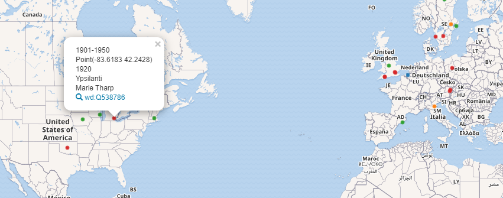
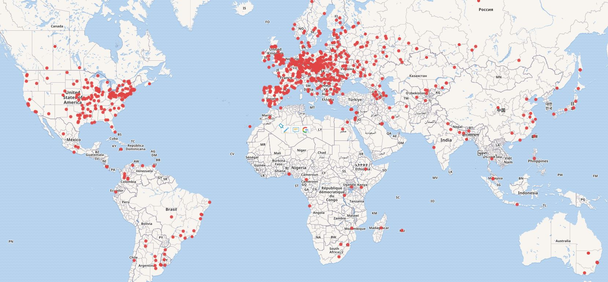

# 🔍 Wikidata Query Service
## Sistema de consultas SPARQL para Wikipedia

Podemos acceder desde [https://query.wikidata.org/](https://query.wikidata.org/). Permite hacer consultas sobre Wikidata. Utiliza un lenguaje pseudo-sql realizando consultas SPARQL sobre Base de datos de Wikidata. En Wikidata todo se almacena en forma de tripletas que contienen **Sujeto - Predicado - Objeto**. Todos los sujetos y predicados tienen su entrada en Wikidata. Los objetos pueden ser entradas en Wikidata o cadenas de textos, números o fechas.


* Lista de propiedades [👉 https://www.wikidata.org/wiki/Wikidata:List_of_properties/es](https://www.wikidata.org/wiki/Wikidata:List_of_properties/es)
* Lista de prefijos [👉  https://www.mediawiki.org/wiki/Wikibase/Indexing/RDF_Dump_Format#Full_list_of_prefixes](https://www.mediawiki.org/wiki/Wikibase/Indexing/RDF_Dump_Format#Full_list_of_prefixes)


### Consulta de imágenes

```sql
#added before 2016-10
#defaultView:ImageGrid
SELECT *
WHERE
{
  ?item wdt:P31 wd:Q3305213 .
  ?item wdt:P170 wd:Q34661 .      
  ?item wdt:P18 ?pic
}
```
Las dos primeras líneas predecidad de almohadilla son parámetros por defecto en los que se establece que los datos sean anteriores a **octubre de 2016** y que el resultado de la consulta se muestre en forma de **rejilla de imágenes**. Luego se eligen los campos a mostrar y despuás tras la partícula WHERE, se establecen las condiciones. El prefijo *wdt* es indicativo de propiedad de entidad y el prefijo *wd* enlaza con una entidad determinada. Con el signo del punto, concatenamos condiciones.

 
* **wd:Q3305213** -> Código del tema: pintura ---> https://www.wikidata.org/wiki/Q3305213
* **wd:Q34661** ->  Código de Gustav Klimt ---> https://www.wikidata.org/wiki/Q34661  . La propiedad **wdt:P170** es *Creador de la obra*.
* **?item wdt:P18 ?pic** ->  Obligamos a que la entrada tenga un registro de imagen

Si hubieramos querido scar cualquier registro que cunpliera criterios, y opcional que tuviera imagen, habríamos puesto
```sql
SELECT *
WHERE
{
  ?item wdt:P31 wd:Q34661 .
  ?item wdt:P170 wd:Q34661
  OPTIONAL{      
    ?item wdt:P18 ?pic
  }
}
```

Las almohadillas **#** se utilizan para introducir comentarios que aclaren la sentencia de consulta y para establecer propiedades por defecto mediante el uso de keywords; *added before*,  *defaultView*,....

### Obtener todos los cartógrafos de Wikipedia 

Vamos a obtener todas las personas con su nombre, fecha de nacimiento, lugar de nacimiento, coordenadas de su nacimiento y periodo de tiempo al que pertenecen con la ocupación de cartógrafo o que se dediquen al mundo de la Cartografía. Las coordenadas las pintaremos sobre un mapa. El periodo de tiempo de su nacimiento lo establecemos como campo *layer* y la usaremos para agruparlos por colores. En el modo Mapa, el campo *?coord* se utiliza para situar el punto en el mapa y el campo *?layer* lo utilizamos para signarlo a una capa y poder pintarlo.

```sql
#?person wdt:P106 wd:Q188094 --> Persona / Ocupación / Cartógrafo
#?person wdt:P101 wd:Q8134 --> Persona / Campo de trabajo / Cartografía
#?person wdt:P21 wd:Q6581072 .  --> Que sean mujeres
#wdt:P570 Fecha de nacimiento
#wdt:P19 Lugar de nacimiento

#defaultView:Map
SELECT DISTINCT ?person ?name ?birthplace ?birthyear ?coord ?layer WHERE {
{?person wdt:P106 wd:Q1734662} UNION {?person wdt:P101 wd:Q42515} .
?person wdt:P21 wd:Q6581072 .
?person wdt:P570 ?dod;  
# Hasta aquí la consulta. Ahora definimos parámatros para mapear
wdt:P19 ?place .
?place wdt:P625 ?coord
OPTIONAL { ?person wdt:P569 ?dob }
BIND(YEAR(?dob) as ?birthyear)
BIND(
    IF((?birthyear < 1400),"Pre-1400",
    IF((?birthyear < 1500),"Siglo XV", 
    IF((?birthyear < 1600),"Siglo XVI",
    IF((?birthyear < 1700),"Siglo XVII",      
    IF((?birthyear < 1751),"1700-1750", 
    IF((?birthyear < 1801),"1751-1800", 
    IF((?birthyear < 1851),"1801-1850", 
    IF((?birthyear < 1901),"1851-1900", 
    IF((?birthyear < 1951),"1901-1950","Post-1950"))))))))) AS ?layer
)
?person rdfs:label ?name filter (lang(?name) = "en")
?place rdfs:label ?birthplace filter (lang(?birthplace) = "en")
} 
ORDER BY ?birthyear #Ordenamos por año
Limit 2000 # Limitamos resultados para agilidad en la consulta
```

Y si queremos coger sólo las mujeres cartógrafas, insertamos la condición después de la unión.

```sql
#(....)

SELECT DISTINCT ?person ?name ?birthplace ?birthyear ?coord ?layer WHERE {
{?person wdt:P106 wd:Q1734662} UNION {?person wdt:P101 wd:Q42515} .
?person wdt:P21 wd:Q6581072 . # Esta condición establece que el sexo de ?person sean femenino

#(...) 
```



El mapa permite moverse por su contenido y apagar y encender las clases mediante una tabla de contenidos situada a la derecha.

### Trabajando con mujeres químicas 🧪️⚗🧫️

Fuente utilizada [https://www.mediawiki.org/wiki/Wikidata_Query_Service/User_Manual](https://www.mediawiki.org/wiki/Wikidata_Query_Service/User_Manual)

Vamos a ir evolucionando poco a poco una consulta para ver como afecta cada paso al resultado obtenido. Lo primero, es la estructura vase de cualquier consulta.

```sql
# Los comentarios se insertan con el hashtag previo
SELECT ?item  # En esta línea van los resultados de la columna

WHERE {
    # Aquí van encadenados los filtros que nos permitirán definir nuestra consulta
}
``` 

Para obtener las mujeres químicas que hay en Wikipedia, lo mejor es acceder a una de ellas y vemos su perfil en wikidata, por ejemplo [Marie Curie](https://www.wikidata.org/wiki/Q7186). En su ficha de **Wikidata** vemos que su perfil es muy completo por su importancia. Lógicamente no siempre encontraemos perfiles así, pe ro este es un buen punto de captura. Viendo la página llegamos a la seccion de *Statements*, que son los atributos de la ficha: instance of, sex or gender... Si nos ponemos encima con el cursor, aparecen *tooltips* con valores como **Property:P21**. Este es la codificación de la propiedad. Hay propiedades genéricas para todos los objetos y propiedades específicas según el tipo de objeto. Como queremos obtener las químicas que hay en Wikidata, vamos a la propiedad **occupation** y comprobamos que su codificación es **P:106**. Entre sus valores (Curie tiene varios) vemos que está el de **chemist**, y al poner el cursor encima veremos cómo se codifica este valor, **Q593644**.

Ahora vamos a nuestro panel de consultas, y en los criterios de filtro ponemos

```sql
SELECT ?persona  # Hemos cambiado item por persona, a modo de de que que de más claro, pero podría ir cualquier palabra

WHERE {
    # La partícula wdt: nos permite poner una propiedad para el filtro, en nuestro caso occupation, P:106
    # La partícula wd: nos permite poner el valor por el que se filtra, en nuestro caso chemist, Q593644
    # También podemos pulsar ⌨ Ctrl+Space para que se habilite un autocomplete donde escribimos el criterio
    ?persona wdt:P106 wd:Q593644 . 
    # Pero como además queremos que sean mujeres químicas, añadiremos el filtro sex or gender P21 con valor female Q6581072
    ?persona wdt:P21 wd:Q6581072 .
}
``` 
Vemos que los dos filtros se concatenan con un punto **.** para que sean de tipo AND. Los registros que salen en pantalla cumplen ambos criterios. Sin embargo los resultados en pantalla se muestran con el código del registro, y no vemos el nombre. Para etiquetar el resultado con nombres legibles, usamos un servicio de Wikidata, así para obtener resultados legibles.

```sql
SELECT ?persona ?personaLabel # Añadimos el sufijo Label a nuestra palabra

WHERE {
    ?persona wdt:P106 wd:Q593644 . 
    ?persona wdt:P21 wd:Q6581072
    
    # Con este servicio accedemos al atributo label
    SERVICE wikibase:label { bd:serviceParam wikibase:language "es". } 
}
```

También podemos utilizar otros sufijos, como AltLAbel o Description

```sql
SELECT ?persona ?personaLabel ?personaDescription ?personaAltLabel

WHERE {
    ?persona wdt:P106 wd:Q593644 . 
    ?persona wdt:P21 wd:Q6581072
    
    # Con este servicio accedemos al atributo label
    SERVICE wikibase:label { bd:serviceParam wikibase:language "es". } 
}
```

Hemos especificado el idioma en el servicio de etiquetado. Podemos usar otros idiomas. En el caso de los nombres de químicas puede no ser muy clara la utilidad, pero si trabajamos con nombres de países, que cambian según el idioma, veremos su utilidad


```sql
# Países y capitales en español
SELECT ?country ?countryLabel ?capitalLabel ?capitalDescription ?capitalAltLabel
   WHERE {
     wd:Q458 wdt:P150 ?country.   # European Union  contains administrative territorial entity
     OPTIONAL{ ?country wdt:P36 ?capital. }
     SERVICE wikibase:label { bd:serviceParam wikibase:language "es". }
}

# Países y capitales en francés
SELECT ?country ?countryLabel ?capitalLabel ?capitalDescription ?capitalAltLabel
   WHERE {
     wd:Q458 wdt:P150 ?country.   # European Union  contains administrative territorial entity
     OPTIONAL{ ?country wdt:P36 ?capital. }
     SERVICE wikibase:label { bd:serviceParam wikibase:language "fr". }
}
```
Volvemos a nuestra consulta de químicas. Vamos a obtener otro campo, el de imagen, con una foto de las químicas.

```sql
SELECT ?persona ?personaLabel ?foto

WHERE {
    ?persona wdt:P106 wd:Q593644 . 
    ?persona wdt:P21 wd:Q6581072 .
    ?persona wdt:P18 ?foto
    # Aquí definimos que salgan las que tienen el campo imagen P18. 
    # Al no poner nada, le decimos al motor de consulta que saque aquellas que tiene el valor relleno
    # Al final podemos la partícula ?foto, que es el alias para este campo. Lo pondemos arriba, en la lista de campos que salen
      

    SERVICE wikibase:label { bd:serviceParam wikibase:language "es". }
}
```
Las imágenes se listan con su URL en el caso de que el modo de visualización que usamos sea el de tabla. Para ver las imágenes podemos utilizar el modo *Image grid*. Veremos las imagenes mosaicadas de las mujeres químicas.


Notaremos que ahora que al añadir la imagen nos ha bajado notablemente el número de resultados. Quizás nos interese hacer la imagen opcional, para que liste los mismos registros que antes, pero añada la imagen en el caso de que esté. Para ello

```sql
SELECT ?persona ?personaLabel ?foto 

WHERE {
  # Aquí van los filtros iniciales restrictivos
  ?persona wdt:P106 wd:Q593644 .  # Química
  ?persona wdt:P21 wd:Q6581072 .  # Mujer
  
  # Aquí ponemos las opcionales (puede haber valores de ese campo o no)
  OPTIONAL{ ?persona wdt:P18 ?foto } # Foto

  SERVICE wikibase:label { bd:serviceParam wikibase:language "es". } 
}
```

Vamos a añadir algunos campos más de resultados a nuestra consulta de químicas. Añadiremos el lugar **wdt:P19** y la fecha de nacimiento **wdt:P569**. Las pondremos como restrictivas, porque nuestro objetivo es dibujar un mapa con el nacimiento de todas ellas.

```sql
SELECT ?persona ?personaLabel ?birthDate ?birthPlaceLabel ?foto  

WHERE {
  # Aquí van los filtros iniciales restrictivos
  ?persona wdt:P106 wd:Q593644 .  # Química
  ?persona wdt:P21 wd:Q6581072 .  # Mujer
  
  # Aquí ponemos las opcionales (puede haber valores de ese campo o no)
  OPTIONAL{ ?persona wdt:P18 ?foto } # Foto

  # Aquí ponemos las restrictivas. Para que salga registro, el campo debe estar relleno
  ?persona wdt:P569 ?birthDate .
  ?persona wdt:P19 ?birthPlace .

  SERVICE wikibase:label { bd:serviceParam wikibase:language "es". } 
}
```
Con esta consulta el campo lugar de nacimiento no devuelve un valor sino un objeto *Wikidata*. Por eso sacamos la etiqueta usando *?birthPlaceLabel*.

Sin embargo para obtener la coordenada del lugar de nacimiento necesitamos añadir unas líneas más para acceder a la propiedad de coordendas, no del objeto *?persona*, sino del objeto *?birthPlace*.

```sql
SELECT ?persona ?personaLabel ?birthDate ?birthPlace ?birthPlaceLabel ?coordenadas  ?foto  

WHERE {
  # Aquí van los filtros iniciales restrictivos
  ?persona wdt:P106 wd:Q593644 .  # Química
  ?persona wdt:P21 wd:Q6581072 .  # Mujer
  
  # Aquí ponemos las opcionales (puede haber valores de ese campo o no)
  OPTIONAL{ ?persona wdt:P18 ?foto } # Foto

  # Aquí ponemos las restrictivas. Para que salga registro, el campo debe estar relleno
  ?persona wdt:P569 ?birthDate .
  ?persona wdt:P19 ?birthPlace .
  #Sacamos las coordenadas, no del objeto ?persona, sino del objeto ?birthPlace
  #De todas las propiedades del objeto ?birthPlace, accedemos a las coordenadas (P625)
  ?birthPlace wdt:P625 ?coordenadas .  
  
  SERVICE wikibase:label { bd:serviceParam wikibase:language "es". } 
}
```
El tipo de vista que nos devuelve el resultado



### Consultas espaciales

Podemos complicar un poco la consulta con funciones espaciales. Por ejemplo, podemos restringir la consulta a las químicas nacidas en un *bounding box* que abarque la Península Ibérica.

```sql
SELECT ?persona ?personaLabel ?birthDate ?birthPlace ?foto ?location
{

  SERVICE wikibase:box {
    ?birthPlace wdt:P625 ?location .
    bd:serviceParam wikibase:cornerWest "Point(-10 37)"^^geo:wktLiteral. 
    bd:serviceParam wikibase:cornerEast "Point(6 42)"^^geo:wktLiteral.
  }
  ?persona wdt:P106 wd:Q593644. # Filtro: Química
  ?persona wdt:P21 wd:Q6581072. # Filtro: Mujer
  ?persona wdt:P569 ?birthDate. # Fecha nacimiento
  ?persona wdt:P19 ?birthPlace. # Lugar nacimiento
  OPTIONAL{ ?persona wdt:P18 ?foto } # Foto

  SERVICE wikibase:label { bd:serviceParam wikibase:language "en" }
  
} 
```

O definir un radio de 100 Km alrededor de Londres para ver cuantas químicas han nacido en sus proximidades.

```sql
SELECT ?persona ?personaLabel ?birthDate ?birthPlaceLabel ?foto ?location ?dist
WHERE
{
  SERVICE wikibase:around {
      ?birthPlace wdt:P625 ?location .
      bd:serviceParam wikibase:center "Point(-0.1275 51.5072)"^^geo:wktLiteral. #Londres
      bd:serviceParam wikibase:radius "100" . # Distancia en Km
  }
  ?persona wdt:P106 wd:Q593644. # Filtro: Química
  ?persona wdt:P21 wd:Q6581072. # Filtro: Mujer
  ?persona wdt:P569 ?birthDate. # Fecha nacimiento
  ?persona wdt:P19 ?birthPlace. # Lugar nacimiento
  OPTIONAL{ ?persona wdt:P18 ?foto } # Foto
  SERVICE wikibase:label { bd:serviceParam wikibase:language "en" }
  BIND(geof:distance("Point(-0.1275 51.5072)"^^geo:wktLiteral, ?location) as ?dist)
} ORDER BY ?dist # Ordenamos de más próxima a más lejana
```
La definición de los servicios de consulta espacial se explican en [este link 👉](https://en.wikibooks.org/wiki/SPARQL/SERVICE_-_around_and_box).


### Sugerencias para empezar a buscar

Uno de los atributos más importantes es wdt:P31. Correspende la propiedad instancia de, y y casi todos los objetos la tienen. Es un buen punto para empxzar a buscar. Si queremos un listado de los partidos políticos de todo el muindo con su número de miembros.

```sql
SELECT ?partido ?partidoLabel ?countryLabel ?numero
WHERE
{
  ?partido wdt:P31 wd:Q7278.  # Filtro: Instancia de (wdt:P31) PArtidos políticos (wd:Q7278)
  ?partido wdt:P17 ?country.  # País del partido
  ?partido wdt:P2124 ?numero. # Número de militantes
  SERVICE wikibase:label { bd:serviceParam wikibase:language "en" }
  
} ORDER BY DESC (?numero) # Ordenamos de mayor a menor
```
El resultado lo podemos representar con un diaframa de burbujas, al tener valores numéricos


## Herramientas complementarias

Una de las herramientas más interesantes para utilizar con consultas SPARQL es [Histropedia](http://histropedia.com/). Podemos definir una consuta y llevarla a esta web, que mediante un asistente nos permitirá crear interesantes visualizadores de estilo Línea del tiempo o *Timeline*.


## Fuentes

* Navino Evans explicando consultas básicas [📽 Vídeo 👉](https://www.youtube.com/watch?v=b3ft3CzkLYk)

